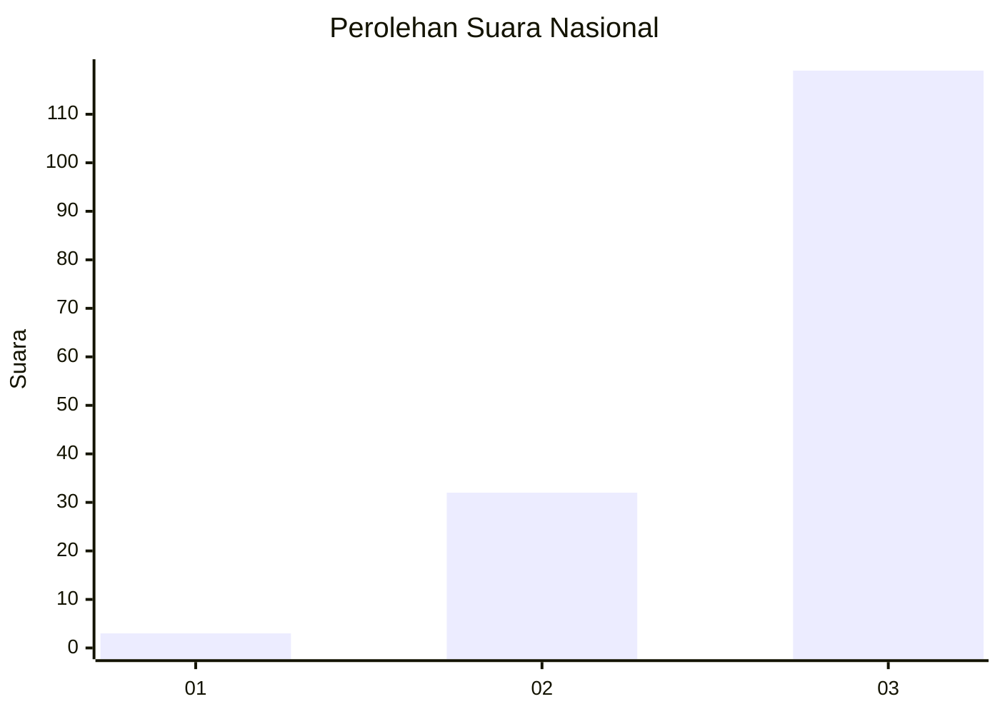
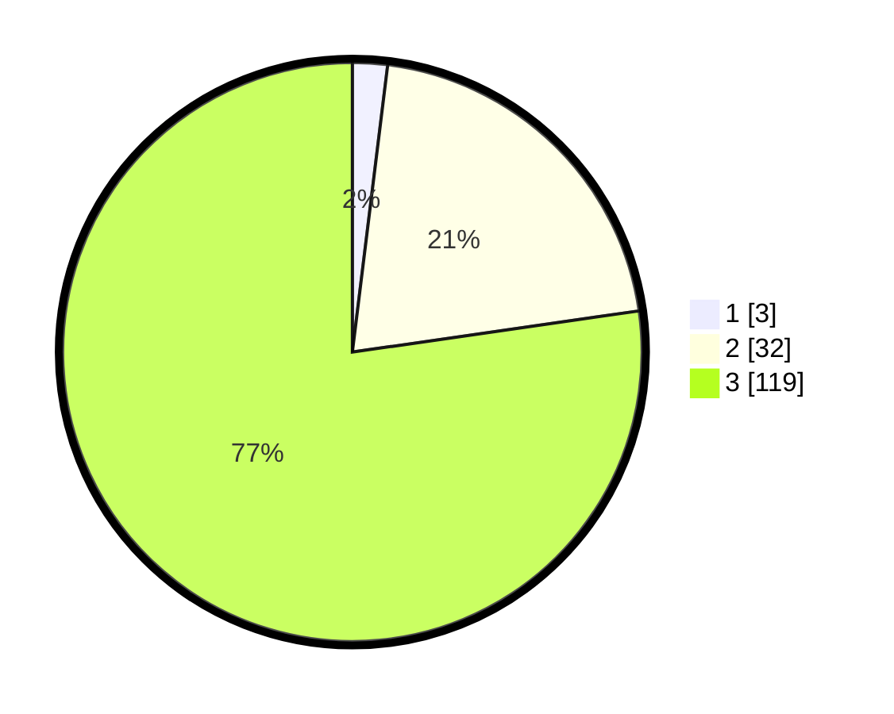

# Hasil

## Grafik

## Tabel

| No. | Nama Paslon    | Suara | Suara (raw) | Persentase |
|:--- |:-------------- | -----:| -----------:| ----------:|
| 1   | ANIES MUHAIMIN | 3     | [3][p-1]    | 1,95       |
| 2   | PRABOWO GIBRAN | 32    | [32][p-2]   | 20,78      |
| 3   | GANJAR MAHFUD  | 119   | [119][p-3]  | 77,27      |

[p-1]: https://github.com/gigit-pemilu/pemilu-2024/blob/main/pilpres/hitung-suara/sub/53-nusa-tenggara-timur/sub/07-sikka/sub/13-waiblama/sub/2004-werang/sub/005-tps/sub/paslon-1.txt
[p-2]: https://github.com/gigit-pemilu/pemilu-2024/blob/main/pilpres/hitung-suara/sub/53-nusa-tenggara-timur/sub/07-sikka/sub/13-waiblama/sub/2004-werang/sub/005-tps/sub/paslon-2.txt
[p-3]: https://github.com/gigit-pemilu/pemilu-2024/blob/main/pilpres/hitung-suara/sub/53-nusa-tenggara-timur/sub/07-sikka/sub/13-waiblama/sub/2004-werang/sub/005-tps/sub/paslon-3.txt

## Foto C Plano

https://sirekap-obj-formc.kpu.go.id/3b46/pemilu/ppwp/53/07/13/20/04/5307132004005-20240215-095857--732a46f8-806a-4648-911a-0a8be03790a6.jpg

https://sirekap-obj-formc.kpu.go.id/3b46/pemilu/ppwp/53/07/13/20/04/5307132004005-20240215-095108--02c07b96-59bb-47e9-b424-67c75b5e6866.jpg

https://sirekap-obj-formc.kpu.go.id/3b46/pemilu/ppwp/53/07/13/20/04/5307132004005-20240215-095312--08c6e63a-35b7-449d-a966-2537a0d4d72b.jpg

## Metadata

| Key        | Value               |
| ---------- | ------------------- |
| Time Stamp | 2024-02-19 06:16:00 |

