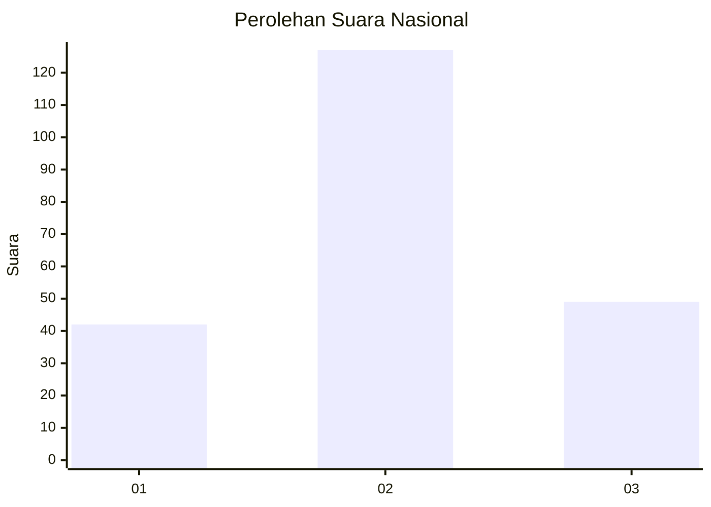
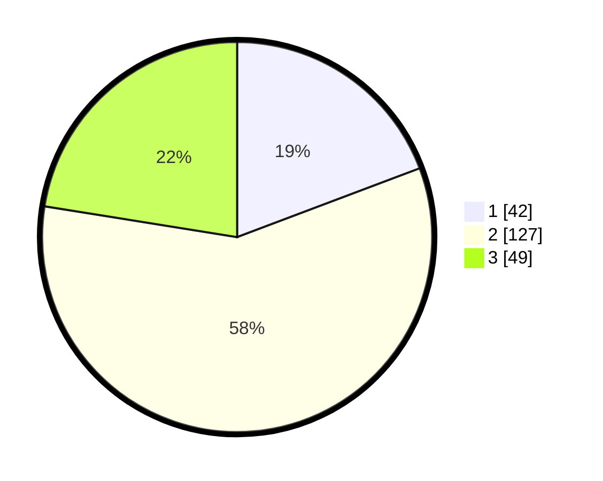

# Hasil

## Grafik

## Tabel

| No. | Nama Paslon    | Suara | Suara (raw) | Persentase |
|:--- |:-------------- | -----:| -----------:| ----------:|
| 1   | ANIES MUHAIMIN | 42    | [42][p-1]   | 19,27      |
| 2   | PRABOWO GIBRAN | 127   | [127][p-2]  | 58,26      |
| 3   | GANJAR MAHFUD  | 49    | [49][p-3]   | 22,48      |

[p-1]: https://github.com/gigit-pemilu/pemilu-2024/blob/main/pilpres/hitung-suara/sub/53-nusa-tenggara-timur/sub/07-sikka/sub/15-alok-timur/sub/1001-beru/sub/003-tps/sub/paslon-1.txt
[p-2]: https://github.com/gigit-pemilu/pemilu-2024/blob/main/pilpres/hitung-suara/sub/53-nusa-tenggara-timur/sub/07-sikka/sub/15-alok-timur/sub/1001-beru/sub/003-tps/sub/paslon-2.txt
[p-3]: https://github.com/gigit-pemilu/pemilu-2024/blob/main/pilpres/hitung-suara/sub/53-nusa-tenggara-timur/sub/07-sikka/sub/15-alok-timur/sub/1001-beru/sub/003-tps/sub/paslon-3.txt

## Foto C Plano

https://sirekap-obj-formc.kpu.go.id/cd36/pemilu/ppwp/53/07/15/10/01/5307151001003-20240215-091201--3abd4eaf-f4bb-4e55-9668-9844698d6019.jpg

https://sirekap-obj-formc.kpu.go.id/cd36/pemilu/ppwp/53/07/15/10/01/5307151001003-20240215-091454--7aba2b0a-a8b1-4480-a6d8-83a7c9687ed1.jpg

https://sirekap-obj-formc.kpu.go.id/cd36/pemilu/ppwp/53/07/15/10/01/5307151001003-20240215-091637--990fc3b9-b4e5-4238-abe3-05d7038c46e3.jpg

## Metadata

| Key        | Value               |
| ---------- | ------------------- |
| Time Stamp | 2024-02-17 16:00:02 |

