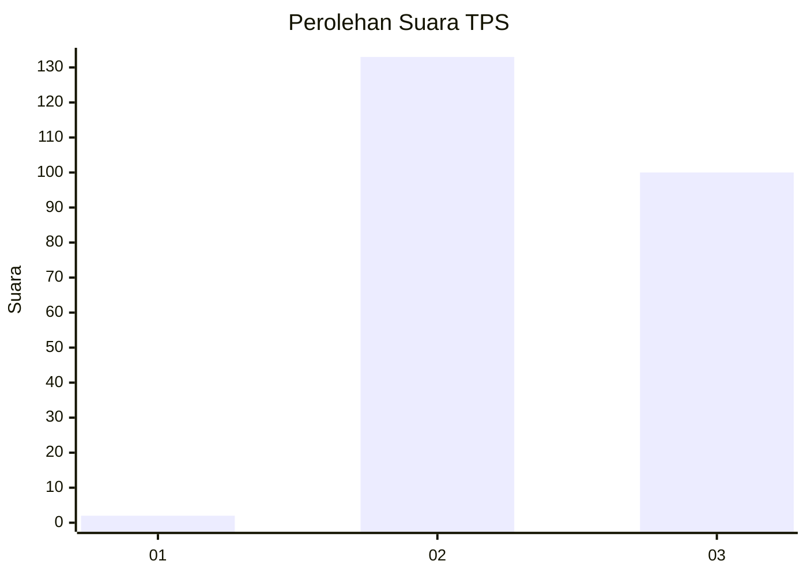
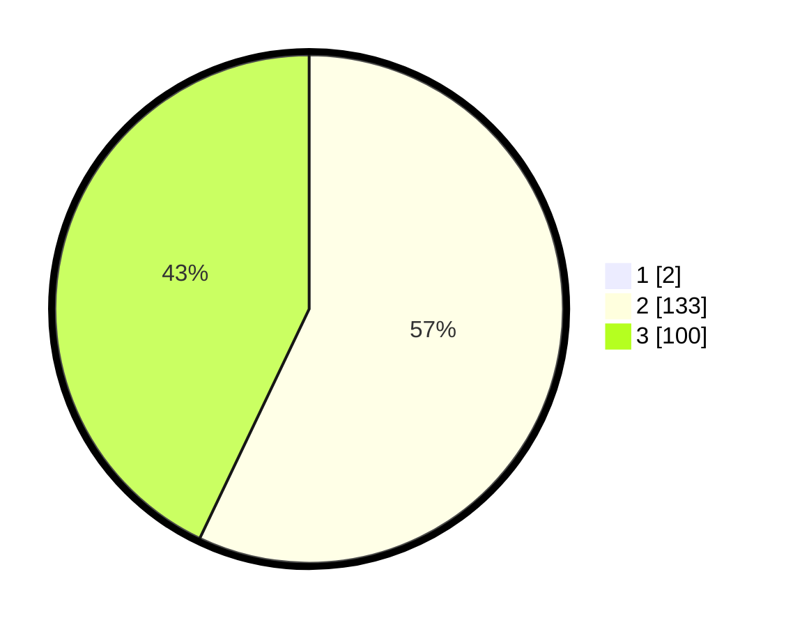

# Hasil

## Grafik

## Tabel

| No. | Nama Paslon    | Suara | Suara (raw) | Persentase |
|:--- |:-------------- | -----:| -----------:| ----------:|
| 1   | ANIES MUHAIMIN | 2     | [2][p-1]    | 0,85       |
| 2   | PRABOWO GIBRAN | 133   | [133][p-2]  | 56,60      |
| 3   | GANJAR MAHFUD  | 100   | [100][p-3]  | 42,55      |

[p-1]: https://github.com/gigit-pemilu/pemilu-2024-53-nusa-tenggara-timur/blob/main/pilpres/hitung-suara/sub/53-nusa-tenggara-timur/sub/07-sikka/sub/16-koting/sub/2001-koting-a/sub/004-tps/sub/paslon-1.txt
[p-2]: https://github.com/gigit-pemilu/pemilu-2024-53-nusa-tenggara-timur/blob/main/pilpres/hitung-suara/sub/53-nusa-tenggara-timur/sub/07-sikka/sub/16-koting/sub/2001-koting-a/sub/004-tps/sub/paslon-2.txt
[p-3]: https://github.com/gigit-pemilu/pemilu-2024-53-nusa-tenggara-timur/blob/main/pilpres/hitung-suara/sub/53-nusa-tenggara-timur/sub/07-sikka/sub/16-koting/sub/2001-koting-a/sub/004-tps/sub/paslon-3.txt

## Foto C Plano

https://sirekap-obj-formc.kpu.go.id/eb54/pemilu/ppwp/53/07/16/20/01/5307162001004-20240215-074629--463eb697-8e50-4b19-805a-fe12daab1a47.jpg

https://sirekap-obj-formc.kpu.go.id/eb54/pemilu/ppwp/53/07/16/20/01/5307162001004-20240215-074828--340d2544-9bd8-4986-a680-8c8aa49abee6.jpg

https://sirekap-obj-formc.kpu.go.id/eb54/pemilu/ppwp/53/07/16/20/01/5307162001004-20240215-075241--609b7c7c-55d9-4f97-abbb-4b1e91958d81.jpg

## Metadata

| Key        | Value               |
| ---------- | ------------------- |
| Time Stamp | 2024-02-15 18:00:26 |

