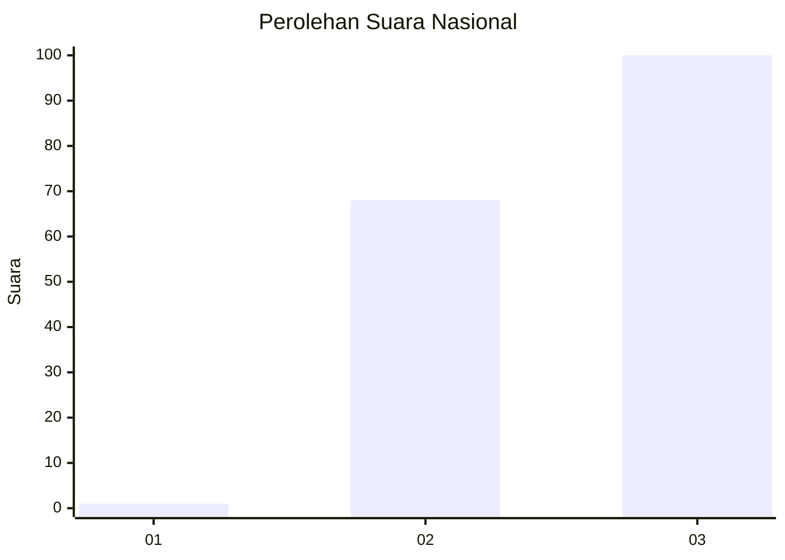
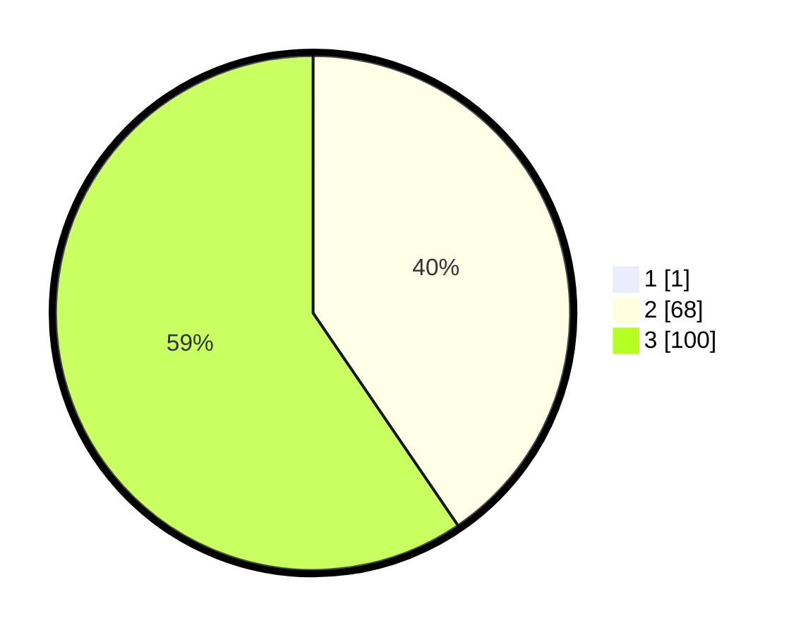

# Hasil

## Grafik

## Tabel

| No. | Nama Paslon    | Suara | Suara (raw) | Persentase |
|:--- |:-------------- | -----:| -----------:| ----------:|
| 1   | ANIES MUHAIMIN | 1     | [1][p-1]    | 0,59       |
| 2   | PRABOWO GIBRAN | 68    | [68][p-2]   | 40,24      |
| 3   | GANJAR MAHFUD  | 100   | [100][p-3]  | 59,17      |

[p-1]: https://github.com/gigit-pemilu/pemilu-2024/blob/main/pilpres/hitung-suara/sub/53-nusa-tenggara-timur/sub/07-sikka/sub/17-tana-wawo/sub/2002-bu-utara/sub/001-tps/sub/paslon-1.txt
[p-2]: https://github.com/gigit-pemilu/pemilu-2024/blob/main/pilpres/hitung-suara/sub/53-nusa-tenggara-timur/sub/07-sikka/sub/17-tana-wawo/sub/2002-bu-utara/sub/001-tps/sub/paslon-2.txt
[p-3]: https://github.com/gigit-pemilu/pemilu-2024/blob/main/pilpres/hitung-suara/sub/53-nusa-tenggara-timur/sub/07-sikka/sub/17-tana-wawo/sub/2002-bu-utara/sub/001-tps/sub/paslon-3.txt

## Foto C Plano

https://sirekap-obj-formc.kpu.go.id/1e9f/pemilu/ppwp/53/07/17/20/02/5307172002001-20240215-092215--2127d347-5873-4b83-99e5-9f4ac3e95113.jpg

https://sirekap-obj-formc.kpu.go.id/1e9f/pemilu/ppwp/53/07/17/20/02/5307172002001-20240215-092510--832ab5f4-10c0-410b-b12f-925e0b74831b.jpg

https://sirekap-obj-formc.kpu.go.id/1e9f/pemilu/ppwp/53/07/17/20/02/5307172002001-20240215-092846--74476b0e-a01a-4032-af78-6f66beaaef05.jpg

## Metadata

| Key        | Value               |
| ---------- | ------------------- |
| Time Stamp | 2024-02-16 10:00:28 |

