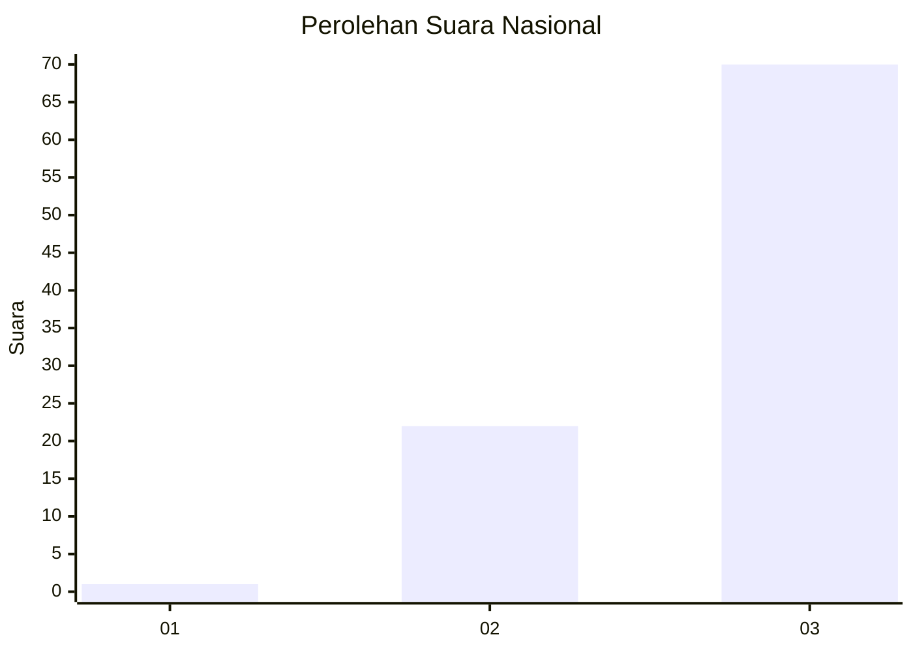
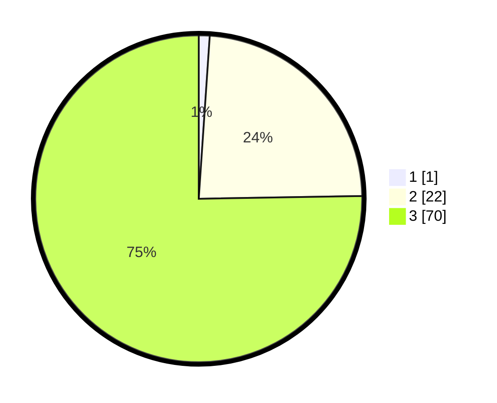

# Hasil

## Grafik

## Tabel

| No. | Nama Paslon    | Suara | Suara (raw) | Persentase |
|:--- |:-------------- | -----:| -----------:| ----------:|
| 1   | ANIES MUHAIMIN | 1     | [1][p-1]    | 1,08       |
| 2   | PRABOWO GIBRAN | 22    | [22][p-2]   | 23,66      |
| 3   | GANJAR MAHFUD  | 70    | [70][p-3]   | 75,27      |

[p-1]: https://github.com/gigit-pemilu/pemilu-2024/blob/main/pilpres/hitung-suara/sub/53-nusa-tenggara-timur/sub/07-sikka/sub/17-tana-wawo/sub/2002-bu-utara/sub/003-tps/sub/paslon-1.txt
[p-2]: https://github.com/gigit-pemilu/pemilu-2024/blob/main/pilpres/hitung-suara/sub/53-nusa-tenggara-timur/sub/07-sikka/sub/17-tana-wawo/sub/2002-bu-utara/sub/003-tps/sub/paslon-2.txt
[p-3]: https://github.com/gigit-pemilu/pemilu-2024/blob/main/pilpres/hitung-suara/sub/53-nusa-tenggara-timur/sub/07-sikka/sub/17-tana-wawo/sub/2002-bu-utara/sub/003-tps/sub/paslon-3.txt

## Foto C Plano

https://sirekap-obj-formc.kpu.go.id/9292/pemilu/ppwp/53/07/17/20/02/5307172002003-20240215-181616--8808574d-257c-4653-b808-2fd29c2b23e2.jpg

https://sirekap-obj-formc.kpu.go.id/9292/pemilu/ppwp/53/07/17/20/02/5307172002003-20240215-213918--3cc1dc3f-f9c8-4155-835a-6f6ca49d109d.jpg

https://sirekap-obj-formc.kpu.go.id/9292/pemilu/ppwp/53/07/17/20/02/5307172002003-20240215-214247--fa5eaec1-4a1e-4e64-a219-8cd6a3fd21b2.jpg

## Metadata

| Key        | Value               |
| ---------- | ------------------- |
| Time Stamp | 2024-02-15 22:30:27 |

