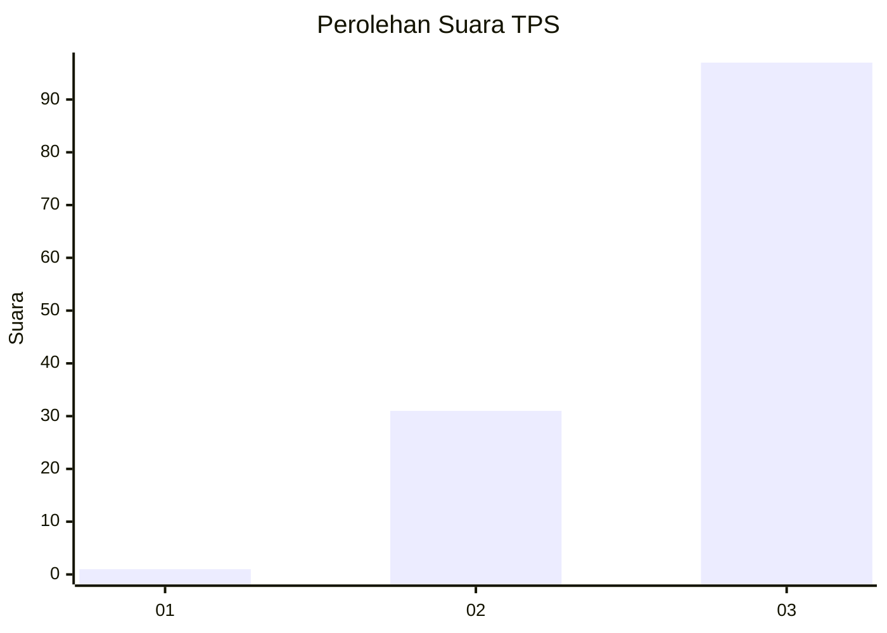
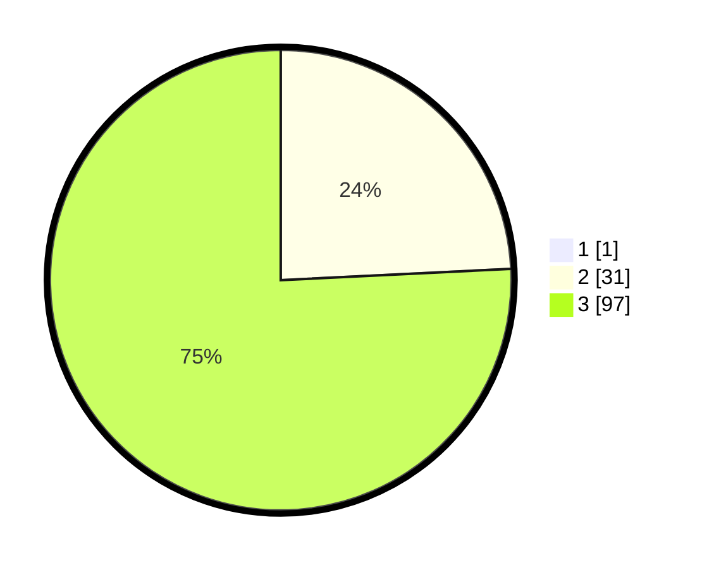

# Hasil

## Grafik

## Tabel

| No. | Nama Paslon    | Suara | Suara (raw) | Persentase |
|:--- |:-------------- | -----:| -----------:| ----------:|
| 1   | ANIES MUHAIMIN | 1     | [1][p-1]    | 0,78       |
| 2   | PRABOWO GIBRAN | 31    | [31][p-2]   | 24,03      |
| 3   | GANJAR MAHFUD  | 97    | [97][p-3]   | 75,19      |

[p-1]: https://github.com/gigit-pemilu/pemilu-2024-53-nusa-tenggara-timur/blob/main/pilpres/hitung-suara/sub/53-nusa-tenggara-timur/sub/07-sikka/sub/17-tana-wawo/sub/2004-loke/sub/003-tps/sub/paslon-1.txt
[p-2]: https://github.com/gigit-pemilu/pemilu-2024-53-nusa-tenggara-timur/blob/main/pilpres/hitung-suara/sub/53-nusa-tenggara-timur/sub/07-sikka/sub/17-tana-wawo/sub/2004-loke/sub/003-tps/sub/paslon-2.txt
[p-3]: https://github.com/gigit-pemilu/pemilu-2024-53-nusa-tenggara-timur/blob/main/pilpres/hitung-suara/sub/53-nusa-tenggara-timur/sub/07-sikka/sub/17-tana-wawo/sub/2004-loke/sub/003-tps/sub/paslon-3.txt

## Foto C Plano

https://sirekap-obj-formc.kpu.go.id/b8cd/pemilu/ppwp/53/07/17/20/04/5307172004003-20240214-141733--55796106-9bff-4b8c-8170-861613d9bb0b.jpg

https://sirekap-obj-formc.kpu.go.id/b8cd/pemilu/ppwp/53/07/17/20/04/5307172004003-20240215-071823--6c4c91c0-e212-4f49-af28-42cdba24f249.jpg

https://sirekap-obj-formc.kpu.go.id/b8cd/pemilu/ppwp/53/07/17/20/04/5307172004003-20240215-071849--eaa3effc-92dc-4cf6-bab4-d9804c7ced5f.jpg

## Metadata

| Key        | Value               |
| ---------- | ------------------- |
| Time Stamp | 2024-02-16 16:25:10 |

