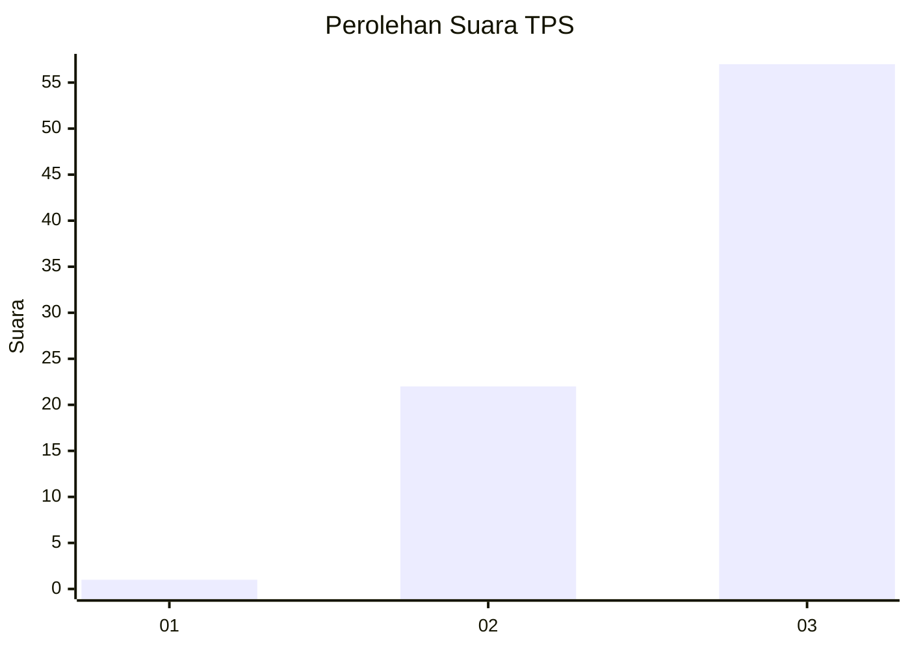
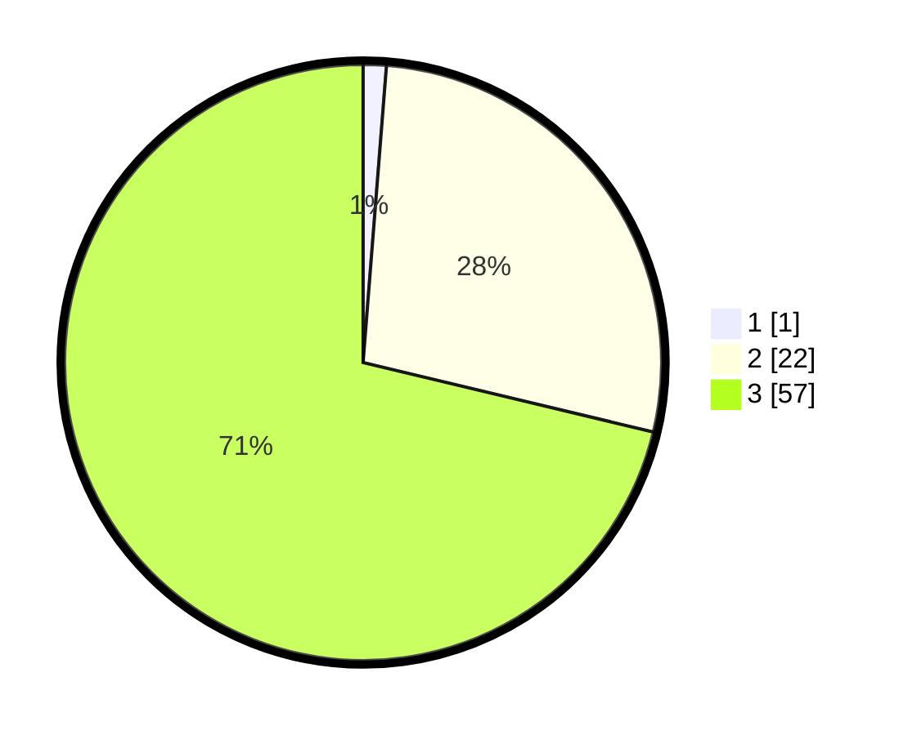

# Hasil

## Grafik

## Tabel

| No. | Nama Paslon    | Suara | Suara (raw) | Persentase |
|:--- |:-------------- | -----:| -----------:| ----------:|
| 1   | ANIES MUHAIMIN | 1     | [1][p-1]    | 1,25       |
| 2   | PRABOWO GIBRAN | 22    | [22][p-2]   | 27,50      |
| 3   | GANJAR MAHFUD  | 57    | [57][p-3]   | 71,25      |

[p-1]: https://github.com/gigit-pemilu/pemilu-2024-53-nusa-tenggara-timur/blob/main/pilpres/hitung-suara/sub/53-nusa-tenggara-timur/sub/07-sikka/sub/17-tana-wawo/sub/2004-loke/sub/004-tps/sub/paslon-1.txt
[p-2]: https://github.com/gigit-pemilu/pemilu-2024-53-nusa-tenggara-timur/blob/main/pilpres/hitung-suara/sub/53-nusa-tenggara-timur/sub/07-sikka/sub/17-tana-wawo/sub/2004-loke/sub/004-tps/sub/paslon-2.txt
[p-3]: https://github.com/gigit-pemilu/pemilu-2024-53-nusa-tenggara-timur/blob/main/pilpres/hitung-suara/sub/53-nusa-tenggara-timur/sub/07-sikka/sub/17-tana-wawo/sub/2004-loke/sub/004-tps/sub/paslon-3.txt

## Foto C Plano

https://sirekap-obj-formc.kpu.go.id/2b23/pemilu/ppwp/53/07/17/20/04/5307172004004-20240215-112109--4ed604bc-fb81-4dea-812d-c09eae842b87.jpg

https://sirekap-obj-formc.kpu.go.id/2b23/pemilu/ppwp/53/07/17/20/04/5307172004004-20240215-112846--dcac388f-677f-4d33-a34f-a7f3745b566e.jpg

https://sirekap-obj-formc.kpu.go.id/2b23/pemilu/ppwp/53/07/17/20/04/5307172004004-20240215-113315--fe9e42ff-35a4-4004-9c0c-5f78f566245d.jpg

## Metadata

| Key        | Value               |
| ---------- | ------------------- |
| Time Stamp | 2024-02-16 16:25:10 |

