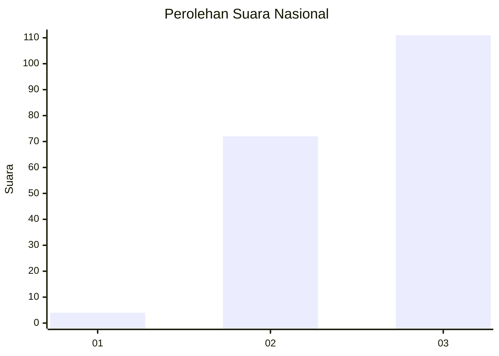
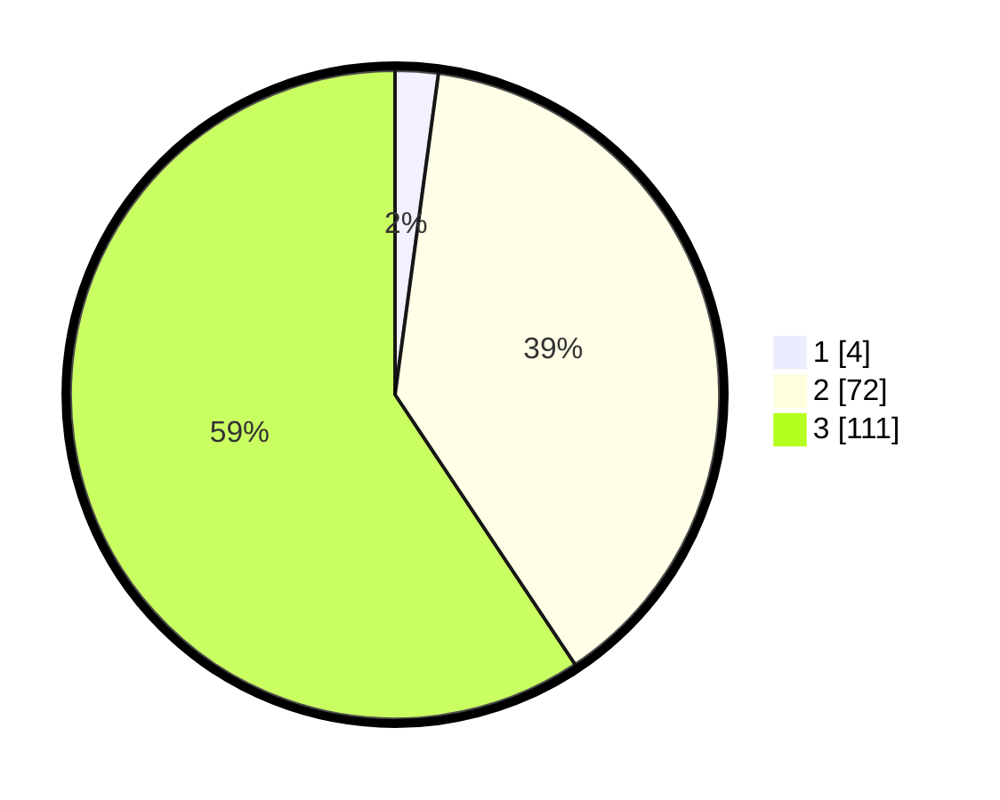

# Hasil

## Grafik

## Tabel

| No. | Nama Paslon    | Suara | Suara (raw) | Persentase |
|:--- |:-------------- | -----:| -----------:| ----------:|
| 1   | ANIES MUHAIMIN | 4     | [4][p-1]    | 2,14       |
| 2   | PRABOWO GIBRAN | 72    | [72][p-2]   | 38,50      |
| 3   | GANJAR MAHFUD  | 111   | [111][p-3]  | 59,36      |

[p-1]: https://github.com/gigit-pemilu/pemilu-2024/blob/main/pilpres/hitung-suara/sub/53-nusa-tenggara-timur/sub/07-sikka/sub/18-hewokloang/sub/2001-rubit/sub/006-tps/sub/paslon-1.txt
[p-2]: https://github.com/gigit-pemilu/pemilu-2024/blob/main/pilpres/hitung-suara/sub/53-nusa-tenggara-timur/sub/07-sikka/sub/18-hewokloang/sub/2001-rubit/sub/006-tps/sub/paslon-2.txt
[p-3]: https://github.com/gigit-pemilu/pemilu-2024/blob/main/pilpres/hitung-suara/sub/53-nusa-tenggara-timur/sub/07-sikka/sub/18-hewokloang/sub/2001-rubit/sub/006-tps/sub/paslon-3.txt

## Foto C Plano

https://sirekap-obj-formc.kpu.go.id/ab83/pemilu/ppwp/53/07/18/20/01/5307182001006-20240215-101220--98103114-22ef-4686-9f1e-b1474224a958.jpg

https://sirekap-obj-formc.kpu.go.id/ab83/pemilu/ppwp/53/07/18/20/01/5307182001006-20240216-143439--207ebbc7-bd94-4d73-85bc-c4b5092f2c4c.jpg

https://sirekap-obj-formc.kpu.go.id/ab83/pemilu/ppwp/53/07/18/20/01/5307182001006-20240215-101653--cecd933c-11e0-4dc1-afd8-30756d88abdf.jpg

## Metadata

| Key        | Value               |
| ---------- | ------------------- |
| Time Stamp | 2024-02-24 23:00:00 |

