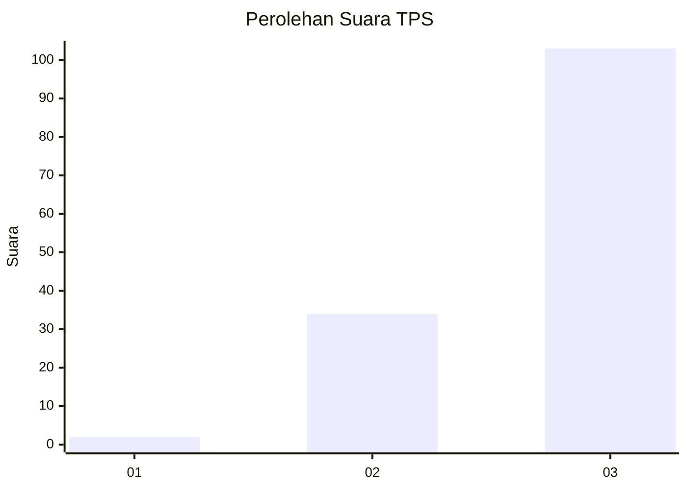
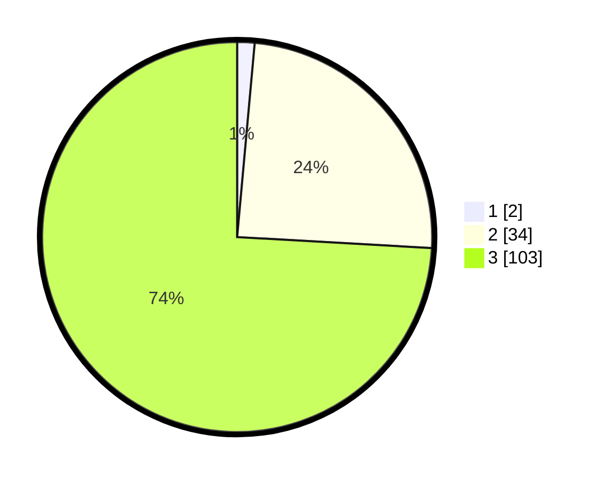

# Hasil

## Grafik

## Tabel

| No. | Nama Paslon    | Suara | Suara (raw) | Persentase |
|:--- |:-------------- | -----:| -----------:| ----------:|
| 1   | ANIES MUHAIMIN | 2     | [2][p-1]    | 1,44       |
| 2   | PRABOWO GIBRAN | 34    | [34][p-2]   | 24,46      |
| 3   | GANJAR MAHFUD  | 103   | [103][p-3]  | 74,10      |

[p-1]: https://github.com/gigit-pemilu/pemilu-2024-53-nusa-tenggara-timur/blob/main/pilpres/hitung-suara/sub/53-nusa-tenggara-timur/sub/07-sikka/sub/18-hewokloang/sub/2006-heopuat/sub/002-tps/sub/paslon-1.txt
[p-2]: https://github.com/gigit-pemilu/pemilu-2024-53-nusa-tenggara-timur/blob/main/pilpres/hitung-suara/sub/53-nusa-tenggara-timur/sub/07-sikka/sub/18-hewokloang/sub/2006-heopuat/sub/002-tps/sub/paslon-2.txt
[p-3]: https://github.com/gigit-pemilu/pemilu-2024-53-nusa-tenggara-timur/blob/main/pilpres/hitung-suara/sub/53-nusa-tenggara-timur/sub/07-sikka/sub/18-hewokloang/sub/2006-heopuat/sub/002-tps/sub/paslon-3.txt

## Foto C Plano

https://sirekap-obj-formc.kpu.go.id/148f/pemilu/ppwp/53/07/18/20/06/5307182006002-20240215-101415--1fb1e415-8f7c-4538-9adb-3c0a1a12ca0a.jpg

https://sirekap-obj-formc.kpu.go.id/148f/pemilu/ppwp/53/07/18/20/06/5307182006002-20240215-023456--04eca351-afe5-4b05-9275-1d5f6d477a72.jpg

https://sirekap-obj-formc.kpu.go.id/148f/pemilu/ppwp/53/07/18/20/06/5307182006002-20240215-023603--dd953a80-24f0-4ea9-840e-1ca80e29763b.jpg

## Metadata

| Key        | Value               |
| ---------- | ------------------- |
| Time Stamp | 2024-02-15 22:30:27 |

