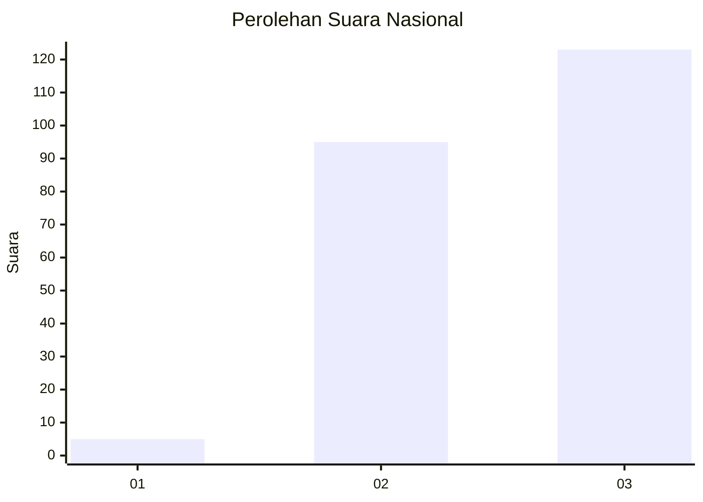
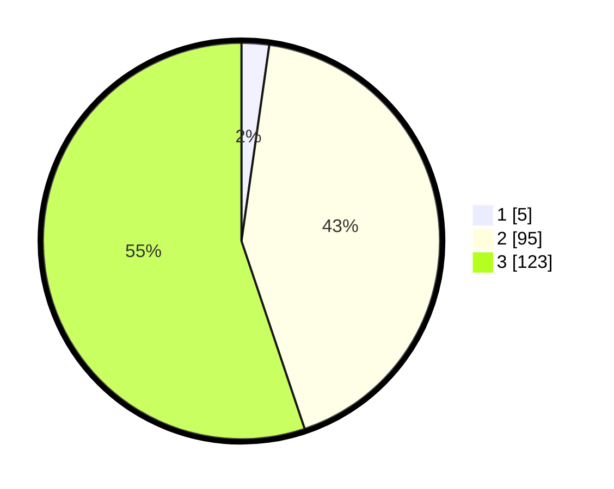

# Hasil

## Grafik

## Tabel

| No. | Nama Paslon    | Suara | Suara (raw) | Persentase |
|:--- |:-------------- | -----:| -----------:| ----------:|
| 1   | ANIES MUHAIMIN | 5     | [5][p-1]    | 2,24       |
| 2   | PRABOWO GIBRAN | 95    | [95][p-2]   | 42,60      |
| 3   | GANJAR MAHFUD  | 123   | [123][p-3]  | 55,16      |

[p-1]: https://github.com/gigit-pemilu/pemilu-2024/blob/main/pilpres/hitung-suara/sub/53-nusa-tenggara-timur/sub/07-sikka/sub/19-kangae/sub/2004-balatatatin/sub/002-tps/sub/paslon-1.txt
[p-2]: https://github.com/gigit-pemilu/pemilu-2024/blob/main/pilpres/hitung-suara/sub/53-nusa-tenggara-timur/sub/07-sikka/sub/19-kangae/sub/2004-balatatatin/sub/002-tps/sub/paslon-2.txt
[p-3]: https://github.com/gigit-pemilu/pemilu-2024/blob/main/pilpres/hitung-suara/sub/53-nusa-tenggara-timur/sub/07-sikka/sub/19-kangae/sub/2004-balatatatin/sub/002-tps/sub/paslon-3.txt

## Foto C Plano

https://sirekap-obj-formc.kpu.go.id/5d7b/pemilu/ppwp/53/07/19/20/04/5307192004002-20240215-083620--9cdc57aa-48b0-4221-8741-611b0e1c83a7.jpg

https://sirekap-obj-formc.kpu.go.id/5d7b/pemilu/ppwp/53/07/19/20/04/5307192004002-20240216-181608--bc6e5a2c-7ec2-4e78-8e3f-8e263b502ae2.jpg

https://sirekap-obj-formc.kpu.go.id/5d7b/pemilu/ppwp/53/07/19/20/04/5307192004002-20240216-182034--122d485a-ae73-43c6-9e2c-3edc42ed7bda.jpg

## Metadata

| Key        | Value               |
| ---------- | ------------------- |
| Time Stamp | 2024-02-25 13:00:00 |

