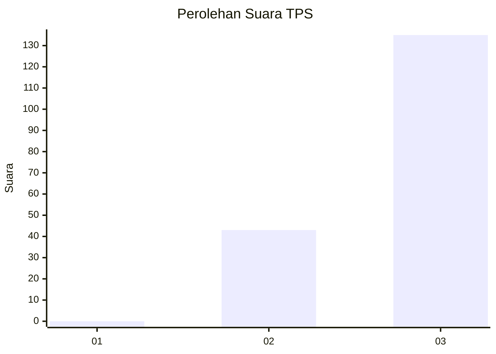
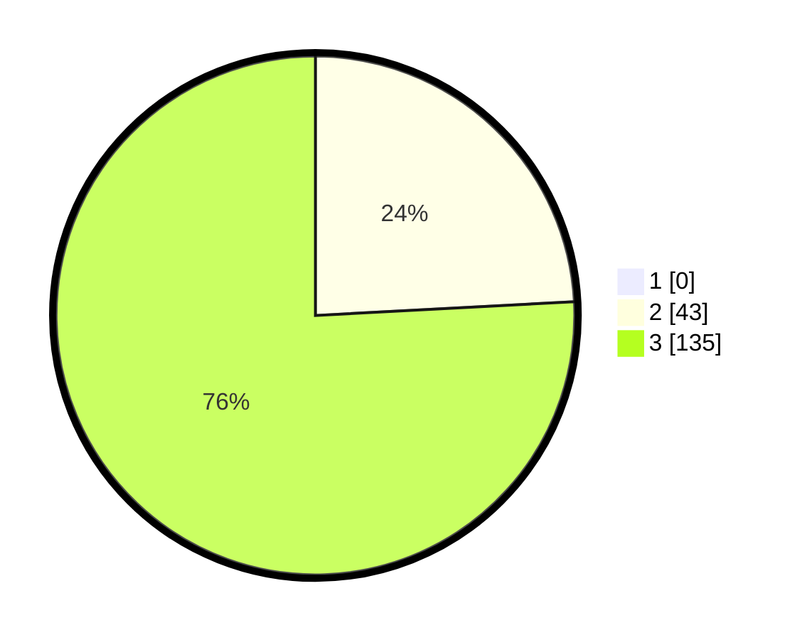

# Hasil

## Grafik

## Tabel

| No. | Nama Paslon    | Suara | Suara (raw) | Persentase |
|:--- |:-------------- | -----:| -----------:| ----------:|
| 1   | ANIES MUHAIMIN | 0     | [0][p-1]    | 0,00       |
| 2   | PRABOWO GIBRAN | 43    | [43][p-2]   | 24,16      |
| 3   | GANJAR MAHFUD  | 135   | [135][p-3]  | 75,84      |

[p-1]: https://github.com/gigit-pemilu/pemilu-2024-53-nusa-tenggara-timur/blob/main/pilpres/hitung-suara/sub/53-nusa-tenggara-timur/sub/08-ende/sub/01-nangapanda/sub/2013-sanggarhorho/sub/001-tps/sub/paslon-1.txt
[p-2]: https://github.com/gigit-pemilu/pemilu-2024-53-nusa-tenggara-timur/blob/main/pilpres/hitung-suara/sub/53-nusa-tenggara-timur/sub/08-ende/sub/01-nangapanda/sub/2013-sanggarhorho/sub/001-tps/sub/paslon-2.txt
[p-3]: https://github.com/gigit-pemilu/pemilu-2024-53-nusa-tenggara-timur/blob/main/pilpres/hitung-suara/sub/53-nusa-tenggara-timur/sub/08-ende/sub/01-nangapanda/sub/2013-sanggarhorho/sub/001-tps/sub/paslon-3.txt

## Foto C Plano

https://sirekap-obj-formc.kpu.go.id/8eff/pemilu/ppwp/53/08/01/20/13/5308012013001-20240215-074720--2a65e02b-a031-4200-8074-8a13ddeb24f8.jpg

https://sirekap-obj-formc.kpu.go.id/8eff/pemilu/ppwp/53/08/01/20/13/5308012013001-20240215-075057--ff2d167f-d34f-474b-8b71-5070ff8fd1aa.jpg

https://sirekap-obj-formc.kpu.go.id/8eff/pemilu/ppwp/53/08/01/20/13/5308012013001-20240215-075352--0c58e4b7-57d9-42bd-8972-496cd4543bf4.jpg

## Metadata

| Key        | Value               |
| ---------- | ------------------- |
| Time Stamp | 2024-02-15 15:30:25 |

