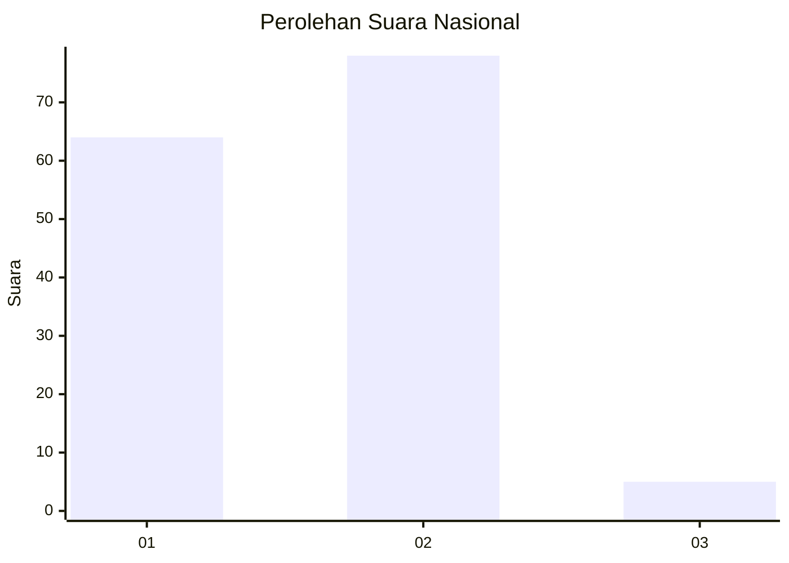
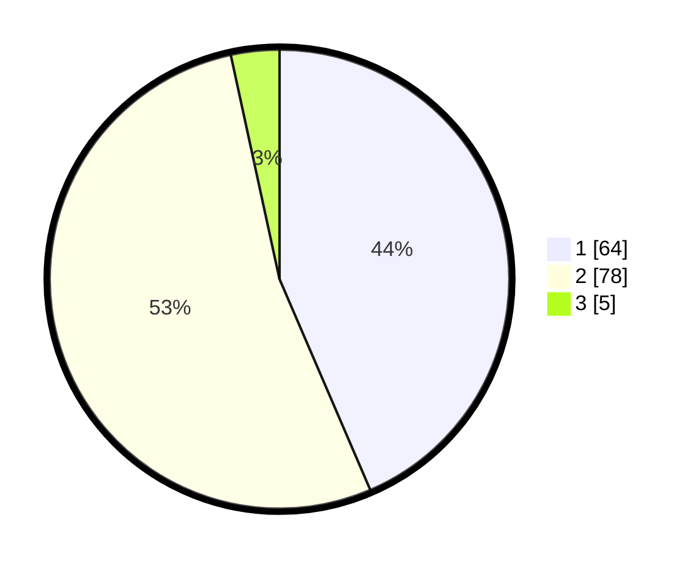

# Hasil

## Grafik

## Tabel

| No. | Nama Paslon    | Suara | Suara (raw) | Persentase |
|:--- |:-------------- | -----:| -----------:| ----------:|
| 1   | ANIES MUHAIMIN | 64    | [64][p-1]   | 43,54      |
| 2   | PRABOWO GIBRAN | 78    | [78][p-2]   | 53,06      |
| 3   | GANJAR MAHFUD  | 5     | [5][p-3]    | 3,40       |

[p-1]: https://github.com/gigit-pemilu/pemilu-2024/blob/main/pilpres/hitung-suara/sub/53-nusa-tenggara-timur/sub/08-ende/sub/02-pulau-ende/sub/2001-aejeti/sub/002-tps/sub/paslon-1.txt
[p-2]: https://github.com/gigit-pemilu/pemilu-2024/blob/main/pilpres/hitung-suara/sub/53-nusa-tenggara-timur/sub/08-ende/sub/02-pulau-ende/sub/2001-aejeti/sub/002-tps/sub/paslon-2.txt
[p-3]: https://github.com/gigit-pemilu/pemilu-2024/blob/main/pilpres/hitung-suara/sub/53-nusa-tenggara-timur/sub/08-ende/sub/02-pulau-ende/sub/2001-aejeti/sub/002-tps/sub/paslon-3.txt

## Foto C Plano

https://sirekap-obj-formc.kpu.go.id/091d/pemilu/ppwp/53/08/02/20/01/5308022001002-20240214-220332--579ed700-849e-4cc4-8da1-5ab674742912.jpg

https://sirekap-obj-formc.kpu.go.id/091d/pemilu/ppwp/53/08/02/20/01/5308022001002-20240214-221404--0fa992fd-a4d9-414c-abfb-237f05462932.jpg

https://sirekap-obj-formc.kpu.go.id/091d/pemilu/ppwp/53/08/02/20/01/5308022001002-20240214-221715--0987e9a1-e7c8-44fd-a564-ce7be4cc36d5.jpg

## Metadata

| Key        | Value               |
| ---------- | ------------------- |
| Time Stamp | 2024-02-15 15:00:29 |

