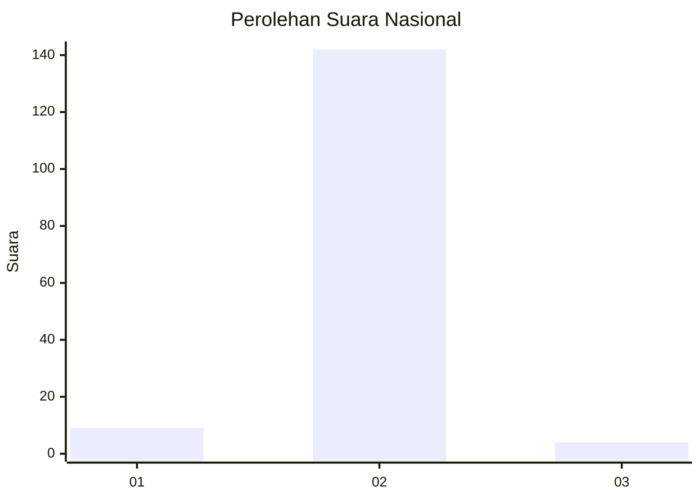
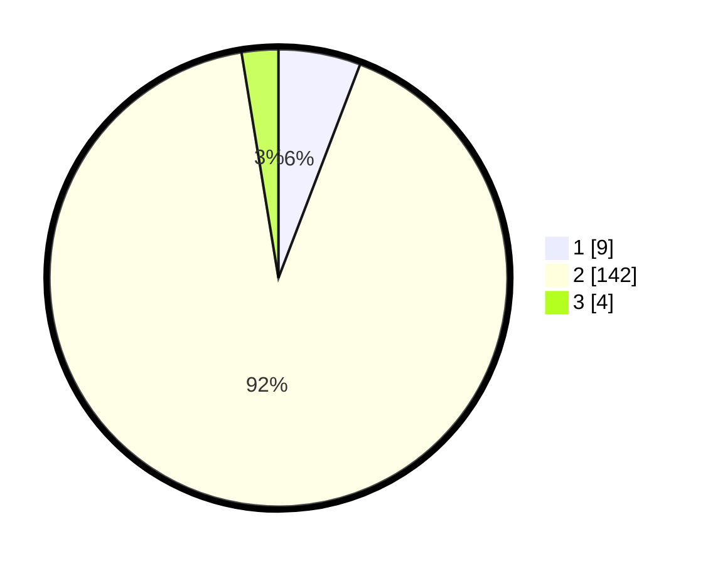

# Hasil

## Grafik

## Tabel

| No. | Nama Paslon    | Suara | Suara (raw) | Persentase |
|:--- |:-------------- | -----:| -----------:| ----------:|
| 1   | ANIES MUHAIMIN | 9     | [9][p-1]    | 5,81       |
| 2   | PRABOWO GIBRAN | 142   | [142][p-2]  | 91,61      |
| 3   | GANJAR MAHFUD  | 4     | [4][p-3]    | 2,58       |

[p-1]: https://github.com/gigit-pemilu/pemilu-2024/blob/main/pilpres/hitung-suara/sub/53-nusa-tenggara-timur/sub/08-ende/sub/02-pulau-ende/sub/2001-aejeti/sub/003-tps/sub/paslon-1.txt
[p-2]: https://github.com/gigit-pemilu/pemilu-2024/blob/main/pilpres/hitung-suara/sub/53-nusa-tenggara-timur/sub/08-ende/sub/02-pulau-ende/sub/2001-aejeti/sub/003-tps/sub/paslon-2.txt
[p-3]: https://github.com/gigit-pemilu/pemilu-2024/blob/main/pilpres/hitung-suara/sub/53-nusa-tenggara-timur/sub/08-ende/sub/02-pulau-ende/sub/2001-aejeti/sub/003-tps/sub/paslon-3.txt

## Foto C Plano

https://sirekap-obj-formc.kpu.go.id/7fdb/pemilu/ppwp/53/08/02/20/01/5308022001003-20240215-080225--afa7140f-846a-4f93-a475-93b360d2172f.jpg

https://sirekap-obj-formc.kpu.go.id/7fdb/pemilu/ppwp/53/08/02/20/01/5308022001003-20240215-080427--b78056c4-5734-4d68-8ac0-f33319d696c0.jpg

https://sirekap-obj-formc.kpu.go.id/7fdb/pemilu/ppwp/53/08/02/20/01/5308022001003-20240215-080908--3f1dd11f-80d4-484c-a96f-506cfd4272a0.jpg

## Metadata

| Key        | Value               |
| ---------- | ------------------- |
| Time Stamp | 2024-02-16 16:25:10 |

