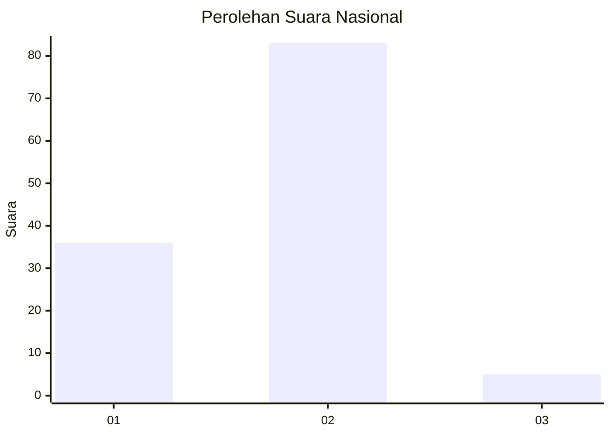
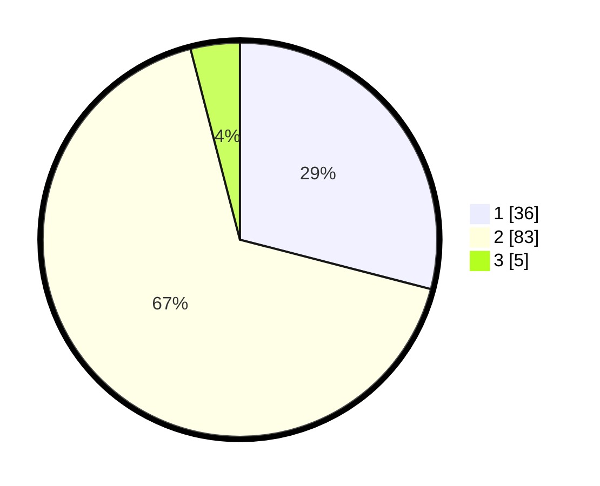

# Hasil

## Grafik

## Tabel

| No. | Nama Paslon    | Suara | Suara (raw) | Persentase |
|:--- |:-------------- | -----:| -----------:| ----------:|
| 1   | ANIES MUHAIMIN | 36    | [36][p-1]   | 29,03      |
| 2   | PRABOWO GIBRAN | 83    | [83][p-2]   | 66,94      |
| 3   | GANJAR MAHFUD  | 5     | [5][p-3]    | 4,03       |

[p-1]: https://github.com/gigit-pemilu/pemilu-2024/blob/main/pilpres/hitung-suara/sub/53-nusa-tenggara-timur/sub/08-ende/sub/02-pulau-ende/sub/2002-puutara/sub/001-tps/sub/paslon-1.txt
[p-2]: https://github.com/gigit-pemilu/pemilu-2024/blob/main/pilpres/hitung-suara/sub/53-nusa-tenggara-timur/sub/08-ende/sub/02-pulau-ende/sub/2002-puutara/sub/001-tps/sub/paslon-2.txt
[p-3]: https://github.com/gigit-pemilu/pemilu-2024/blob/main/pilpres/hitung-suara/sub/53-nusa-tenggara-timur/sub/08-ende/sub/02-pulau-ende/sub/2002-puutara/sub/001-tps/sub/paslon-3.txt

## Foto C Plano

https://sirekap-obj-formc.kpu.go.id/0cdb/pemilu/ppwp/53/08/02/20/02/5308022002001-20240222-103409--cbc06f24-ca52-4981-b7a9-6e823c5e9378.jpg

https://sirekap-obj-formc.kpu.go.id/0cdb/pemilu/ppwp/53/08/02/20/02/5308022002001-20240222-103525--5e44511e-2140-4c76-9e28-90c231ef7436.jpg

https://sirekap-obj-formc.kpu.go.id/0cdb/pemilu/ppwp/53/08/02/20/02/5308022002001-20240222-103609--376b9a70-0ec5-4061-93da-cd9152a63f0d.jpg

## Metadata

| Key        | Value               |
| ---------- | ------------------- |
| Time Stamp | 2024-02-25 08:00:00 |

