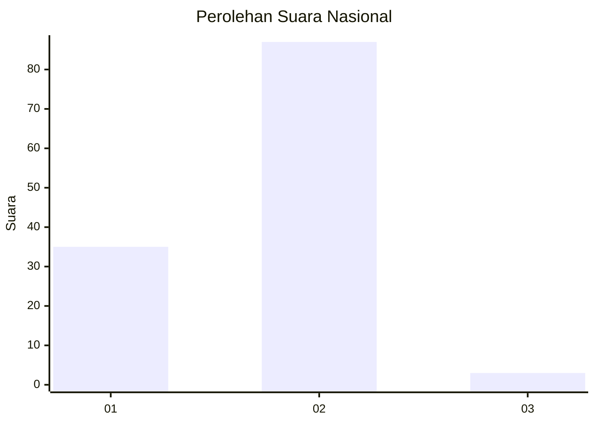
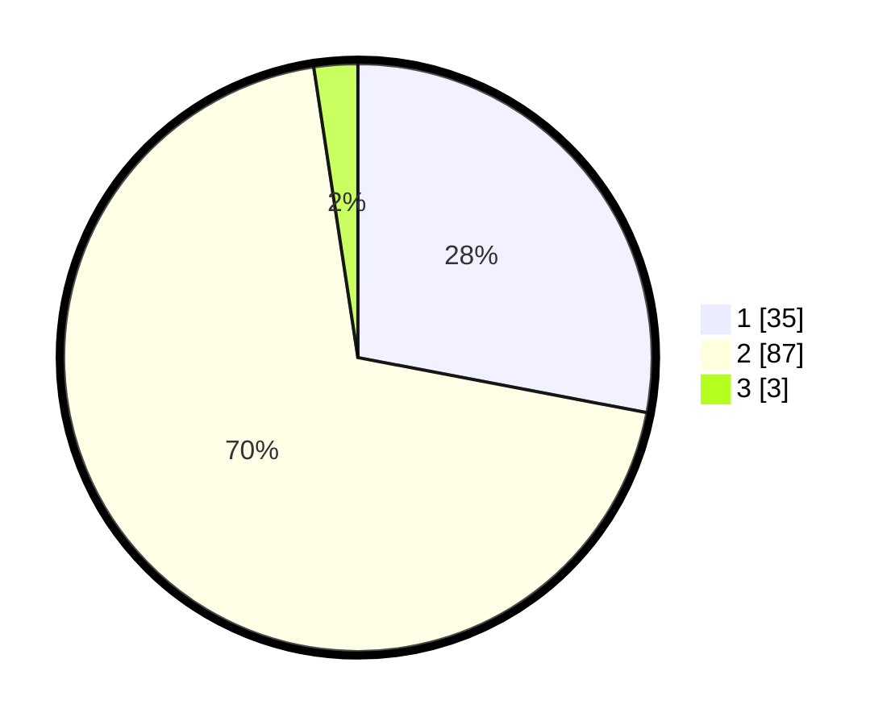

# Hasil

## Grafik

## Tabel

| No. | Nama Paslon    | Suara | Suara (raw) | Persentase |
|:--- |:-------------- | -----:| -----------:| ----------:|
| 1   | ANIES MUHAIMIN | 35    | [35][p-1]   | 28,00      |
| 2   | PRABOWO GIBRAN | 87    | [87][p-2]   | 69,60      |
| 3   | GANJAR MAHFUD  | 3     | [3][p-3]    | 2,40       |

[p-1]: https://github.com/gigit-pemilu/pemilu-2024/blob/main/pilpres/hitung-suara/sub/53-nusa-tenggara-timur/sub/08-ende/sub/02-pulau-ende/sub/2002-puutara/sub/002-tps/sub/paslon-1.txt
[p-2]: https://github.com/gigit-pemilu/pemilu-2024/blob/main/pilpres/hitung-suara/sub/53-nusa-tenggara-timur/sub/08-ende/sub/02-pulau-ende/sub/2002-puutara/sub/002-tps/sub/paslon-2.txt
[p-3]: https://github.com/gigit-pemilu/pemilu-2024/blob/main/pilpres/hitung-suara/sub/53-nusa-tenggara-timur/sub/08-ende/sub/02-pulau-ende/sub/2002-puutara/sub/002-tps/sub/paslon-3.txt

## Foto C Plano

https://sirekap-obj-formc.kpu.go.id/369f/pemilu/ppwp/53/08/02/20/02/5308022002002-20240222-110456--d1e7e586-cd89-4a22-8a60-e3e9f20828ab.jpg

https://sirekap-obj-formc.kpu.go.id/369f/pemilu/ppwp/53/08/02/20/02/5308022002002-20240222-110530--370b775d-53c5-4fa0-a94e-a62440c3b5e3.jpg

https://sirekap-obj-formc.kpu.go.id/369f/pemilu/ppwp/53/08/02/20/02/5308022002002-20240222-110602--753095ad-19f4-4f63-b679-3f3a3bb09f28.jpg

## Metadata

| Key        | Value               |
| ---------- | ------------------- |
| Time Stamp | 2024-02-24 22:31:28 |

