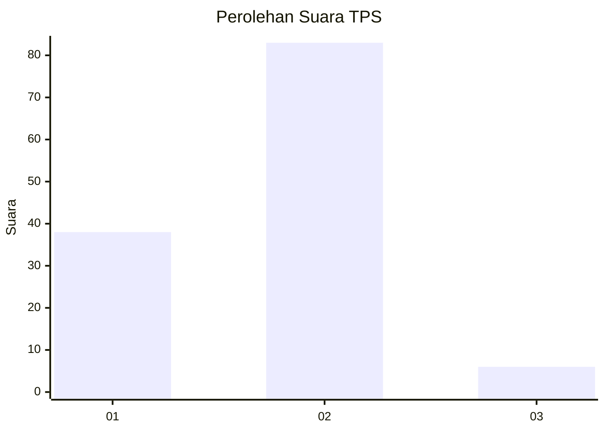
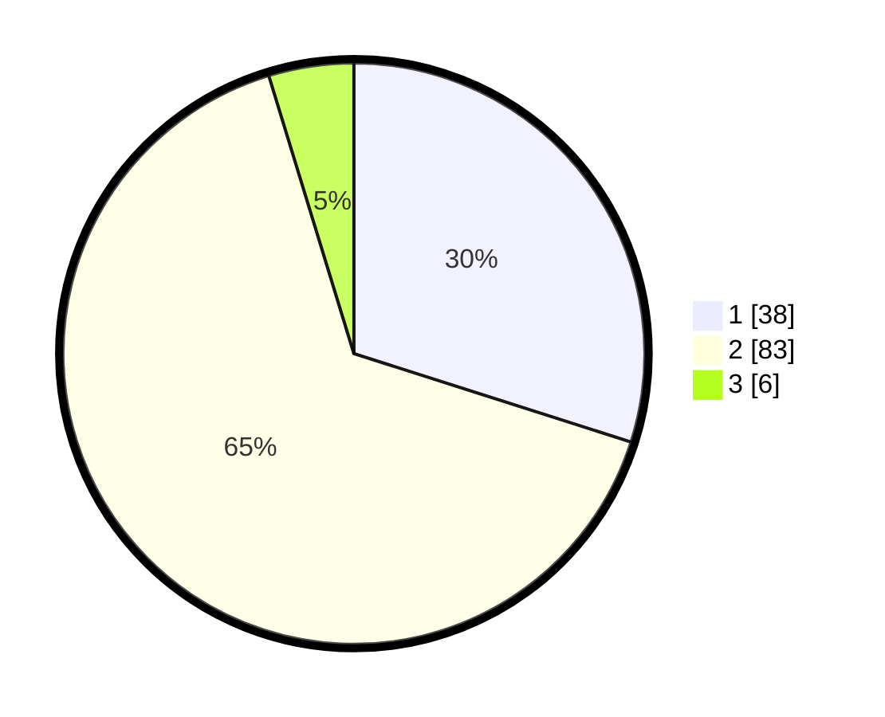

# Hasil

## Grafik

## Tabel

| No. | Nama Paslon    | Suara | Suara (raw) | Persentase |
|:--- |:-------------- | -----:| -----------:| ----------:|
| 1   | ANIES MUHAIMIN | 38    | [38][p-1]   | 29,92      |
| 2   | PRABOWO GIBRAN | 83    | [83][p-2]   | 65,35      |
| 3   | GANJAR MAHFUD  | 6     | [6][p-3]    | 4,72       |

[p-1]: https://github.com/gigit-pemilu/pemilu-2024-53-nusa-tenggara-timur/blob/main/pilpres/hitung-suara/sub/53-nusa-tenggara-timur/sub/08-ende/sub/02-pulau-ende/sub/2002-puutara/sub/003-tps/sub/paslon-1.txt
[p-2]: https://github.com/gigit-pemilu/pemilu-2024-53-nusa-tenggara-timur/blob/main/pilpres/hitung-suara/sub/53-nusa-tenggara-timur/sub/08-ende/sub/02-pulau-ende/sub/2002-puutara/sub/003-tps/sub/paslon-2.txt
[p-3]: https://github.com/gigit-pemilu/pemilu-2024-53-nusa-tenggara-timur/blob/main/pilpres/hitung-suara/sub/53-nusa-tenggara-timur/sub/08-ende/sub/02-pulau-ende/sub/2002-puutara/sub/003-tps/sub/paslon-3.txt

## Foto C Plano

https://sirekap-obj-formc.kpu.go.id/289a/pemilu/ppwp/53/08/02/20/02/5308022002003-20240222-110145--1e3a05dc-af6f-4220-aabc-d6dc5e8261a0.jpg

https://sirekap-obj-formc.kpu.go.id/289a/pemilu/ppwp/53/08/02/20/02/5308022002003-20240222-110231--8fe52388-8cb9-48f5-a147-1eea253b5d82.jpg

https://sirekap-obj-formc.kpu.go.id/289a/pemilu/ppwp/53/08/02/20/02/5308022002003-20240222-110304--8522f839-73b8-4e3b-899c-866c98c51c7c.jpg

## Metadata

| Key        | Value               |
| ---------- | ------------------- |
| Time Stamp | 2024-02-25 09:00:00 |

