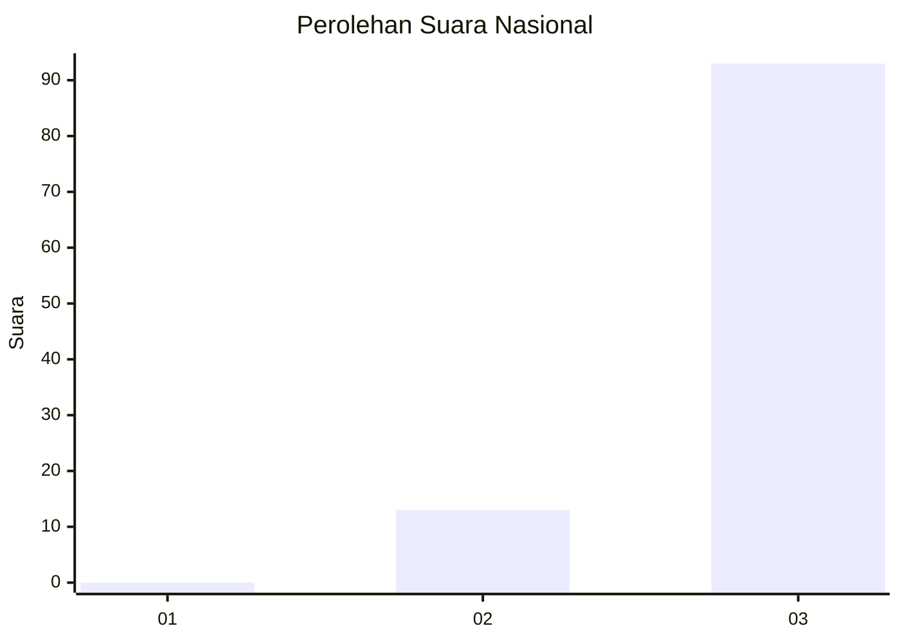
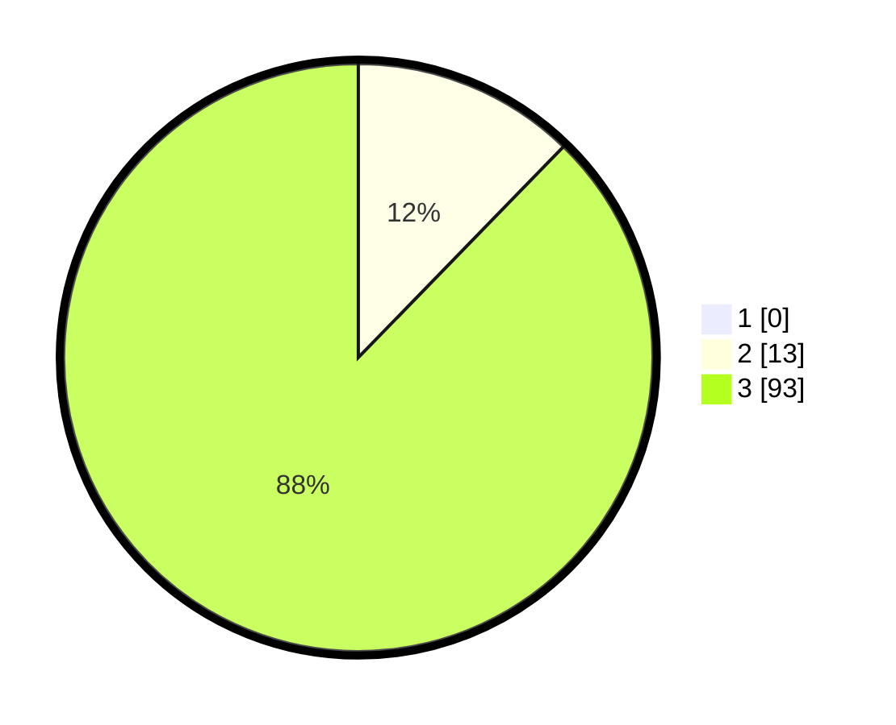

# Hasil

## Grafik

## Tabel

| No. | Nama Paslon    | Suara | Suara (raw) | Persentase |
|:--- |:-------------- | -----:| -----------:| ----------:|
| 1   | ANIES MUHAIMIN | 0     | [0][p-1]    | 0,00       |
| 2   | PRABOWO GIBRAN | 13    | [13][p-2]   | 12,26      |
| 3   | GANJAR MAHFUD  | 93    | [93][p-3]   | 87,74      |

[p-1]: https://github.com/gigit-pemilu/pemilu-2024/blob/main/pilpres/hitung-suara/sub/53-nusa-tenggara-timur/sub/08-ende/sub/03-ende/sub/2001-raburia/sub/002-tps/sub/paslon-1.txt
[p-2]: https://github.com/gigit-pemilu/pemilu-2024/blob/main/pilpres/hitung-suara/sub/53-nusa-tenggara-timur/sub/08-ende/sub/03-ende/sub/2001-raburia/sub/002-tps/sub/paslon-2.txt
[p-3]: https://github.com/gigit-pemilu/pemilu-2024/blob/main/pilpres/hitung-suara/sub/53-nusa-tenggara-timur/sub/08-ende/sub/03-ende/sub/2001-raburia/sub/002-tps/sub/paslon-3.txt

## Foto C Plano

https://sirekap-obj-formc.kpu.go.id/5e9a/pemilu/ppwp/53/08/03/20/01/5308032001002-20240215-082655--8812bc7e-1fdd-4276-bfcf-8f455e582eed.jpg

https://sirekap-obj-formc.kpu.go.id/5e9a/pemilu/ppwp/53/08/03/20/01/5308032001002-20240215-083229--38fae020-5518-4a18-be81-c12716d165c0.jpg

https://sirekap-obj-formc.kpu.go.id/5e9a/pemilu/ppwp/53/08/03/20/01/5308032001002-20240215-083947--2ddf67fa-5661-4a7f-be23-72560cdd5536.jpg

## Metadata

| Key        | Value               |
| ---------- | ------------------- |
| Time Stamp | 2024-02-16 16:25:10 |

