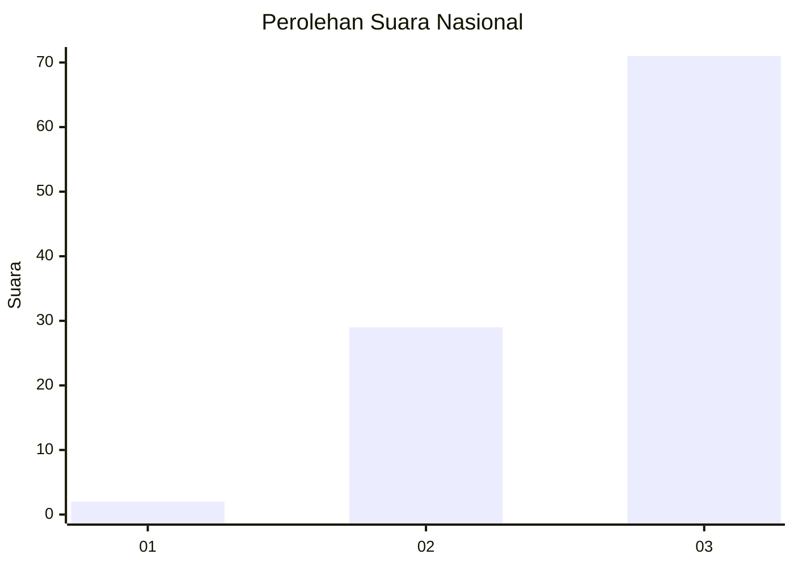
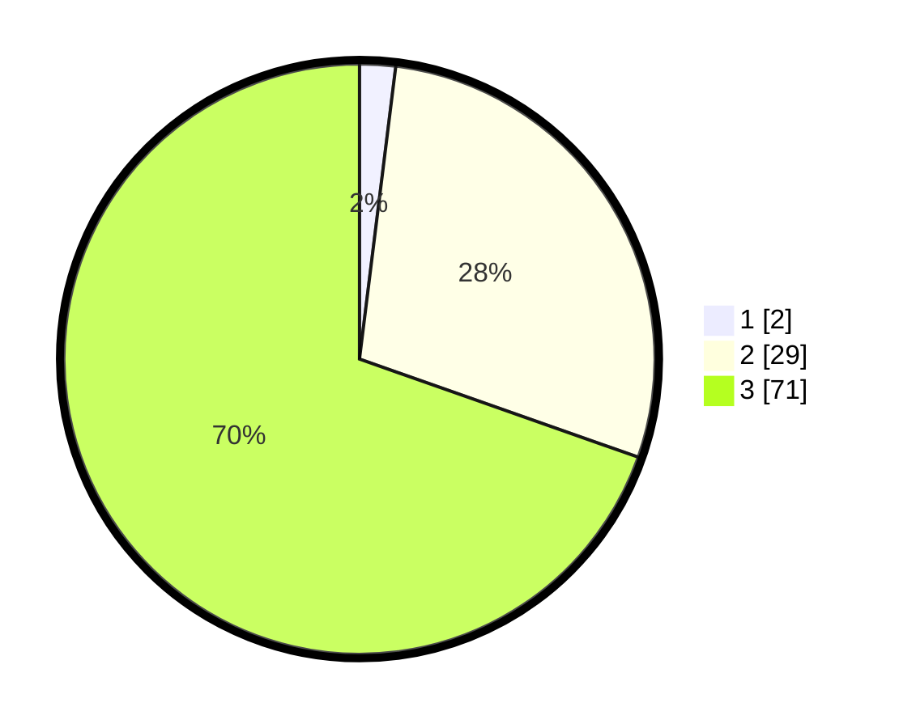

# Hasil

## Grafik

## Tabel

| No. | Nama Paslon    | Suara | Suara (raw) | Persentase |
|:--- |:-------------- | -----:| -----------:| ----------:|
| 1   | ANIES MUHAIMIN | 2     | [2][p-1]    | 1,96       |
| 2   | PRABOWO GIBRAN | 29    | [29][p-2]   | 28,43      |
| 3   | GANJAR MAHFUD  | 71    | [71][p-3]   | 69,61      |

[p-1]: https://github.com/gigit-pemilu/pemilu-2024/blob/main/pilpres/hitung-suara/sub/53-nusa-tenggara-timur/sub/08-ende/sub/03-ende/sub/2001-raburia/sub/003-tps/sub/paslon-1.txt
[p-2]: https://github.com/gigit-pemilu/pemilu-2024/blob/main/pilpres/hitung-suara/sub/53-nusa-tenggara-timur/sub/08-ende/sub/03-ende/sub/2001-raburia/sub/003-tps/sub/paslon-2.txt
[p-3]: https://github.com/gigit-pemilu/pemilu-2024/blob/main/pilpres/hitung-suara/sub/53-nusa-tenggara-timur/sub/08-ende/sub/03-ende/sub/2001-raburia/sub/003-tps/sub/paslon-3.txt

## Foto C Plano

https://sirekap-obj-formc.kpu.go.id/4381/pemilu/ppwp/53/08/03/20/01/5308032001003-20240215-093721--ae793bf1-97b3-413f-a3e3-e7ac29d1a63d.jpg

https://sirekap-obj-formc.kpu.go.id/4381/pemilu/ppwp/53/08/03/20/01/5308032001003-20240215-094251--7d4bf066-004f-48e9-9098-59b450d6dabe.jpg

https://sirekap-obj-formc.kpu.go.id/4381/pemilu/ppwp/53/08/03/20/01/5308032001003-20240215-094501--e8c45b71-89a9-4a45-b5d9-719522c9c756.jpg

## Metadata

| Key        | Value               |
| ---------- | ------------------- |
| Time Stamp | 2024-02-19 06:16:00 |

