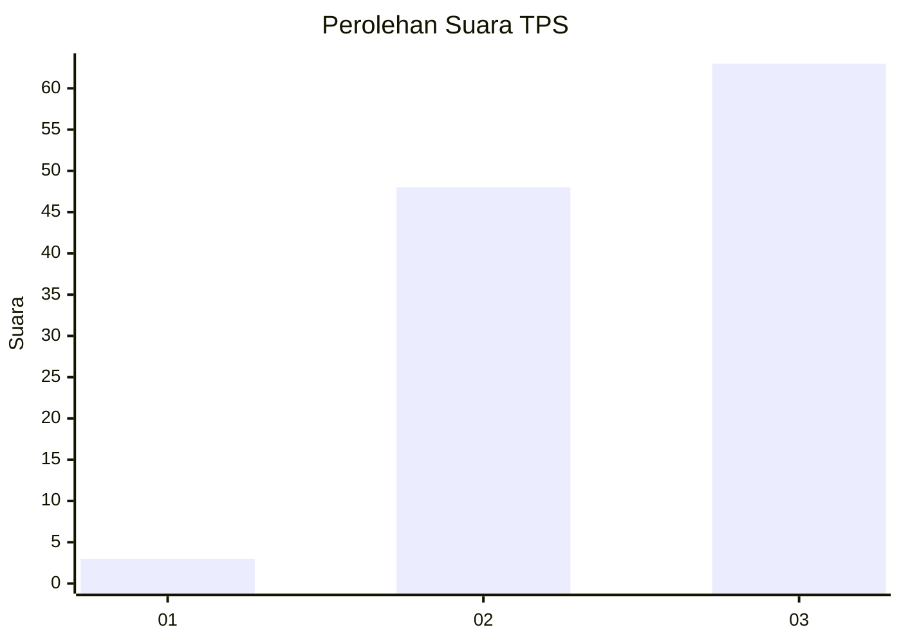
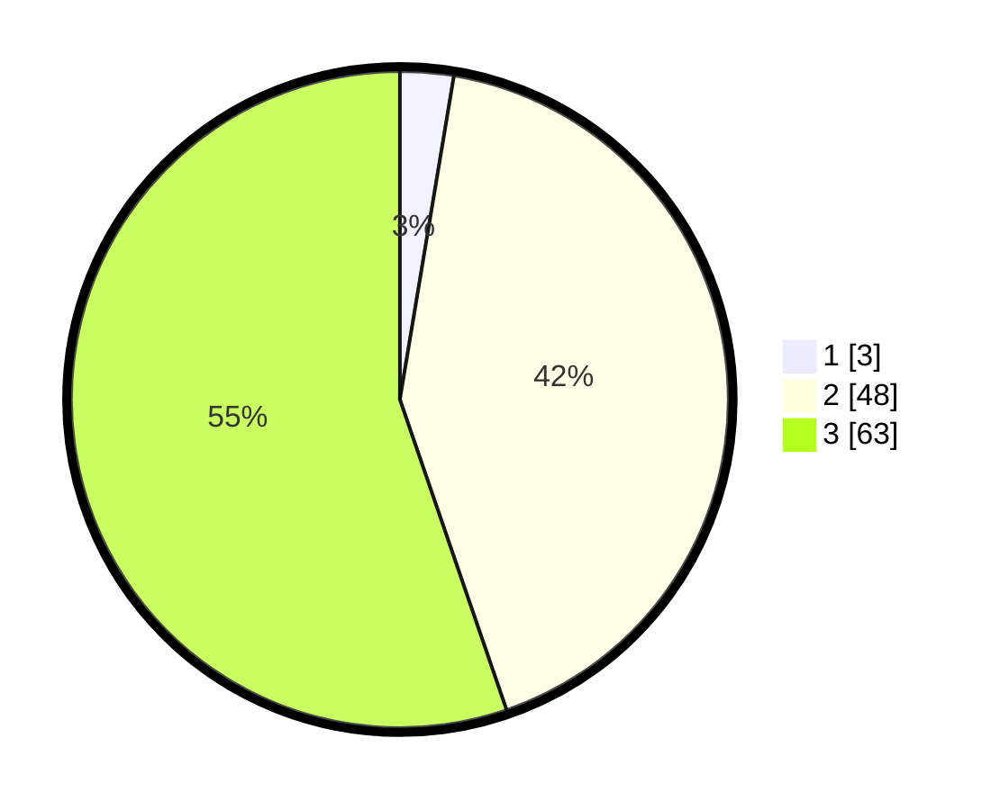

# Hasil

## Grafik

## Tabel

| No. | Nama Paslon    | Suara | Suara (raw) | Persentase |
|:--- |:-------------- | -----:| -----------:| ----------:|
| 1   | ANIES MUHAIMIN | 3     | [3][p-1]    | 2,63       |
| 2   | PRABOWO GIBRAN | 48    | [48][p-2]   | 42,11      |
| 3   | GANJAR MAHFUD  | 63    | [63][p-3]   | 55,26      |

[p-1]: https://github.com/gigit-pemilu/pemilu-2024-53-nusa-tenggara-timur/blob/main/pilpres/hitung-suara/sub/53-nusa-tenggara-timur/sub/08-ende/sub/03-ende/sub/2020-uzuramba/sub/001-tps/sub/paslon-1.txt
[p-2]: https://github.com/gigit-pemilu/pemilu-2024-53-nusa-tenggara-timur/blob/main/pilpres/hitung-suara/sub/53-nusa-tenggara-timur/sub/08-ende/sub/03-ende/sub/2020-uzuramba/sub/001-tps/sub/paslon-2.txt
[p-3]: https://github.com/gigit-pemilu/pemilu-2024-53-nusa-tenggara-timur/blob/main/pilpres/hitung-suara/sub/53-nusa-tenggara-timur/sub/08-ende/sub/03-ende/sub/2020-uzuramba/sub/001-tps/sub/paslon-3.txt

## Foto C Plano

https://sirekap-obj-formc.kpu.go.id/9496/pemilu/ppwp/53/08/03/20/20/5308032020001-20240215-080114--6ded5a9c-57bd-420e-8d8b-b28c961440e2.jpg

https://sirekap-obj-formc.kpu.go.id/9496/pemilu/ppwp/53/08/03/20/20/5308032020001-20240214-222614--55fc1226-9e07-49be-bc1b-8d3d7b90e807.jpg

https://sirekap-obj-formc.kpu.go.id/9496/pemilu/ppwp/53/08/03/20/20/5308032020001-20240214-222623--51e53c91-29f6-409a-8b28-d13c39abb30c.jpg

## Metadata

| Key        | Value               |
| ---------- | ------------------- |
| Time Stamp | 2024-02-19 06:16:00 |

