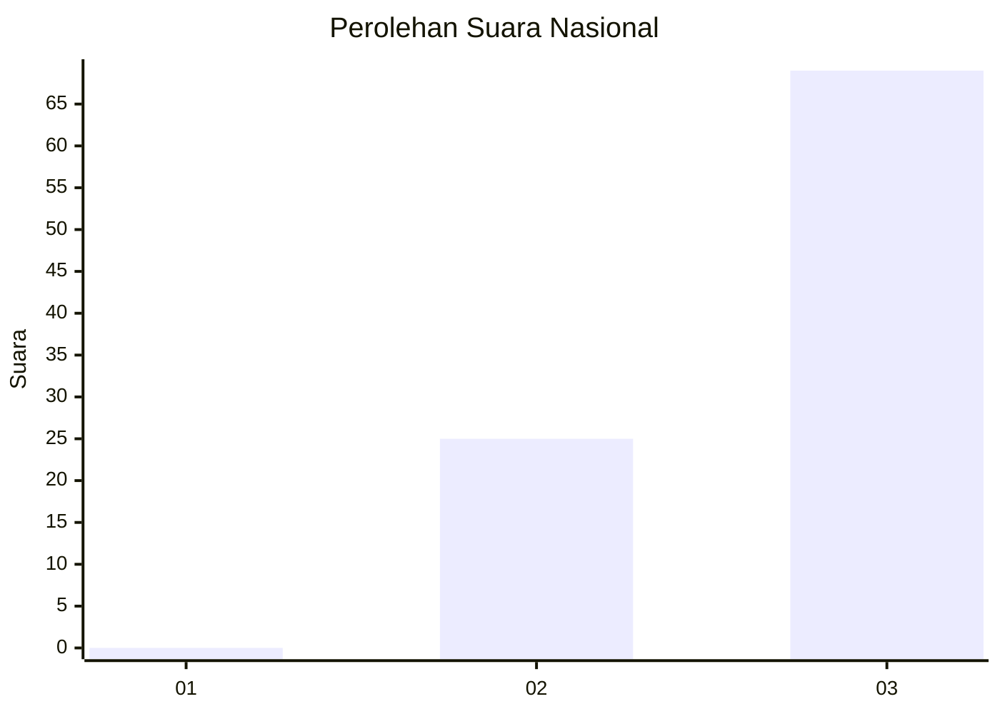
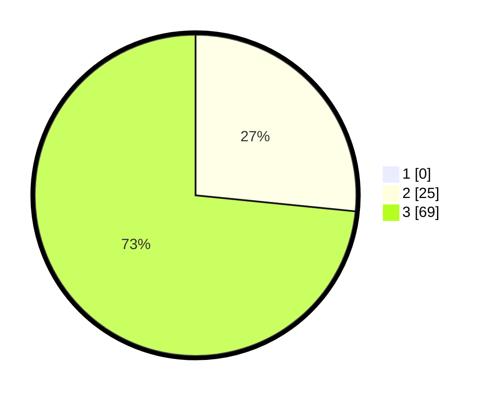

# Hasil

## Grafik

## Tabel

| No. | Nama Paslon    | Suara | Suara (raw) | Persentase |
|:--- |:-------------- | -----:| -----------:| ----------:|
| 1   | ANIES MUHAIMIN | 0     | [0][p-1]    | 0,00       |
| 2   | PRABOWO GIBRAN | 25    | [25][p-2]   | 26,60      |
| 3   | GANJAR MAHFUD  | 69    | [69][p-3]   | 73,40      |

[p-1]: https://github.com/gigit-pemilu/pemilu-2024/blob/main/pilpres/hitung-suara/sub/53-nusa-tenggara-timur/sub/08-ende/sub/03-ende/sub/2035-uzuramba-barat/sub/001-tps/sub/paslon-1.txt
[p-2]: https://github.com/gigit-pemilu/pemilu-2024/blob/main/pilpres/hitung-suara/sub/53-nusa-tenggara-timur/sub/08-ende/sub/03-ende/sub/2035-uzuramba-barat/sub/001-tps/sub/paslon-2.txt
[p-3]: https://github.com/gigit-pemilu/pemilu-2024/blob/main/pilpres/hitung-suara/sub/53-nusa-tenggara-timur/sub/08-ende/sub/03-ende/sub/2035-uzuramba-barat/sub/001-tps/sub/paslon-3.txt

## Foto C Plano

https://sirekap-obj-formc.kpu.go.id/6346/pemilu/ppwp/53/08/03/20/35/5308032035001-20240215-124628--10e42663-91a9-4581-87e7-b640ddcdc749.jpg

https://sirekap-obj-formc.kpu.go.id/6346/pemilu/ppwp/53/08/03/20/35/5308032035001-20240215-124739--ed4eea27-96ed-4775-a07e-55ab3f0d0e3f.jpg

https://sirekap-obj-formc.kpu.go.id/6346/pemilu/ppwp/53/08/03/20/35/5308032035001-20240215-124949--d775dd1e-d06b-49a1-8075-ace49eb184c9.jpg

## Metadata

| Key        | Value               |
| ---------- | ------------------- |
| Time Stamp | 2024-02-16 16:25:10 |

