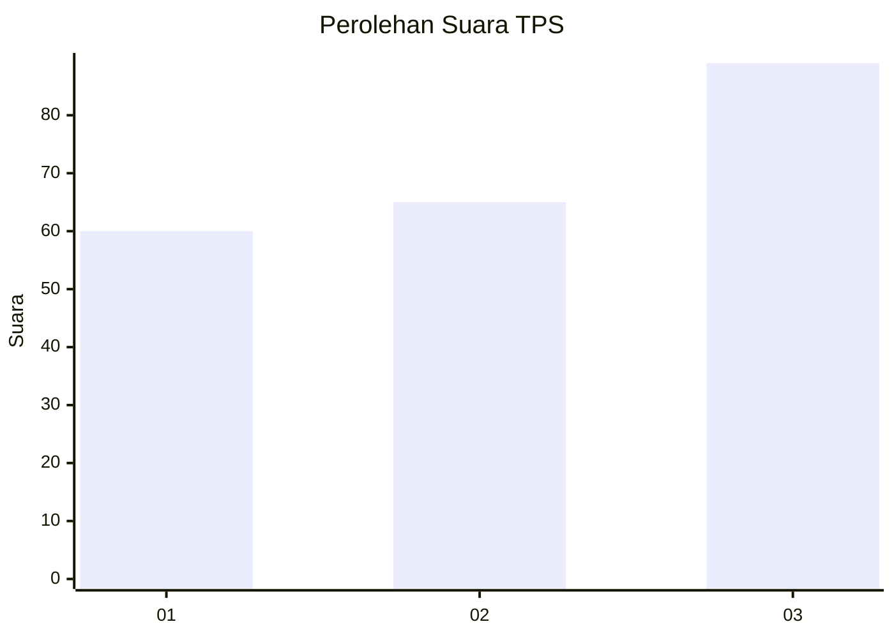
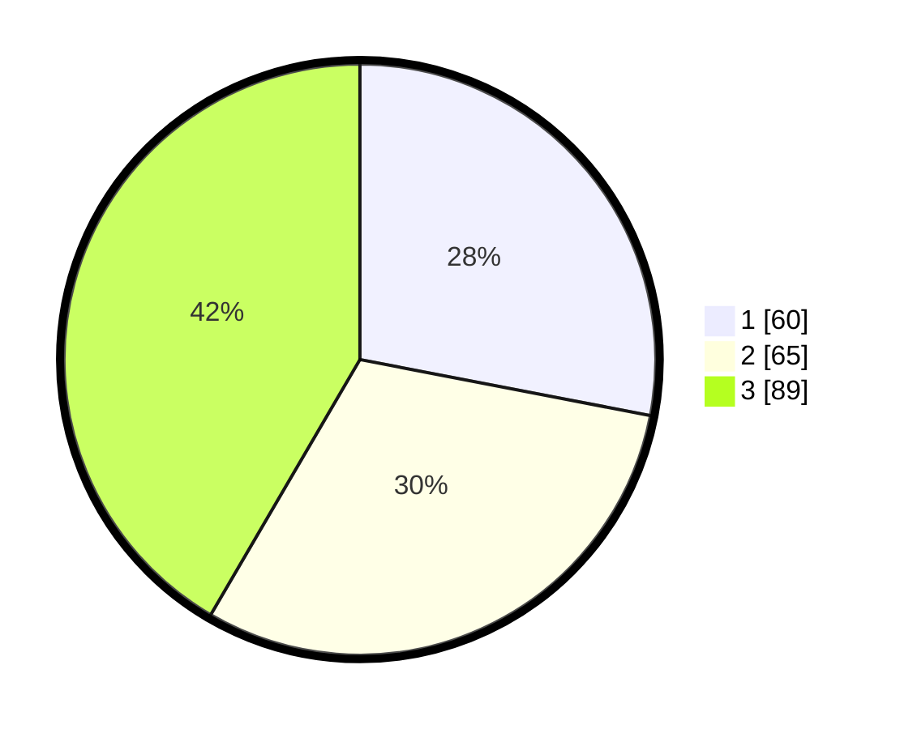

# Hasil

## Grafik

## Tabel

| No. | Nama Paslon    | Suara | Suara (raw) | Persentase |
|:--- |:-------------- | -----:| -----------:| ----------:|
| 1   | ANIES MUHAIMIN | 60    | [60][p-1]   | 28,04      |
| 2   | PRABOWO GIBRAN | 65    | [65][p-2]   | 30,37      |
| 3   | GANJAR MAHFUD  | 89    | [89][p-3]   | 41,59      |

[p-1]: https://github.com/gigit-pemilu/pemilu-2024-53-nusa-tenggara-timur/blob/main/pilpres/hitung-suara/sub/53-nusa-tenggara-timur/sub/08-ende/sub/04-ende-selatan/sub/1003-mbongawani/sub/004-tps/sub/paslon-1.txt
[p-2]: https://github.com/gigit-pemilu/pemilu-2024-53-nusa-tenggara-timur/blob/main/pilpres/hitung-suara/sub/53-nusa-tenggara-timur/sub/08-ende/sub/04-ende-selatan/sub/1003-mbongawani/sub/004-tps/sub/paslon-2.txt
[p-3]: https://github.com/gigit-pemilu/pemilu-2024-53-nusa-tenggara-timur/blob/main/pilpres/hitung-suara/sub/53-nusa-tenggara-timur/sub/08-ende/sub/04-ende-selatan/sub/1003-mbongawani/sub/004-tps/sub/paslon-3.txt

## Foto C Plano

https://sirekap-obj-formc.kpu.go.id/5f64/pemilu/ppwp/53/08/04/10/03/5308041003004-20240215-022904--00a4e2ec-f302-4008-af98-d1757efcede3.jpg

https://sirekap-obj-formc.kpu.go.id/5f64/pemilu/ppwp/53/08/04/10/03/5308041003004-20240215-022856--bda3fb5e-cb86-48b3-b536-441eb365e627.jpg

https://sirekap-obj-formc.kpu.go.id/5f64/pemilu/ppwp/53/08/04/10/03/5308041003004-20240214-141432--77cef057-6979-402d-bc2d-ec6df6e454d2.jpg

## Metadata

| Key        | Value               |
| ---------- | ------------------- |
| Time Stamp | 2024-02-15 23:29:50 |

