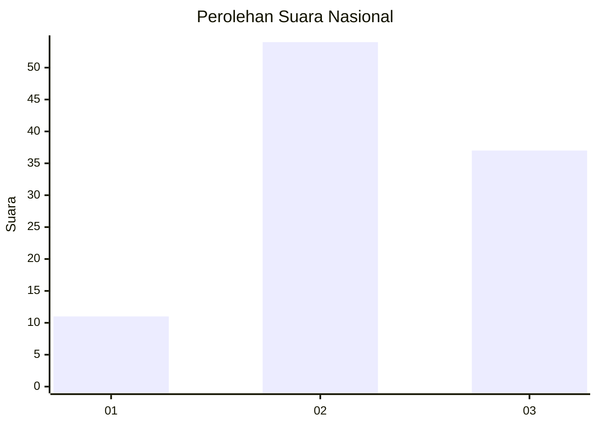
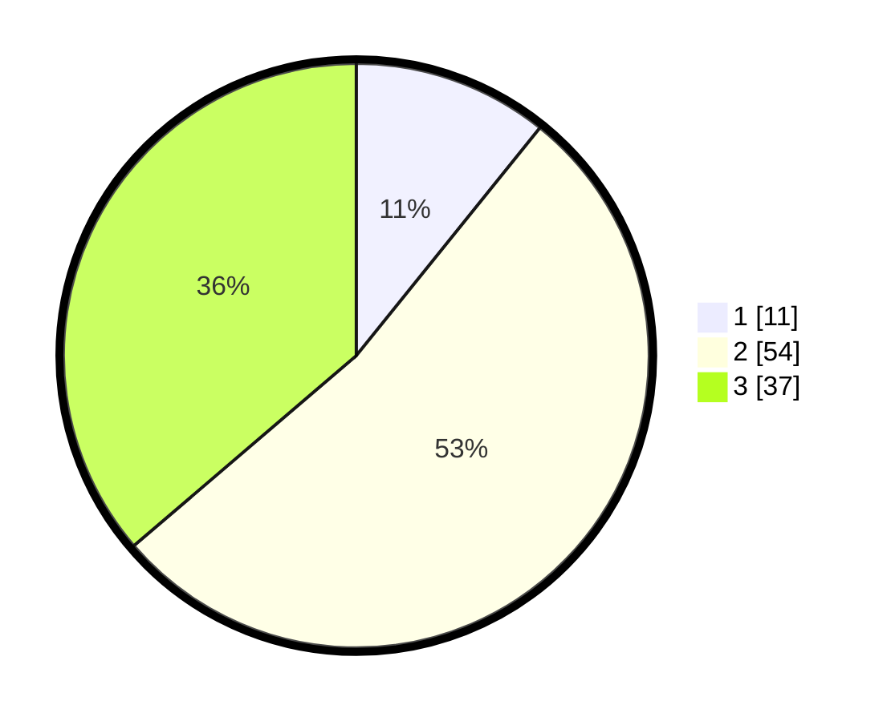

# Hasil

## Grafik

## Tabel

| No. | Nama Paslon    | Suara | Suara (raw) | Persentase |
|:--- |:-------------- | -----:| -----------:| ----------:|
| 1   | ANIES MUHAIMIN | 11    | [11][p-1]   | 10,78      |
| 2   | PRABOWO GIBRAN | 54    | [54][p-2]   | 52,94      |
| 3   | GANJAR MAHFUD  | 37    | [37][p-3]   | 36,27      |

[p-1]: https://github.com/gigit-pemilu/pemilu-2024/blob/main/pilpres/hitung-suara/sub/53-nusa-tenggara-timur/sub/08-ende/sub/05-ndona/sub/1001-onelako/sub/001-tps/sub/paslon-1.txt
[p-2]: https://github.com/gigit-pemilu/pemilu-2024/blob/main/pilpres/hitung-suara/sub/53-nusa-tenggara-timur/sub/08-ende/sub/05-ndona/sub/1001-onelako/sub/001-tps/sub/paslon-2.txt
[p-3]: https://github.com/gigit-pemilu/pemilu-2024/blob/main/pilpres/hitung-suara/sub/53-nusa-tenggara-timur/sub/08-ende/sub/05-ndona/sub/1001-onelako/sub/001-tps/sub/paslon-3.txt

## Foto C Plano

https://sirekap-obj-formc.kpu.go.id/e16d/pemilu/ppwp/53/08/05/10/01/5308051001001-20240215-074124--6dc8275f-2177-4db4-ade0-6968aa7e0705.jpg

https://sirekap-obj-formc.kpu.go.id/e16d/pemilu/ppwp/53/08/05/10/01/5308051001001-20240215-082752--e10e3ede-51a0-4a51-be3b-e67bd5e83b71.jpg

https://sirekap-obj-formc.kpu.go.id/e16d/pemilu/ppwp/53/08/05/10/01/5308051001001-20240215-075429--6d56b707-9b06-47be-af9d-048f7ea30c49.jpg

## Metadata

| Key        | Value               |
| ---------- | ------------------- |
| Time Stamp | 2024-02-16 22:30:00 |

