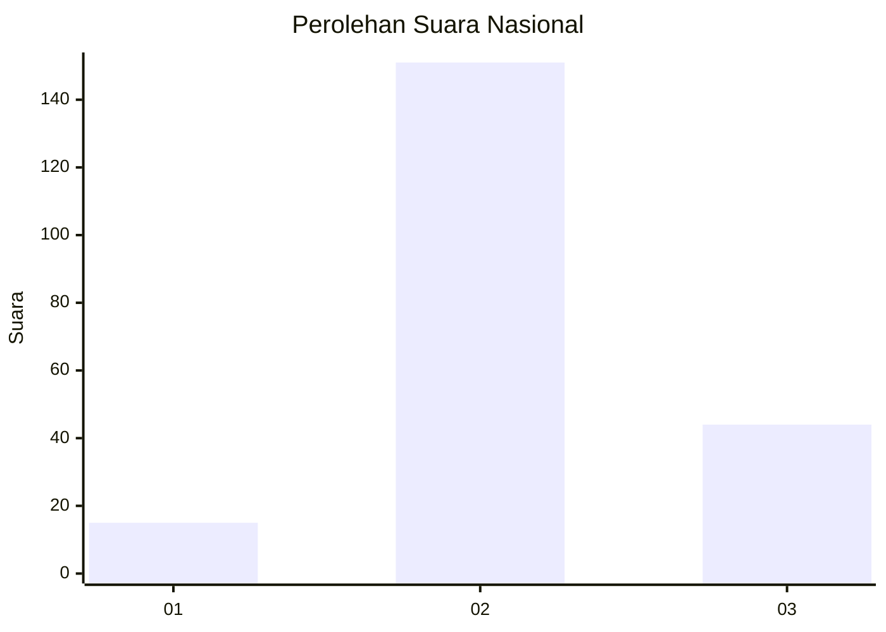

# Hasil

## Grafik

## Tabel

| No. | Nama Paslon    | Suara | Suara (raw) | Persentase |
|:--- |:-------------- | -----:| -----------:| ----------:|
| 1   | ANIES MUHAIMIN | 15    | [15][p-1]   | 7,14       |
| 2   | PRABOWO GIBRAN | 151   | [151][p-2]  | 71,90      |
| 3   | GANJAR MAHFUD  | 44    | [44][p-3]   | 20,95      |

[p-1]: https://github.com/gigit-pemilu/pemilu-2024/blob/main/pilpres/hitung-suara/sub/53-nusa-tenggara-timur/sub/08-ende/sub/05-ndona/sub/1001-onelako/sub/004-tps/sub/paslon-1.txt
[p-2]: https://github.com/gigit-pemilu/pemilu-2024/blob/main/pilpres/hitung-suara/sub/53-nusa-tenggara-timur/sub/08-ende/sub/05-ndona/sub/1001-onelako/sub/004-tps/sub/paslon-2.txt
[p-3]: https://github.com/gigit-pemilu/pemilu-2024/blob/main/pilpres/hitung-suara/sub/53-nusa-tenggara-timur/sub/08-ende/sub/05-ndona/sub/1001-onelako/sub/004-tps/sub/paslon-3.txt

## Foto C Plano

https://sirekap-obj-formc.kpu.go.id/880f/pemilu/ppwp/53/08/05/10/01/5308051001004-20240215-012419--e6e70083-8118-404a-892d-78b77a6e9b59.jpg

https://sirekap-obj-formc.kpu.go.id/880f/pemilu/ppwp/53/08/05/10/01/5308051001004-20240215-012831--3ab6df0a-b683-44cd-96cc-c448804c10ec.jpg

https://sirekap-obj-formc.kpu.go.id/880f/pemilu/ppwp/53/08/05/10/01/5308051001004-20240216-144702--cc5651de-63f0-4d2c-8f93-85452fee3750.jpg

## Metadata

| Key        | Value               |
| ---------- | ------------------- |
| Time Stamp | 2024-02-16 16:25:10 |

