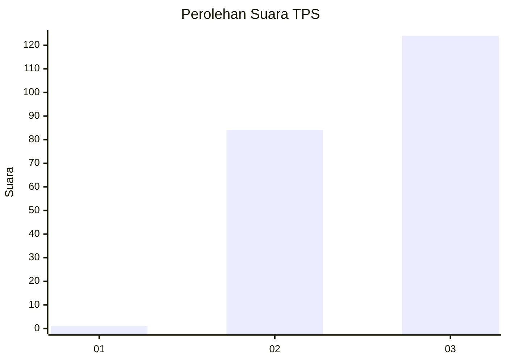
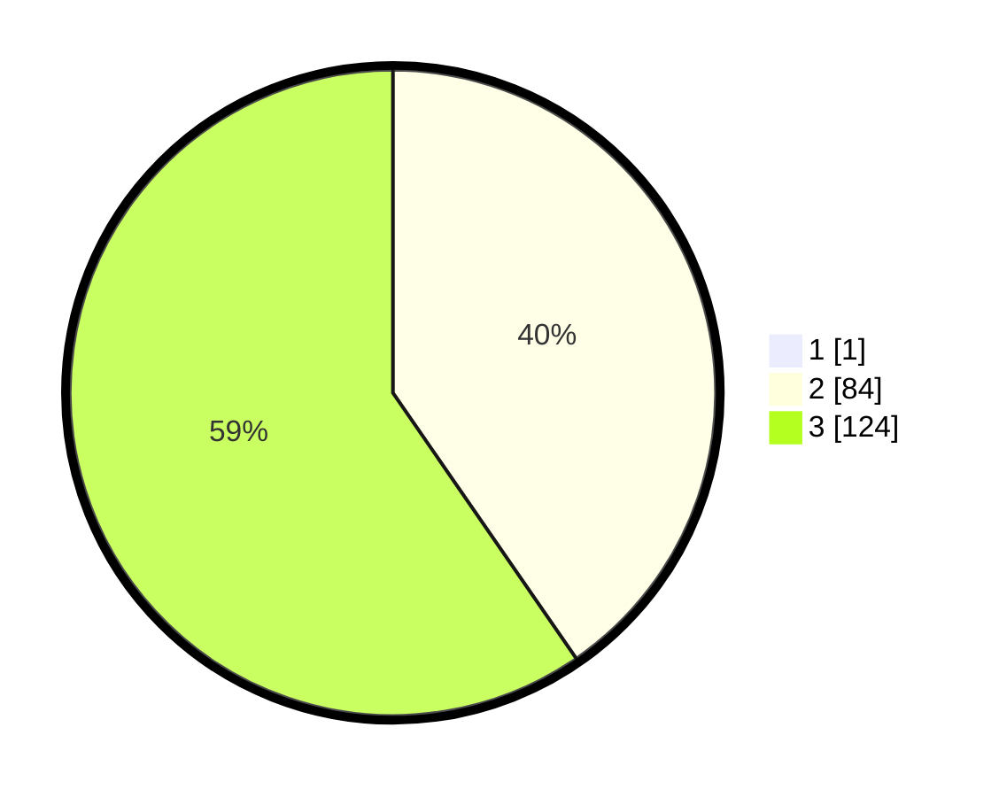

# Hasil

## Grafik

## Tabel

| No. | Nama Paslon    | Suara | Suara (raw) | Persentase |
|:--- |:-------------- | -----:| -----------:| ----------:|
| 1   | ANIES MUHAIMIN | 1     | [1][p-1]    | 0,48       |
| 2   | PRABOWO GIBRAN | 84    | [84][p-2]   | 40,19      |
| 3   | GANJAR MAHFUD  | 124   | [124][p-3]  | 59,33      |

[p-1]: https://github.com/gigit-pemilu/pemilu-2024-53-nusa-tenggara-timur/blob/main/pilpres/hitung-suara/sub/53-nusa-tenggara-timur/sub/08-ende/sub/06-detusoko/sub/2002-detusoko-barat/sub/002-tps/sub/paslon-1.txt
[p-2]: https://github.com/gigit-pemilu/pemilu-2024-53-nusa-tenggara-timur/blob/main/pilpres/hitung-suara/sub/53-nusa-tenggara-timur/sub/08-ende/sub/06-detusoko/sub/2002-detusoko-barat/sub/002-tps/sub/paslon-2.txt
[p-3]: https://github.com/gigit-pemilu/pemilu-2024-53-nusa-tenggara-timur/blob/main/pilpres/hitung-suara/sub/53-nusa-tenggara-timur/sub/08-ende/sub/06-detusoko/sub/2002-detusoko-barat/sub/002-tps/sub/paslon-3.txt

## Foto C Plano

https://sirekap-obj-formc.kpu.go.id/a8f6/pemilu/ppwp/53/08/06/20/02/5308062002002-20240215-090128--4131d944-18bd-448f-a615-a6623f43c374.jpg

https://sirekap-obj-formc.kpu.go.id/a8f6/pemilu/ppwp/53/08/06/20/02/5308062002002-20240215-091719--f6f2e034-e68f-46b6-9de5-fdb378360582.jpg

https://sirekap-obj-formc.kpu.go.id/a8f6/pemilu/ppwp/53/08/06/20/02/5308062002002-20240215-121924--e547cbc3-76fc-477c-aabd-cb111b9f522b.jpg

## Metadata

| Key        | Value               |
| ---------- | ------------------- |
| Time Stamp | 2024-02-25 14:00:00 |

