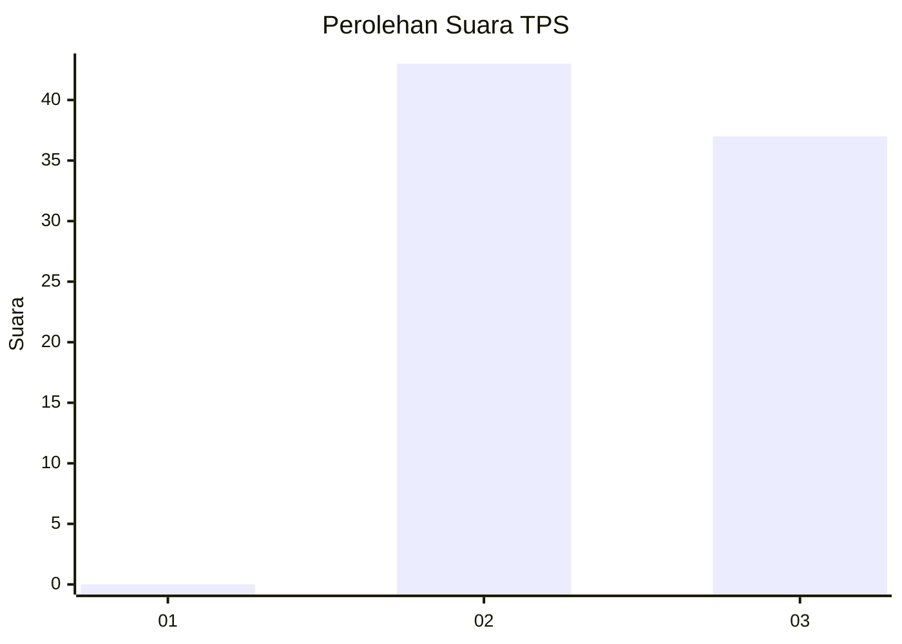
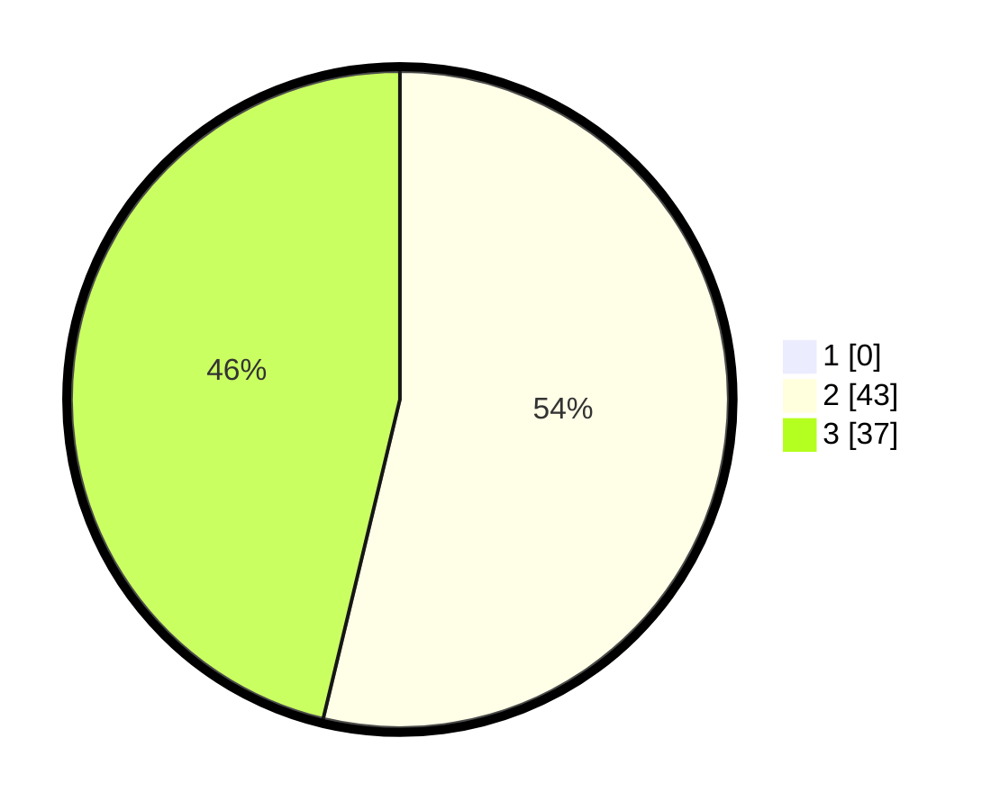

# Hasil

## Grafik

## Tabel

| No. | Nama Paslon    | Suara | Suara (raw) | Persentase |
|:--- |:-------------- | -----:| -----------:| ----------:|
| 1   | ANIES MUHAIMIN | 0     | [0][p-1]    | 0,00       |
| 2   | PRABOWO GIBRAN | 43    | [43][p-2]   | 53,75      |
| 3   | GANJAR MAHFUD  | 37    | [37][p-3]   | 46,25      |

[p-1]: https://github.com/gigit-pemilu/pemilu-2024-53-nusa-tenggara-timur/blob/main/pilpres/hitung-suara/sub/53-nusa-tenggara-timur/sub/08-ende/sub/06-detusoko/sub/2004-wolotolo-tengah/sub/003-tps/sub/paslon-1.txt
[p-2]: https://github.com/gigit-pemilu/pemilu-2024-53-nusa-tenggara-timur/blob/main/pilpres/hitung-suara/sub/53-nusa-tenggara-timur/sub/08-ende/sub/06-detusoko/sub/2004-wolotolo-tengah/sub/003-tps/sub/paslon-2.txt
[p-3]: https://github.com/gigit-pemilu/pemilu-2024-53-nusa-tenggara-timur/blob/main/pilpres/hitung-suara/sub/53-nusa-tenggara-timur/sub/08-ende/sub/06-detusoko/sub/2004-wolotolo-tengah/sub/003-tps/sub/paslon-3.txt

## Foto C Plano

https://sirekap-obj-formc.kpu.go.id/304d/pemilu/ppwp/53/08/06/20/04/5308062004003-20240215-111157--d8a1c033-d909-4799-bd0d-13302543a839.jpg

https://sirekap-obj-formc.kpu.go.id/304d/pemilu/ppwp/53/08/06/20/04/5308062004003-20240215-083106--27c8e502-3b70-4b2c-bcf0-cda537031f59.jpg

https://sirekap-obj-formc.kpu.go.id/304d/pemilu/ppwp/53/08/06/20/04/5308062004003-20240215-084213--fa78a10d-0e26-4600-984b-a0d2ce3a32f6.jpg

## Metadata

| Key        | Value               |
| ---------- | ------------------- |
| Time Stamp | 2024-02-19 06:16:00 |

