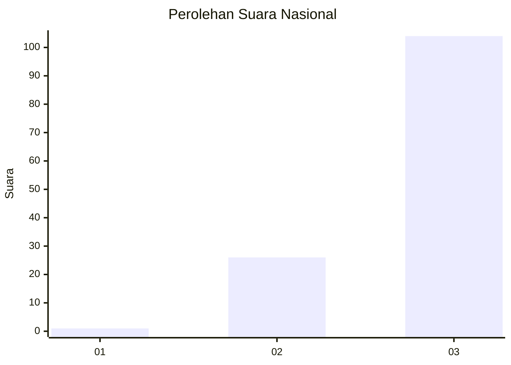
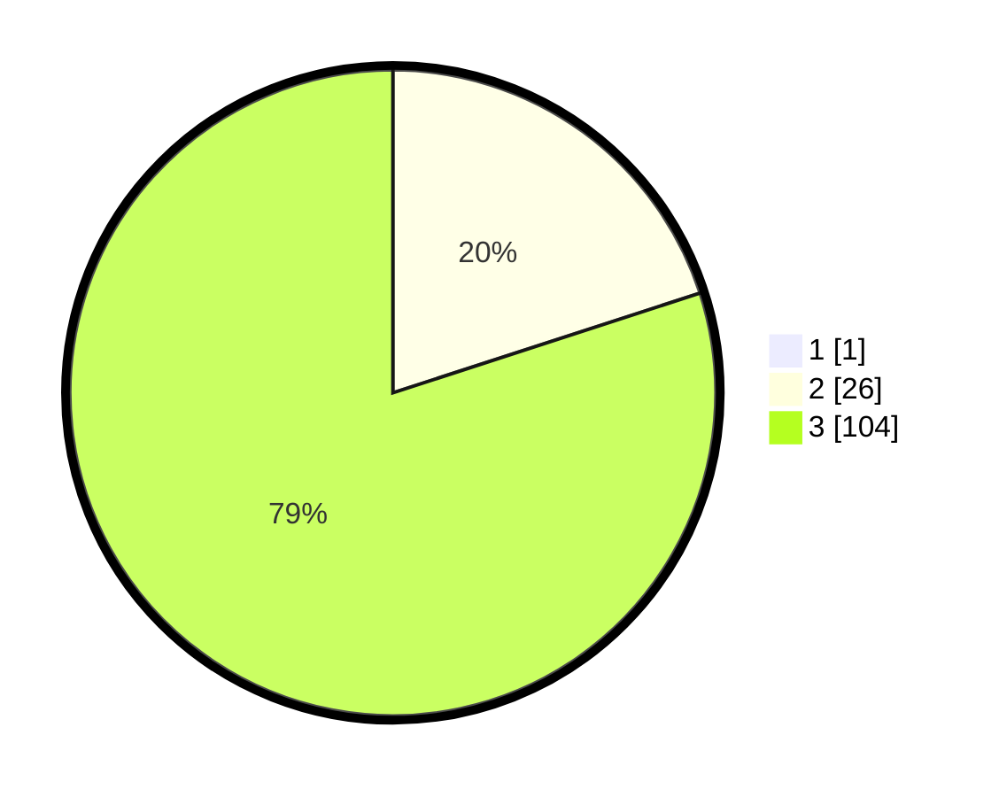

# Hasil

## Grafik

## Tabel

| No. | Nama Paslon    | Suara | Suara (raw) | Persentase |
|:--- |:-------------- | -----:| -----------:| ----------:|
| 1   | ANIES MUHAIMIN | 1     | [1][p-1]    | 0,76       |
| 2   | PRABOWO GIBRAN | 26    | [26][p-2]   | 19,85      |
| 3   | GANJAR MAHFUD  | 104   | [104][p-3]  | 79,39      |

[p-1]: https://github.com/gigit-pemilu/pemilu-2024/blob/main/pilpres/hitung-suara/sub/53-nusa-tenggara-timur/sub/08-ende/sub/06-detusoko/sub/2017-rateroru/sub/002-tps/sub/paslon-1.txt
[p-2]: https://github.com/gigit-pemilu/pemilu-2024/blob/main/pilpres/hitung-suara/sub/53-nusa-tenggara-timur/sub/08-ende/sub/06-detusoko/sub/2017-rateroru/sub/002-tps/sub/paslon-2.txt
[p-3]: https://github.com/gigit-pemilu/pemilu-2024/blob/main/pilpres/hitung-suara/sub/53-nusa-tenggara-timur/sub/08-ende/sub/06-detusoko/sub/2017-rateroru/sub/002-tps/sub/paslon-3.txt

## Foto C Plano

https://sirekap-obj-formc.kpu.go.id/c96e/pemilu/ppwp/53/08/06/20/17/5308062017002-20240215-102634--19ae54a5-343c-4570-a59c-13cfe3889e4a.jpg

https://sirekap-obj-formc.kpu.go.id/c96e/pemilu/ppwp/53/08/06/20/17/5308062017002-20240215-091800--4d2b0a9f-6c60-4ea7-9e96-5309f494070c.jpg

https://sirekap-obj-formc.kpu.go.id/c96e/pemilu/ppwp/53/08/06/20/17/5308062017002-20240215-091957--bdc0ec6b-ecbc-4e13-ad67-a192e4ecbf40.jpg

## Metadata

| Key        | Value               |
| ---------- | ------------------- |
| Time Stamp | 2024-02-16 22:30:00 |

