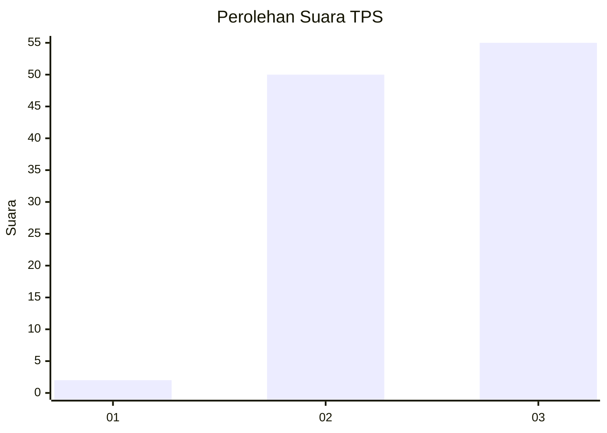
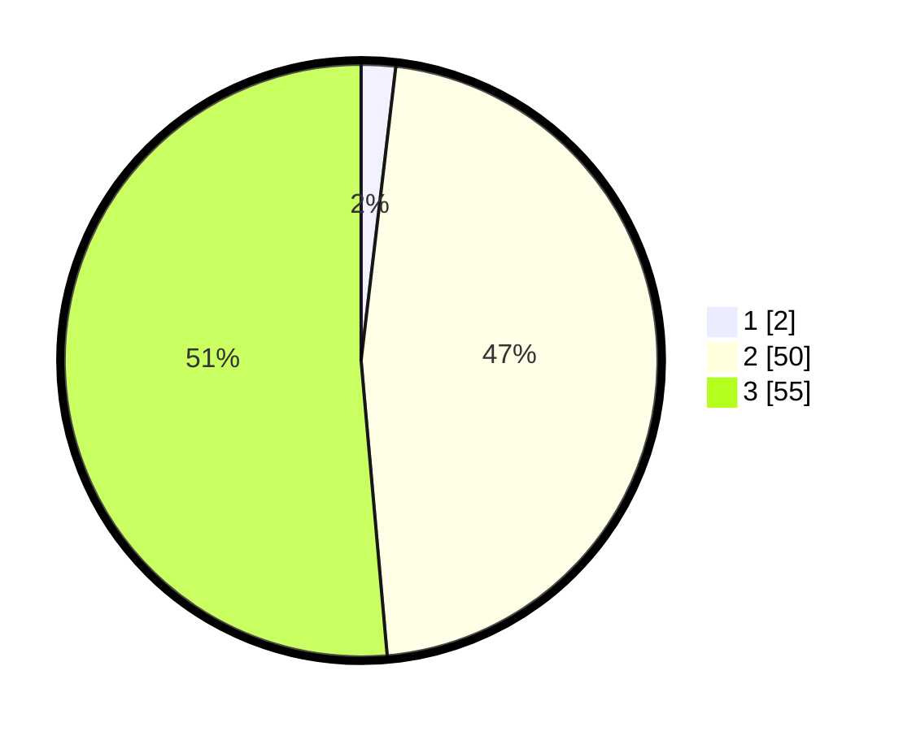

# Hasil

## Grafik

## Tabel

| No. | Nama Paslon    | Suara | Suara (raw) | Persentase |
|:--- |:-------------- | -----:| -----------:| ----------:|
| 1   | ANIES MUHAIMIN | 2     | [2][p-1]    | 1,87       |
| 2   | PRABOWO GIBRAN | 50    | [50][p-2]   | 46,73      |
| 3   | GANJAR MAHFUD  | 55    | [55][p-3]   | 51,40      |

[p-1]: https://github.com/gigit-pemilu/pemilu-2024-53-nusa-tenggara-timur/blob/main/pilpres/hitung-suara/sub/53-nusa-tenggara-timur/sub/08-ende/sub/07-wewaria/sub/2002-nuangenda/sub/001-tps/sub/paslon-1.txt
[p-2]: https://github.com/gigit-pemilu/pemilu-2024-53-nusa-tenggara-timur/blob/main/pilpres/hitung-suara/sub/53-nusa-tenggara-timur/sub/08-ende/sub/07-wewaria/sub/2002-nuangenda/sub/001-tps/sub/paslon-2.txt
[p-3]: https://github.com/gigit-pemilu/pemilu-2024-53-nusa-tenggara-timur/blob/main/pilpres/hitung-suara/sub/53-nusa-tenggara-timur/sub/08-ende/sub/07-wewaria/sub/2002-nuangenda/sub/001-tps/sub/paslon-3.txt

## Foto C Plano

https://sirekap-obj-formc.kpu.go.id/12f2/pemilu/ppwp/53/08/07/20/02/5308072002001-20240215-083651--fedd2467-f4ba-42c8-b500-b7952e400ac7.jpg

https://sirekap-obj-formc.kpu.go.id/12f2/pemilu/ppwp/53/08/07/20/02/5308072002001-20240215-084605--5c82bf05-5d46-4712-b2cf-7059a4a3e86d.jpg

https://sirekap-obj-formc.kpu.go.id/12f2/pemilu/ppwp/53/08/07/20/02/5308072002001-20240215-085055--011c3593-db48-4413-bbce-eabe0c86d704.jpg

## Metadata

| Key        | Value               |
| ---------- | ------------------- |
| Time Stamp | 2024-02-16 22:01:00 |

