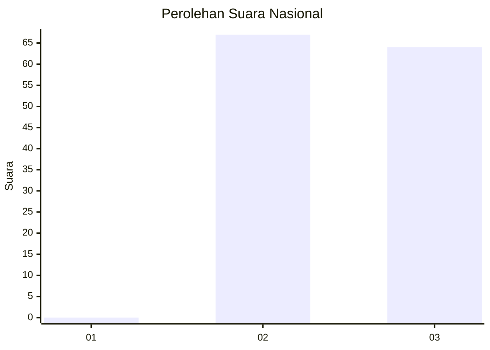
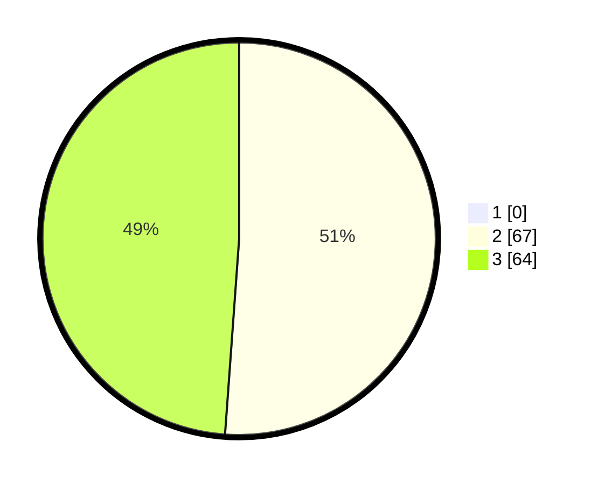

# Hasil

## Grafik

## Tabel

| No. | Nama Paslon    | Suara | Suara (raw) | Persentase |
|:--- |:-------------- | -----:| -----------:| ----------:|
| 1   | ANIES MUHAIMIN | 0     | [0][p-1]    | 0,00       |
| 2   | PRABOWO GIBRAN | 67    | [67][p-2]   | 51,15      |
| 3   | GANJAR MAHFUD  | 64    | [64][p-3]   | 48,85      |

[p-1]: https://github.com/gigit-pemilu/pemilu-2024/blob/main/pilpres/hitung-suara/sub/53-nusa-tenggara-timur/sub/08-ende/sub/07-wewaria/sub/2002-nuangenda/sub/003-tps/sub/paslon-1.txt
[p-2]: https://github.com/gigit-pemilu/pemilu-2024/blob/main/pilpres/hitung-suara/sub/53-nusa-tenggara-timur/sub/08-ende/sub/07-wewaria/sub/2002-nuangenda/sub/003-tps/sub/paslon-2.txt
[p-3]: https://github.com/gigit-pemilu/pemilu-2024/blob/main/pilpres/hitung-suara/sub/53-nusa-tenggara-timur/sub/08-ende/sub/07-wewaria/sub/2002-nuangenda/sub/003-tps/sub/paslon-3.txt

## Foto C Plano

https://sirekap-obj-formc.kpu.go.id/6b25/pemilu/ppwp/53/08/07/20/02/5308072002003-20240214-190053--f1b9d57c-91bd-4079-8304-a72dc9c2959c.jpg

https://sirekap-obj-formc.kpu.go.id/6b25/pemilu/ppwp/53/08/07/20/02/5308072002003-20240214-190855--631b0566-a821-450c-841a-007174b4274a.jpg

https://sirekap-obj-formc.kpu.go.id/6b25/pemilu/ppwp/53/08/07/20/02/5308072002003-20240214-191203--077db4f2-6133-435c-b813-46c9c13fc4e3.jpg

## Metadata

| Key        | Value               |
| ---------- | ------------------- |
| Time Stamp | 2024-02-16 21:01:00 |

