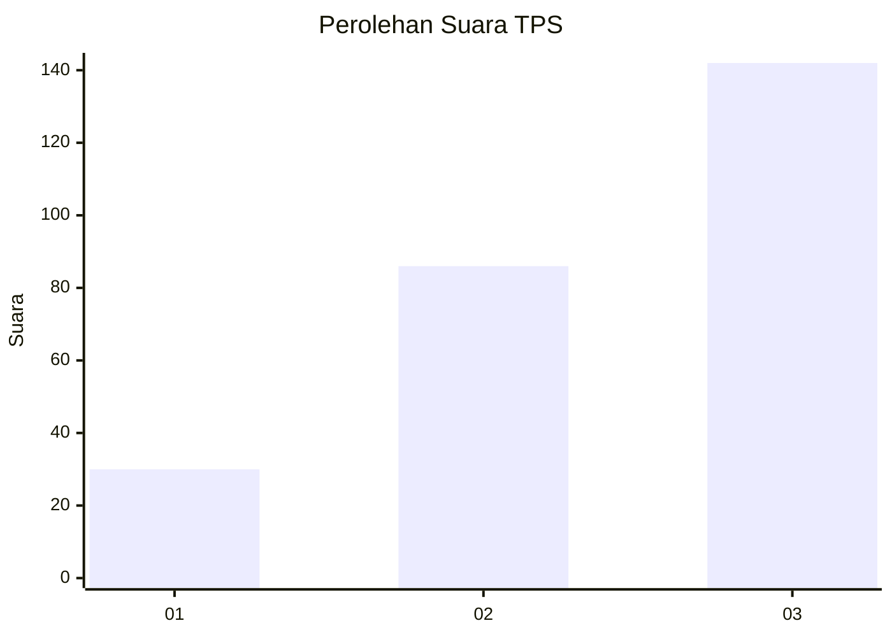
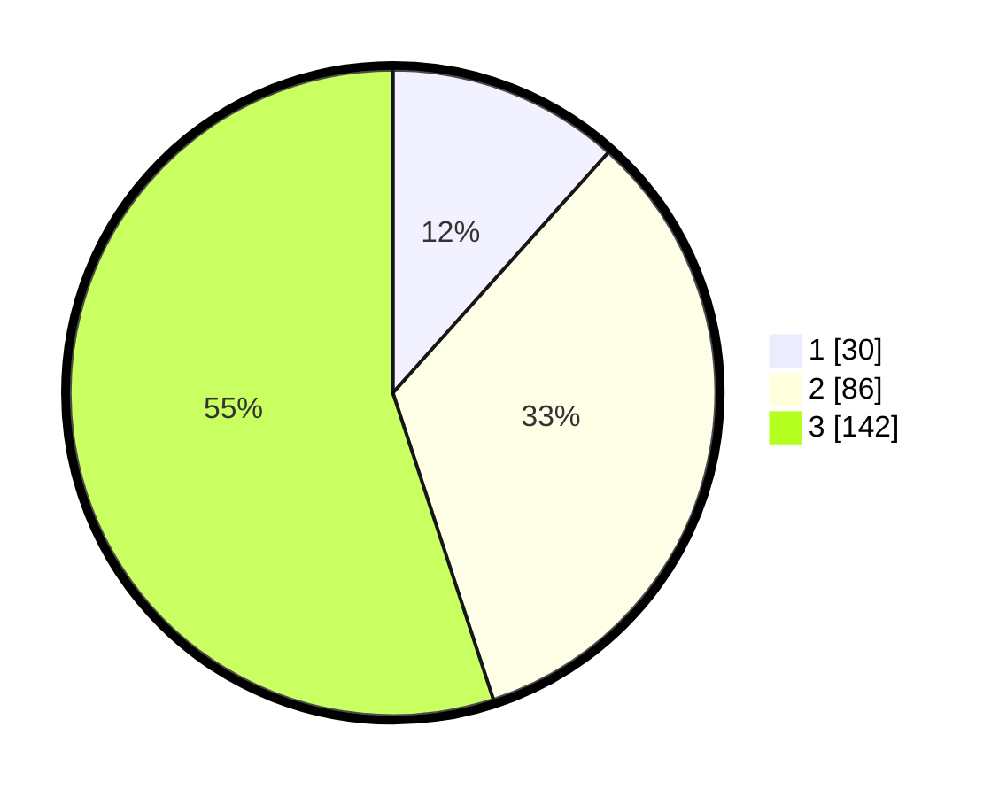

# Hasil

## Grafik

## Tabel

| No. | Nama Paslon    | Suara | Suara (raw) | Persentase |
|:--- |:-------------- | -----:| -----------:| ----------:|
| 1   | ANIES MUHAIMIN | 30    | [30][p-1]   | 11,63      |
| 2   | PRABOWO GIBRAN | 86    | [86][p-2]   | 33,33      |
| 3   | GANJAR MAHFUD  | 142   | [142][p-3]  | 55,04      |

[p-1]: https://github.com/gigit-pemilu/pemilu-2024-53-nusa-tenggara-timur/blob/main/pilpres/hitung-suara/sub/53-nusa-tenggara-timur/sub/08-ende/sub/07-wewaria/sub/2003-mautenda/sub/004-tps/sub/paslon-1.txt
[p-2]: https://github.com/gigit-pemilu/pemilu-2024-53-nusa-tenggara-timur/blob/main/pilpres/hitung-suara/sub/53-nusa-tenggara-timur/sub/08-ende/sub/07-wewaria/sub/2003-mautenda/sub/004-tps/sub/paslon-2.txt
[p-3]: https://github.com/gigit-pemilu/pemilu-2024-53-nusa-tenggara-timur/blob/main/pilpres/hitung-suara/sub/53-nusa-tenggara-timur/sub/08-ende/sub/07-wewaria/sub/2003-mautenda/sub/004-tps/sub/paslon-3.txt

## Foto C Plano

https://sirekap-obj-formc.kpu.go.id/1540/pemilu/ppwp/53/08/07/20/03/5308072003004-20240215-134216--1eb58461-7478-479d-b6b1-66aeb6af48e1.jpg

https://sirekap-obj-formc.kpu.go.id/1540/pemilu/ppwp/53/08/07/20/03/5308072003004-20240215-134343--d29da9fe-d0ed-4b21-a223-f72ebdcebdd9.jpg

https://sirekap-obj-formc.kpu.go.id/1540/pemilu/ppwp/53/08/07/20/03/5308072003004-20240215-134645--8e4ad876-2b28-45d6-8efe-6e068f981ebe.jpg

## Metadata

| Key        | Value               |
| ---------- | ------------------- |
| Time Stamp | 2024-02-16 17:30:00 |

