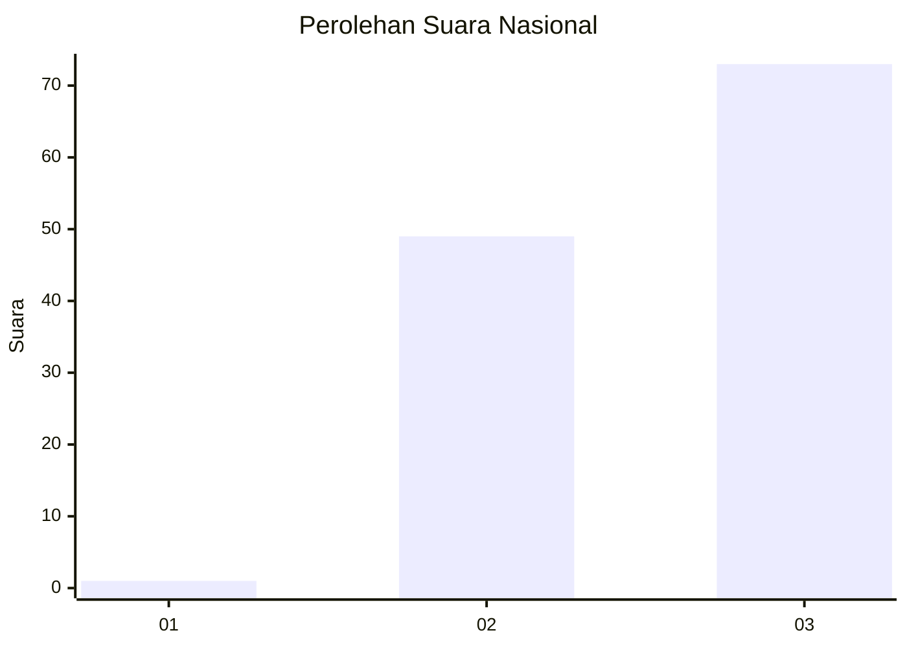
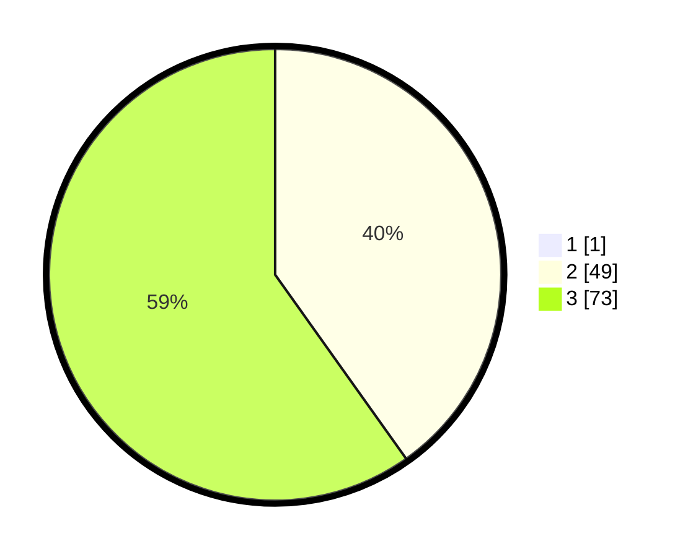

# Hasil

## Grafik

## Tabel

| No. | Nama Paslon    | Suara | Suara (raw) | Persentase |
|:--- |:-------------- | -----:| -----------:| ----------:|
| 1   | ANIES MUHAIMIN | 1     | [1][p-1]    | 0,81       |
| 2   | PRABOWO GIBRAN | 49    | [49][p-2]   | 39,84      |
| 3   | GANJAR MAHFUD  | 73    | [73][p-3]   | 59,35      |

[p-1]: https://github.com/gigit-pemilu/pemilu-2024/blob/main/pilpres/hitung-suara/sub/53-nusa-tenggara-timur/sub/08-ende/sub/08-wolowaru/sub/2024-lise-pu'u/sub/002-tps/sub/paslon-1.txt
[p-2]: https://github.com/gigit-pemilu/pemilu-2024/blob/main/pilpres/hitung-suara/sub/53-nusa-tenggara-timur/sub/08-ende/sub/08-wolowaru/sub/2024-lise-pu'u/sub/002-tps/sub/paslon-2.txt
[p-3]: https://github.com/gigit-pemilu/pemilu-2024/blob/main/pilpres/hitung-suara/sub/53-nusa-tenggara-timur/sub/08-ende/sub/08-wolowaru/sub/2024-lise-pu'u/sub/002-tps/sub/paslon-3.txt

## Foto C Plano

https://sirekap-obj-formc.kpu.go.id/23aa/pemilu/ppwp/53/08/08/20/24/5308082024002-20240215-095932--4ac318ac-5636-417c-9592-20d6dc4bc76d.jpg

https://sirekap-obj-formc.kpu.go.id/23aa/pemilu/ppwp/53/08/08/20/24/5308082024002-20240215-100504--c5ea2807-3386-4d6f-a9a7-5a80dd72283a.jpg

https://sirekap-obj-formc.kpu.go.id/23aa/pemilu/ppwp/53/08/08/20/24/5308082024002-20240215-101200--a06eb12b-2e59-48c7-85b2-3ef5f4744032.jpg

## Metadata

| Key        | Value               |
| ---------- | ------------------- |
| Time Stamp | 2024-02-16 22:01:00 |

