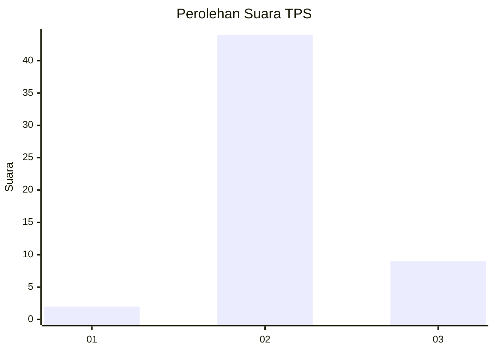
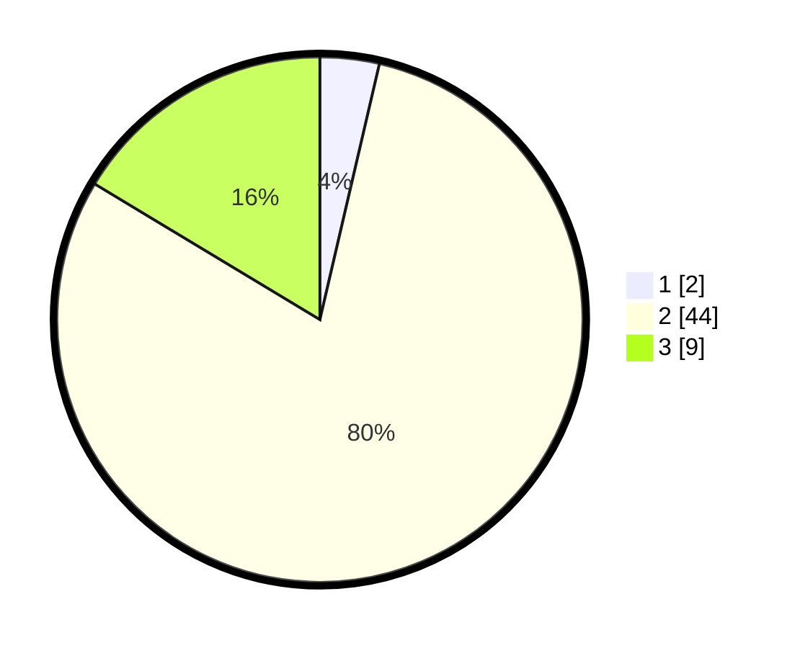

# Hasil

## Grafik

## Tabel

| No. | Nama Paslon    | Suara | Suara (raw) | Persentase |
|:--- |:-------------- | -----:| -----------:| ----------:|
| 1   | ANIES MUHAIMIN | 2     | [2][p-1]    | 3,64       |
| 2   | PRABOWO GIBRAN | 44    | [44][p-2]   | 80,00      |
| 3   | GANJAR MAHFUD  | 9     | [9][p-3]    | 16,36      |

[p-1]: https://github.com/gigit-pemilu/pemilu-2024-53-nusa-tenggara-timur/blob/main/pilpres/hitung-suara/sub/53-nusa-tenggara-timur/sub/08-ende/sub/09-wolojita/sub/1001-wolojita/sub/003-tps/sub/paslon-1.txt
[p-2]: https://github.com/gigit-pemilu/pemilu-2024-53-nusa-tenggara-timur/blob/main/pilpres/hitung-suara/sub/53-nusa-tenggara-timur/sub/08-ende/sub/09-wolojita/sub/1001-wolojita/sub/003-tps/sub/paslon-2.txt
[p-3]: https://github.com/gigit-pemilu/pemilu-2024-53-nusa-tenggara-timur/blob/main/pilpres/hitung-suara/sub/53-nusa-tenggara-timur/sub/08-ende/sub/09-wolojita/sub/1001-wolojita/sub/003-tps/sub/paslon-3.txt

## Foto C Plano

https://sirekap-obj-formc.kpu.go.id/d390/pemilu/ppwp/53/08/09/10/01/5308091001003-20240214-132311--22ace754-7092-47a7-8483-2778df45e35e.jpg

https://sirekap-obj-formc.kpu.go.id/d390/pemilu/ppwp/53/08/09/10/01/5308091001003-20240214-132326--4bf97710-9df8-4537-b415-41a19bf3aff8.jpg

https://sirekap-obj-formc.kpu.go.id/d390/pemilu/ppwp/53/08/09/10/01/5308091001003-20240214-132344--cc3c9e8e-8736-40eb-8b17-d4ab5281bca8.jpg

## Metadata

| Key        | Value               |
| ---------- | ------------------- |
| Time Stamp | 2024-02-14 21:46:01 |

## DATA PEMILIH TETAP

Jumlah pemilih dalam DPT: **88**.
 * L: **42**.
 * P: **46**.

## DATA PENGGUNA HAK PILIH

Jumlah pengguna hak pilih dalam DPT: **50**.
 * L: **22**.
 * P: **28**.

Jumlah pengguna hak pilih dalam DPTb: **4**.
 * L: **1**.
 * P: **3**.

Jumlah pengguna hak pilih dalam DPK: **2**.
 * L: **0**.
 * P: **2**.

Jumlah pengguna hak pilih: **56**.
 * L: **23**.
 * P: **33**.

## JUMLAH SUARA SAH DAN TIDAK SAH

JUMLAH SELURUH SUARA SAH: **55**.

JUMLAH SUARA TIDAK SAH: **1**.

JUMLAH SELURUH SUARA SAH DAN SUARA TIDAK SAH: **56**.

