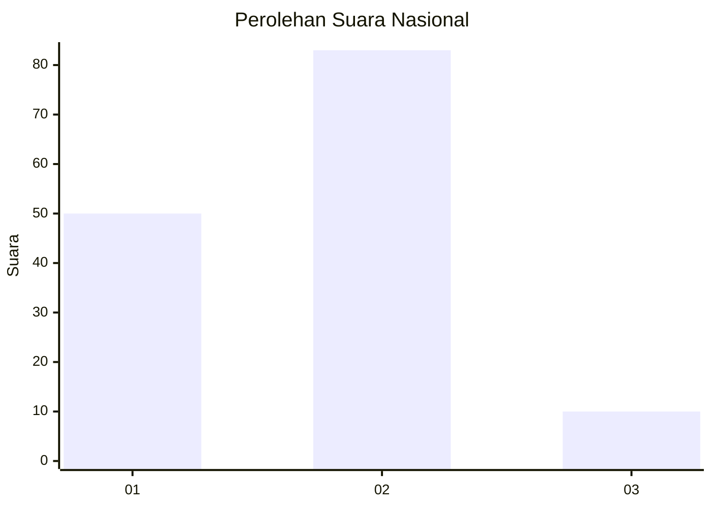
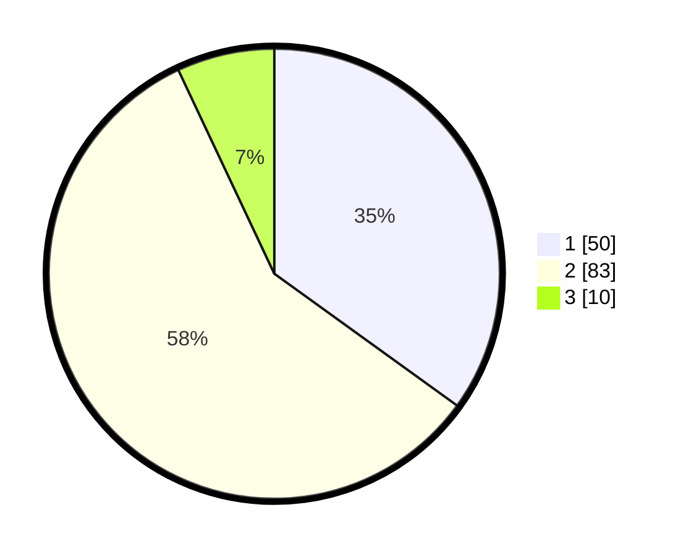

# Hasil

## Grafik

## Tabel

| No. | Nama Paslon    | Suara | Suara (raw) | Persentase |
|:--- |:-------------- | -----:| -----------:| ----------:|
| 1   | ANIES MUHAIMIN | 50    | [50][p-1]   | 34,97      |
| 2   | PRABOWO GIBRAN | 83    | [83][p-2]   | 58,04      |
| 3   | GANJAR MAHFUD  | 10    | [10][p-3]   | 6,99       |

[p-1]: https://github.com/gigit-pemilu/pemilu-2024/blob/main/pilpres/hitung-suara/sub/53-nusa-tenggara-timur/sub/08-ende/sub/09-wolojita/sub/1001-wolojita/sub/005-tps/sub/paslon-1.txt
[p-2]: https://github.com/gigit-pemilu/pemilu-2024/blob/main/pilpres/hitung-suara/sub/53-nusa-tenggara-timur/sub/08-ende/sub/09-wolojita/sub/1001-wolojita/sub/005-tps/sub/paslon-2.txt
[p-3]: https://github.com/gigit-pemilu/pemilu-2024/blob/main/pilpres/hitung-suara/sub/53-nusa-tenggara-timur/sub/08-ende/sub/09-wolojita/sub/1001-wolojita/sub/005-tps/sub/paslon-3.txt

## Foto C Plano

https://sirekap-obj-formc.kpu.go.id/b5c3/pemilu/ppwp/53/08/09/10/01/5308091001005-20240215-102332--bdbbfe8b-681f-43f1-b53f-52b8e1c42d7e.jpg

https://sirekap-obj-formc.kpu.go.id/b5c3/pemilu/ppwp/53/08/09/10/01/5308091001005-20240215-102505--4675c616-1504-406e-9d1c-e6506a784bfb.jpg

https://sirekap-obj-formc.kpu.go.id/b5c3/pemilu/ppwp/53/08/09/10/01/5308091001005-20240215-100739--668f536a-41f3-4acc-9a9a-387f2b7c28fa.jpg

## Metadata

| Key        | Value               |
| ---------- | ------------------- |
| Time Stamp | 2024-02-16 22:01:00 |

