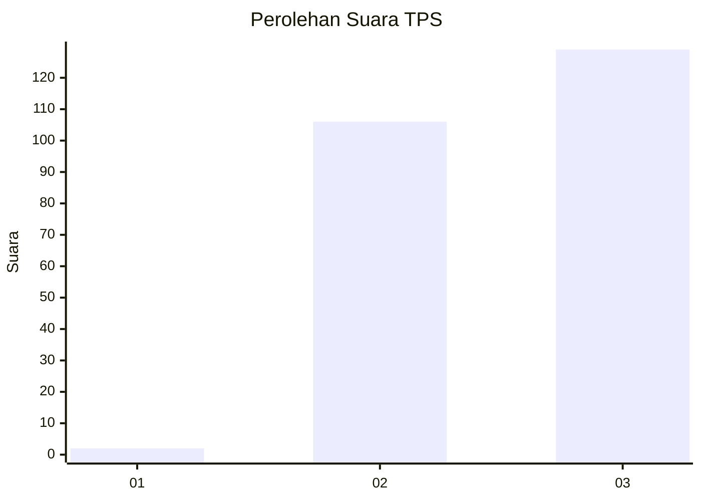
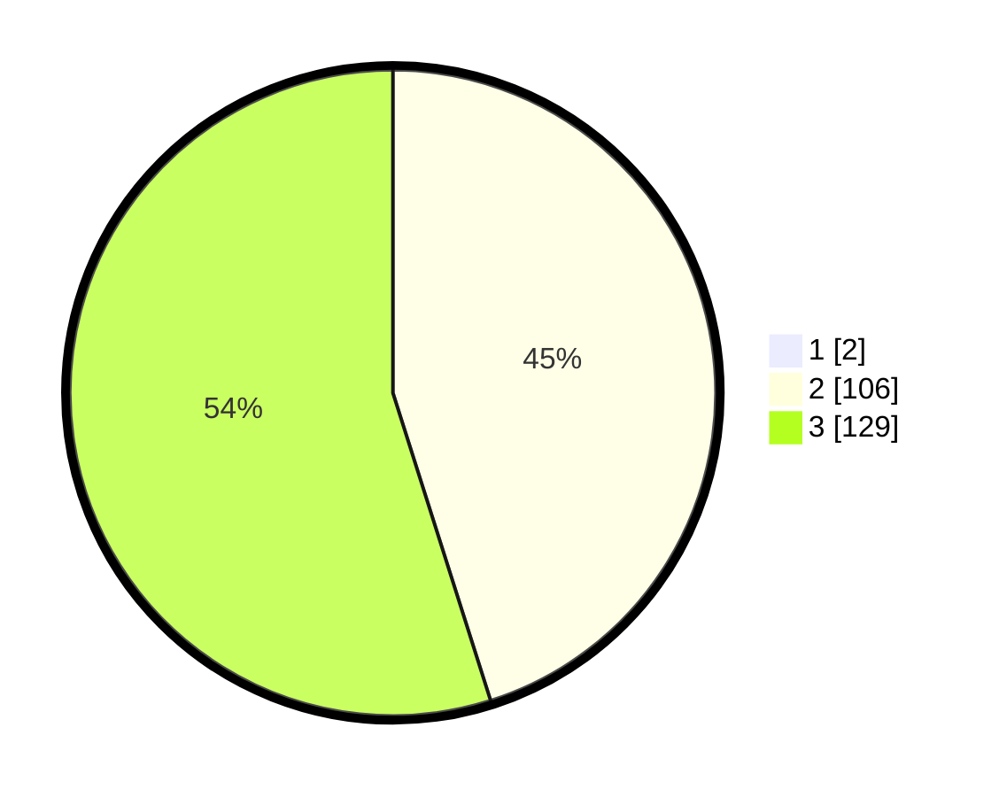

# Hasil

## Grafik

## Tabel

| No. | Nama Paslon    | Suara | Suara (raw) | Persentase |
|:--- |:-------------- | -----:| -----------:| ----------:|
| 1   | ANIES MUHAIMIN | 2     | [2][p-1]    | 0,84       |
| 2   | PRABOWO GIBRAN | 106   | [106][p-2]  | 44,73      |
| 3   | GANJAR MAHFUD  | 129   | [129][p-3]  | 54,43      |

[p-1]: https://github.com/gigit-pemilu/pemilu-2024-53-nusa-tenggara-timur/blob/main/pilpres/hitung-suara/sub/53-nusa-tenggara-timur/sub/08-ende/sub/09-wolojita/sub/2002-tenda/sub/001-tps/sub/paslon-1.txt
[p-2]: https://github.com/gigit-pemilu/pemilu-2024-53-nusa-tenggara-timur/blob/main/pilpres/hitung-suara/sub/53-nusa-tenggara-timur/sub/08-ende/sub/09-wolojita/sub/2002-tenda/sub/001-tps/sub/paslon-2.txt
[p-3]: https://github.com/gigit-pemilu/pemilu-2024-53-nusa-tenggara-timur/blob/main/pilpres/hitung-suara/sub/53-nusa-tenggara-timur/sub/08-ende/sub/09-wolojita/sub/2002-tenda/sub/001-tps/sub/paslon-3.txt

## Foto C Plano

https://sirekap-obj-formc.kpu.go.id/f9f1/pemilu/ppwp/53/08/09/20/02/5308092002001-20240215-100247--0584ff77-68b2-42b3-96cd-e0c6bcd5f1d6.jpg

https://sirekap-obj-formc.kpu.go.id/f9f1/pemilu/ppwp/53/08/09/20/02/5308092002001-20240215-095930--f5e7f3bb-b1e1-4a3c-a4b8-e20b65d250a9.jpg

https://sirekap-obj-formc.kpu.go.id/f9f1/pemilu/ppwp/53/08/09/20/02/5308092002001-20240215-100154--195329c4-ca8c-4b3d-9eee-6b59674e2a6c.jpg

## Metadata

| Key        | Value               |
| ---------- | ------------------- |
| Time Stamp | 2024-02-15 18:00:26 |

