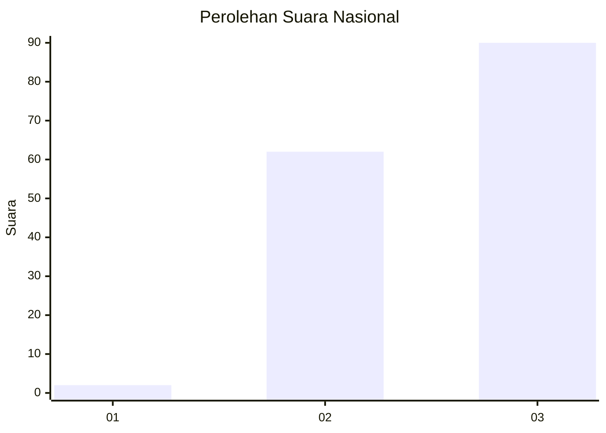
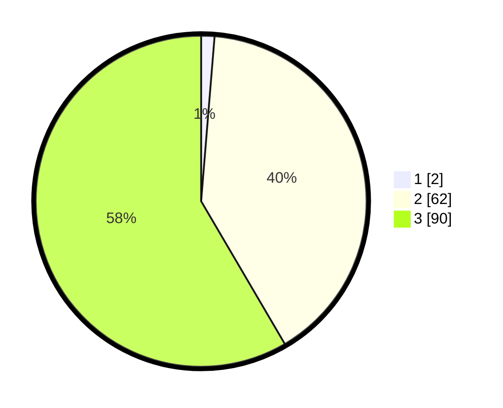

# Hasil

## Grafik

## Tabel

| No. | Nama Paslon    | Suara | Suara (raw) | Persentase |
|:--- |:-------------- | -----:| -----------:| ----------:|
| 1   | ANIES MUHAIMIN | 2     | [2][p-1]    | 1,30       |
| 2   | PRABOWO GIBRAN | 62    | [62][p-2]   | 40,26      |
| 3   | GANJAR MAHFUD  | 90    | [90][p-3]   | 58,44      |

[p-1]: https://github.com/gigit-pemilu/pemilu-2024/blob/main/pilpres/hitung-suara/sub/53-nusa-tenggara-timur/sub/08-ende/sub/09-wolojita/sub/2003-wiwipemo/sub/003-tps/sub/paslon-1.txt
[p-2]: https://github.com/gigit-pemilu/pemilu-2024/blob/main/pilpres/hitung-suara/sub/53-nusa-tenggara-timur/sub/08-ende/sub/09-wolojita/sub/2003-wiwipemo/sub/003-tps/sub/paslon-2.txt
[p-3]: https://github.com/gigit-pemilu/pemilu-2024/blob/main/pilpres/hitung-suara/sub/53-nusa-tenggara-timur/sub/08-ende/sub/09-wolojita/sub/2003-wiwipemo/sub/003-tps/sub/paslon-3.txt

## Foto C Plano

https://sirekap-obj-formc.kpu.go.id/e2ac/pemilu/ppwp/53/08/09/20/03/5308092003003-20240215-120203--bbf6f620-1159-44f5-a145-6d6b83fb5ec8.jpg

https://sirekap-obj-formc.kpu.go.id/e2ac/pemilu/ppwp/53/08/09/20/03/5308092003003-20240215-115955--023201ef-a553-426c-be57-d4765c83dd7e.jpg

https://sirekap-obj-formc.kpu.go.id/e2ac/pemilu/ppwp/53/08/09/20/03/5308092003003-20240215-115754--fca369d3-f93b-48a5-8c17-215900eaa074.jpg

## Metadata

| Key        | Value               |
| ---------- | ------------------- |
| Time Stamp | 2024-02-15 18:00:26 |

