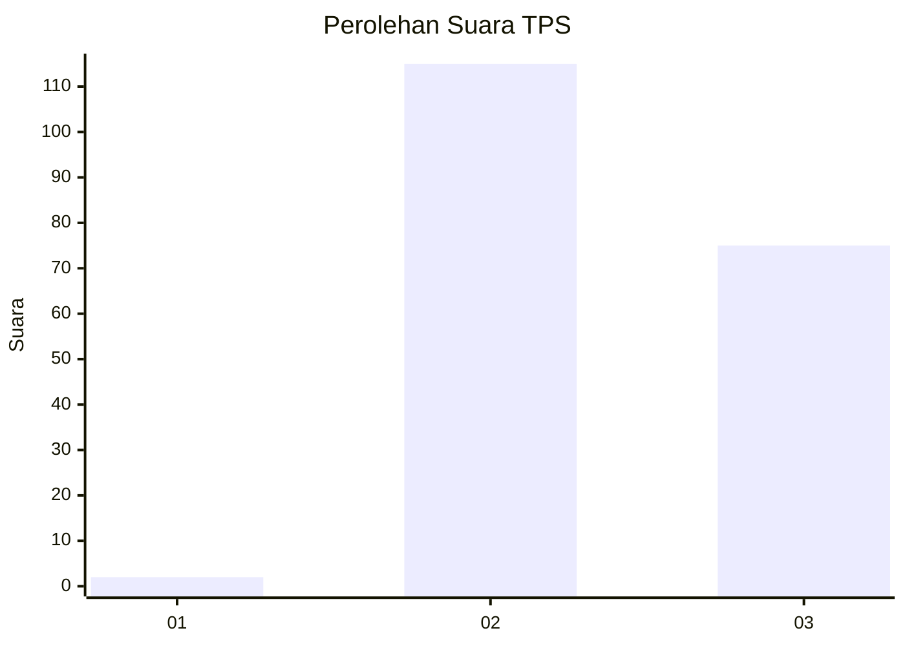
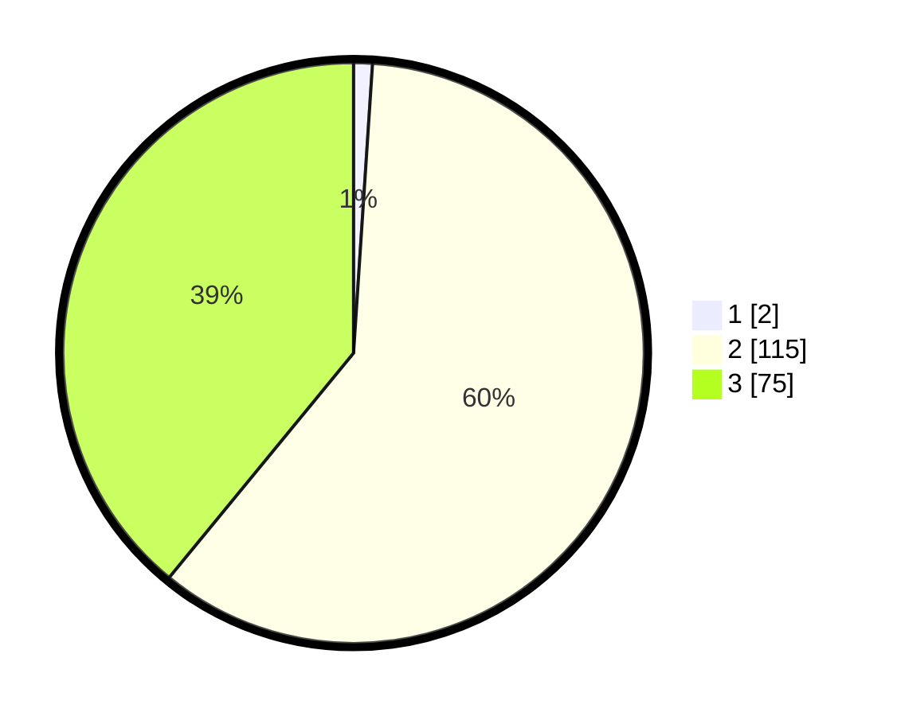

# Hasil

## Grafik

## Tabel

| No. | Nama Paslon    | Suara | Suara (raw) | Persentase |
|:--- |:-------------- | -----:| -----------:| ----------:|
| 1   | ANIES MUHAIMIN | 2     | [2][p-1]    | 1,04       |
| 2   | PRABOWO GIBRAN | 115   | [115][p-2]  | 59,90      |
| 3   | GANJAR MAHFUD  | 75    | [75][p-3]   | 39,06      |

[p-1]: https://github.com/gigit-pemilu/pemilu-2024-53-nusa-tenggara-timur/blob/main/pilpres/hitung-suara/sub/53-nusa-tenggara-timur/sub/08-ende/sub/10-maurole/sub/2001-maurole/sub/007-tps/sub/paslon-1.txt
[p-2]: https://github.com/gigit-pemilu/pemilu-2024-53-nusa-tenggara-timur/blob/main/pilpres/hitung-suara/sub/53-nusa-tenggara-timur/sub/08-ende/sub/10-maurole/sub/2001-maurole/sub/007-tps/sub/paslon-2.txt
[p-3]: https://github.com/gigit-pemilu/pemilu-2024-53-nusa-tenggara-timur/blob/main/pilpres/hitung-suara/sub/53-nusa-tenggara-timur/sub/08-ende/sub/10-maurole/sub/2001-maurole/sub/007-tps/sub/paslon-3.txt

## Foto C Plano

https://sirekap-obj-formc.kpu.go.id/ba16/pemilu/ppwp/53/08/10/20/01/5308102001007-20240215-042215--0424e75b-66ff-44b7-beed-7c455ff68ea7.jpg

https://sirekap-obj-formc.kpu.go.id/ba16/pemilu/ppwp/53/08/10/20/01/5308102001007-20240215-041111--f0ab4a9b-5795-4d7e-b7e4-b7d9fcd14454.jpg

https://sirekap-obj-formc.kpu.go.id/ba16/pemilu/ppwp/53/08/10/20/01/5308102001007-20240214-200812--33ae9603-f656-4d40-bee6-40c5dab933e6.jpg

## Metadata

| Key        | Value               |
| ---------- | ------------------- |
| Time Stamp | 2024-02-16 21:01:00 |

