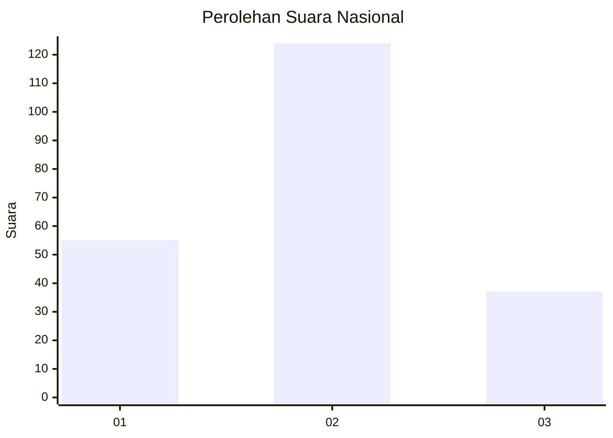
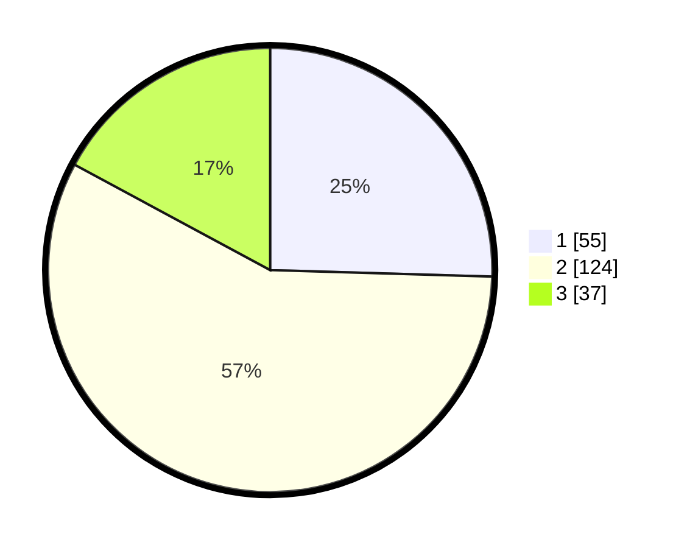

# Hasil

## Grafik

## Tabel

| No. | Nama Paslon    | Suara | Suara (raw) | Persentase |
|:--- |:-------------- | -----:| -----------:| ----------:|
| 1   | ANIES MUHAIMIN | 55    | [55][p-1]   | 25,46      |
| 2   | PRABOWO GIBRAN | 124   | [124][p-2]  | 57,41      |
| 3   | GANJAR MAHFUD  | 37    | [37][p-3]   | 17,13      |

[p-1]: https://github.com/gigit-pemilu/pemilu-2024/blob/main/pilpres/hitung-suara/sub/53-nusa-tenggara-timur/sub/08-ende/sub/11-maukaro/sub/2001-kebirangga/sub/002-tps/sub/paslon-1.txt
[p-2]: https://github.com/gigit-pemilu/pemilu-2024/blob/main/pilpres/hitung-suara/sub/53-nusa-tenggara-timur/sub/08-ende/sub/11-maukaro/sub/2001-kebirangga/sub/002-tps/sub/paslon-2.txt
[p-3]: https://github.com/gigit-pemilu/pemilu-2024/blob/main/pilpres/hitung-suara/sub/53-nusa-tenggara-timur/sub/08-ende/sub/11-maukaro/sub/2001-kebirangga/sub/002-tps/sub/paslon-3.txt

## Foto C Plano

https://sirekap-obj-formc.kpu.go.id/6e66/pemilu/ppwp/53/08/11/20/01/5308112001002-20240215-160155--d43bfefe-927a-4881-bbf0-66740fe34d20.jpg

https://sirekap-obj-formc.kpu.go.id/6e66/pemilu/ppwp/53/08/11/20/01/5308112001002-20240215-160408--a4213c4c-d308-4e30-a874-6c76241e49c0.jpg

https://sirekap-obj-formc.kpu.go.id/6e66/pemilu/ppwp/53/08/11/20/01/5308112001002-20240215-160524--bb3e681c-134b-42dc-976c-015335fa2441.jpg

## Metadata

| Key        | Value               |
| ---------- | ------------------- |
| Time Stamp | 2024-02-15 20:00:44 |

