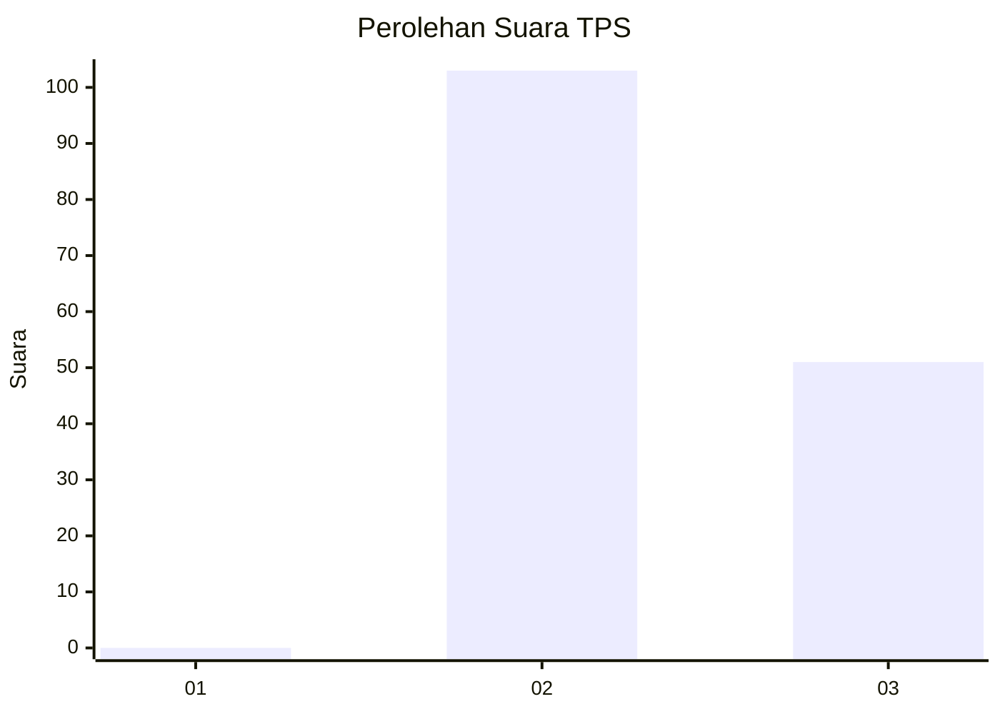
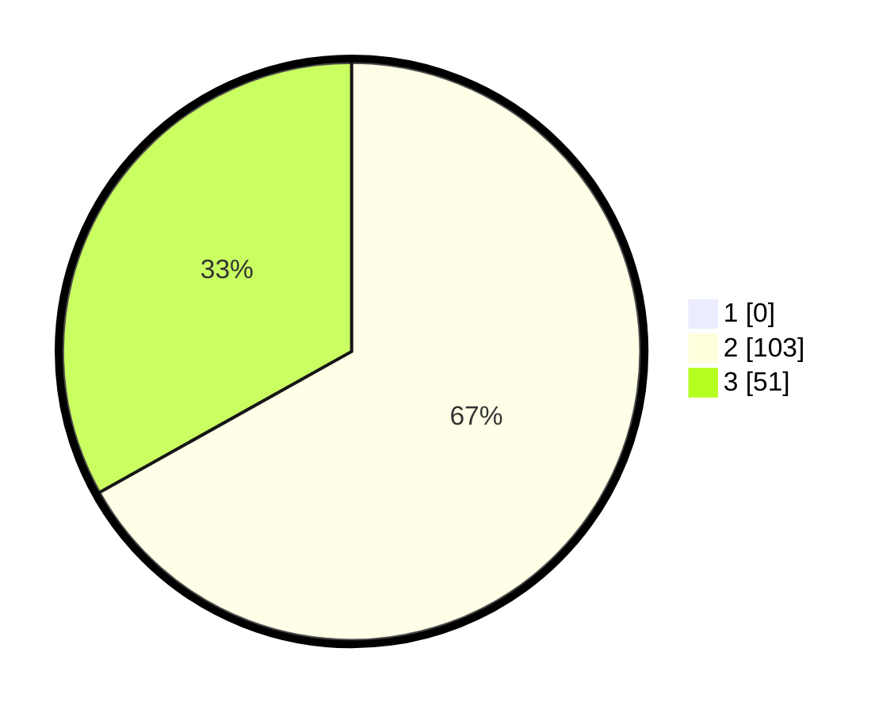

# Hasil

## Grafik

## Tabel

| No. | Nama Paslon    | Suara | Suara (raw) | Persentase |
|:--- |:-------------- | -----:| -----------:| ----------:|
| 1   | ANIES MUHAIMIN | 0     | [0][p-1]    | 0,00       |
| 2   | PRABOWO GIBRAN | 103   | [103][p-2]  | 66,88      |
| 3   | GANJAR MAHFUD  | 51    | [51][p-3]   | 33,12      |

[p-1]: https://github.com/gigit-pemilu/pemilu-2024-53-nusa-tenggara-timur/blob/main/pilpres/hitung-suara/sub/53-nusa-tenggara-timur/sub/08-ende/sub/11-maukaro/sub/2001-kebirangga/sub/004-tps/sub/paslon-1.txt
[p-2]: https://github.com/gigit-pemilu/pemilu-2024-53-nusa-tenggara-timur/blob/main/pilpres/hitung-suara/sub/53-nusa-tenggara-timur/sub/08-ende/sub/11-maukaro/sub/2001-kebirangga/sub/004-tps/sub/paslon-2.txt
[p-3]: https://github.com/gigit-pemilu/pemilu-2024-53-nusa-tenggara-timur/blob/main/pilpres/hitung-suara/sub/53-nusa-tenggara-timur/sub/08-ende/sub/11-maukaro/sub/2001-kebirangga/sub/004-tps/sub/paslon-3.txt

## Foto C Plano

https://sirekap-obj-formc.kpu.go.id/8f1e/pemilu/ppwp/53/08/11/20/01/5308112001004-20240215-110021--f2c207d1-1dc8-441b-8d06-8ae4e066b928.jpg

https://sirekap-obj-formc.kpu.go.id/8f1e/pemilu/ppwp/53/08/11/20/01/5308112001004-20240215-110302--6c79d492-b181-429a-917a-738a3305ac99.jpg

https://sirekap-obj-formc.kpu.go.id/8f1e/pemilu/ppwp/53/08/11/20/01/5308112001004-20240215-110529--0134de50-b3dd-41b9-83e5-c7f1957f2f41.jpg

## Metadata

| Key        | Value               |
| ---------- | ------------------- |
| Time Stamp | 2024-02-15 19:00:26 |

