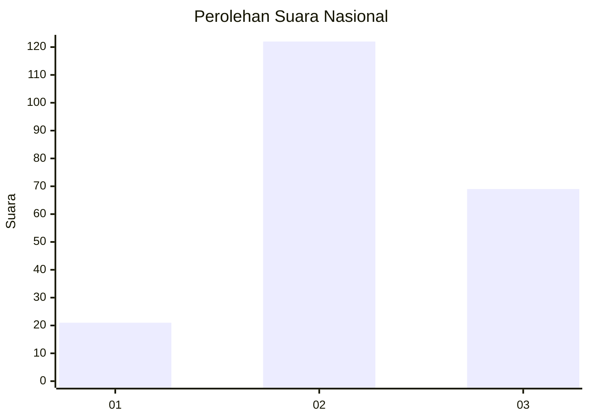
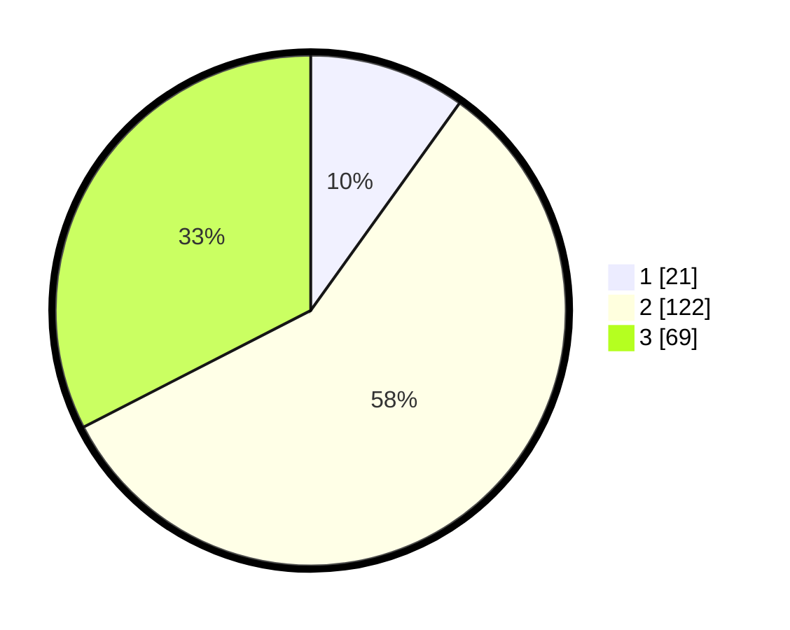

# Hasil

## Grafik

## Tabel

| No. | Nama Paslon    | Suara | Suara (raw) | Persentase |
|:--- |:-------------- | -----:| -----------:| ----------:|
| 1   | ANIES MUHAIMIN | 21    | [21][p-1]   | 9,91       |
| 2   | PRABOWO GIBRAN | 122   | [122][p-2]  | 57,55      |
| 3   | GANJAR MAHFUD  | 69    | [69][p-3]   | 32,55      |

[p-1]: https://github.com/gigit-pemilu/pemilu-2024/blob/main/pilpres/hitung-suara/sub/53-nusa-tenggara-timur/sub/08-ende/sub/11-maukaro/sub/2001-kebirangga/sub/005-tps/sub/paslon-1.txt
[p-2]: https://github.com/gigit-pemilu/pemilu-2024/blob/main/pilpres/hitung-suara/sub/53-nusa-tenggara-timur/sub/08-ende/sub/11-maukaro/sub/2001-kebirangga/sub/005-tps/sub/paslon-2.txt
[p-3]: https://github.com/gigit-pemilu/pemilu-2024/blob/main/pilpres/hitung-suara/sub/53-nusa-tenggara-timur/sub/08-ende/sub/11-maukaro/sub/2001-kebirangga/sub/005-tps/sub/paslon-3.txt

## Foto C Plano

https://sirekap-obj-formc.kpu.go.id/0fdd/pemilu/ppwp/53/08/11/20/01/5308112001005-20240215-100943--d38c78d8-5783-4375-ae13-28cf8fc74136.jpg

https://sirekap-obj-formc.kpu.go.id/0fdd/pemilu/ppwp/53/08/11/20/01/5308112001005-20240215-101446--29daafd2-10ed-4883-8302-65a86779fbef.jpg

https://sirekap-obj-formc.kpu.go.id/0fdd/pemilu/ppwp/53/08/11/20/01/5308112001005-20240215-151448--e503caf5-9e6d-456b-9274-3bf24b1db38d.jpg

## Metadata

| Key        | Value               |
| ---------- | ------------------- |
| Time Stamp | 2024-02-15 19:30:26 |

