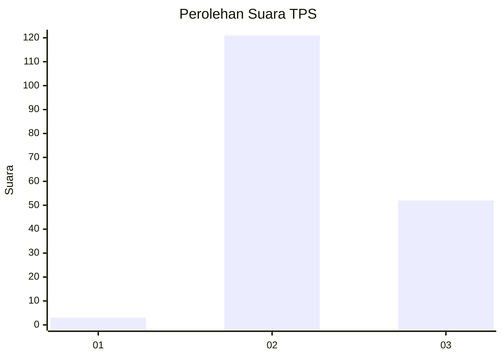

# Hasil

## Grafik

## Tabel

| No. | Nama Paslon    | Suara | Suara (raw) | Persentase |
|:--- |:-------------- | -----:| -----------:| ----------:|
| 1   | ANIES MUHAIMIN | 3     | [3][p-1]    | 1,70       |
| 2   | PRABOWO GIBRAN | 121   | [121][p-2]  | 68,75      |
| 3   | GANJAR MAHFUD  | 52    | [52][p-3]   | 29,55      |

[p-1]: https://github.com/gigit-pemilu/pemilu-2024-53-nusa-tenggara-timur/blob/main/pilpres/hitung-suara/sub/53-nusa-tenggara-timur/sub/08-ende/sub/12-lio-timur/sub/1001-watuneso/sub/002-tps/sub/paslon-1.txt
[p-2]: https://github.com/gigit-pemilu/pemilu-2024-53-nusa-tenggara-timur/blob/main/pilpres/hitung-suara/sub/53-nusa-tenggara-timur/sub/08-ende/sub/12-lio-timur/sub/1001-watuneso/sub/002-tps/sub/paslon-2.txt
[p-3]: https://github.com/gigit-pemilu/pemilu-2024-53-nusa-tenggara-timur/blob/main/pilpres/hitung-suara/sub/53-nusa-tenggara-timur/sub/08-ende/sub/12-lio-timur/sub/1001-watuneso/sub/002-tps/sub/paslon-3.txt

## Foto C Plano

https://sirekap-obj-formc.kpu.go.id/768a/pemilu/ppwp/53/08/12/10/01/5308121001002-20240215-114723--8911deb2-7c58-4278-956a-25470bb81bf3.jpg

https://sirekap-obj-formc.kpu.go.id/768a/pemilu/ppwp/53/08/12/10/01/5308121001002-20240215-115001--37bd3513-5796-45aa-a719-25cf899f59f3.jpg

https://sirekap-obj-formc.kpu.go.id/768a/pemilu/ppwp/53/08/12/10/01/5308121001002-20240215-115200--f953f684-9725-4bf9-9ad6-4f6a32fc3777.jpg

## Metadata

| Key        | Value               |
| ---------- | ------------------- |
| Time Stamp | 2024-02-15 18:00:26 |

