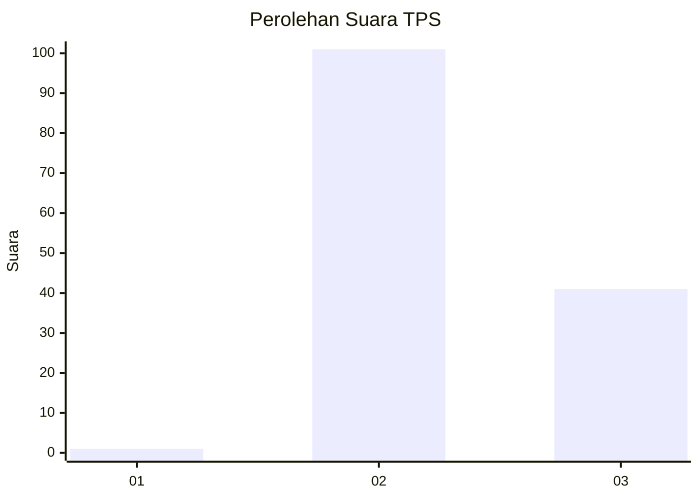
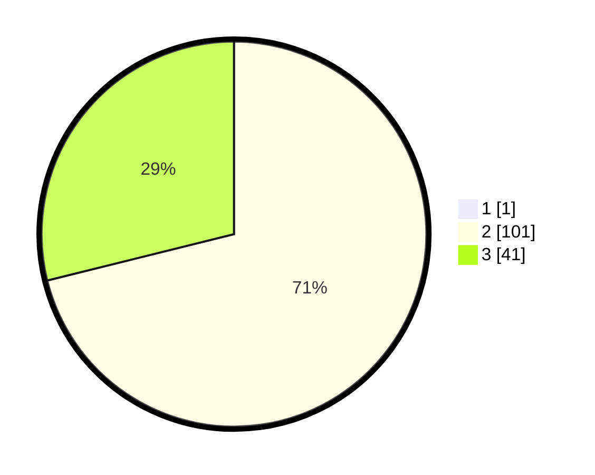

# Hasil

## Grafik

## Tabel

| No. | Nama Paslon    | Suara | Suara (raw) | Persentase |
|:--- |:-------------- | -----:| -----------:| ----------:|
| 1   | ANIES MUHAIMIN | 1     | [1][p-1]    | 0,70       |
| 2   | PRABOWO GIBRAN | 101   | [101][p-2]  | 70,63      |
| 3   | GANJAR MAHFUD  | 41    | [41][p-3]   | 28,67      |

[p-1]: https://github.com/gigit-pemilu/pemilu-2024-53-nusa-tenggara-timur/blob/main/pilpres/hitung-suara/sub/53-nusa-tenggara-timur/sub/08-ende/sub/12-lio-timur/sub/1001-watuneso/sub/006-tps/sub/paslon-1.txt
[p-2]: https://github.com/gigit-pemilu/pemilu-2024-53-nusa-tenggara-timur/blob/main/pilpres/hitung-suara/sub/53-nusa-tenggara-timur/sub/08-ende/sub/12-lio-timur/sub/1001-watuneso/sub/006-tps/sub/paslon-2.txt
[p-3]: https://github.com/gigit-pemilu/pemilu-2024-53-nusa-tenggara-timur/blob/main/pilpres/hitung-suara/sub/53-nusa-tenggara-timur/sub/08-ende/sub/12-lio-timur/sub/1001-watuneso/sub/006-tps/sub/paslon-3.txt

## Foto C Plano

https://sirekap-obj-formc.kpu.go.id/865d/pemilu/ppwp/53/08/12/10/01/5308121001006-20240215-062706--598c182a-d883-4257-b42b-bc1f217ffff6.jpg

https://sirekap-obj-formc.kpu.go.id/865d/pemilu/ppwp/53/08/12/10/01/5308121001006-20240215-063047--696a9c08-73cd-4b69-abc2-934bb69881f4.jpg

https://sirekap-obj-formc.kpu.go.id/865d/pemilu/ppwp/53/08/12/10/01/5308121001006-20240215-021539--350dda87-0d74-4251-9b76-32bb99f52ff8.jpg

## Metadata

| Key        | Value               |
| ---------- | ------------------- |
| Time Stamp | 2024-02-16 16:25:10 |

