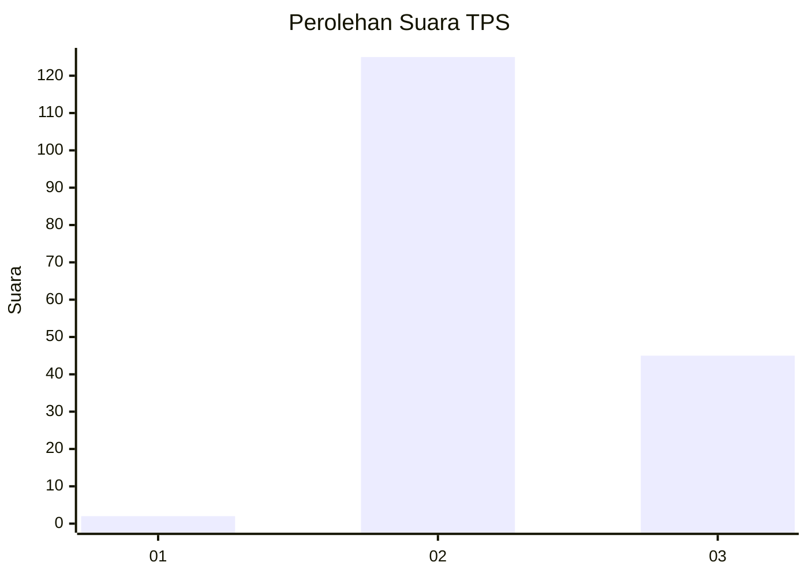
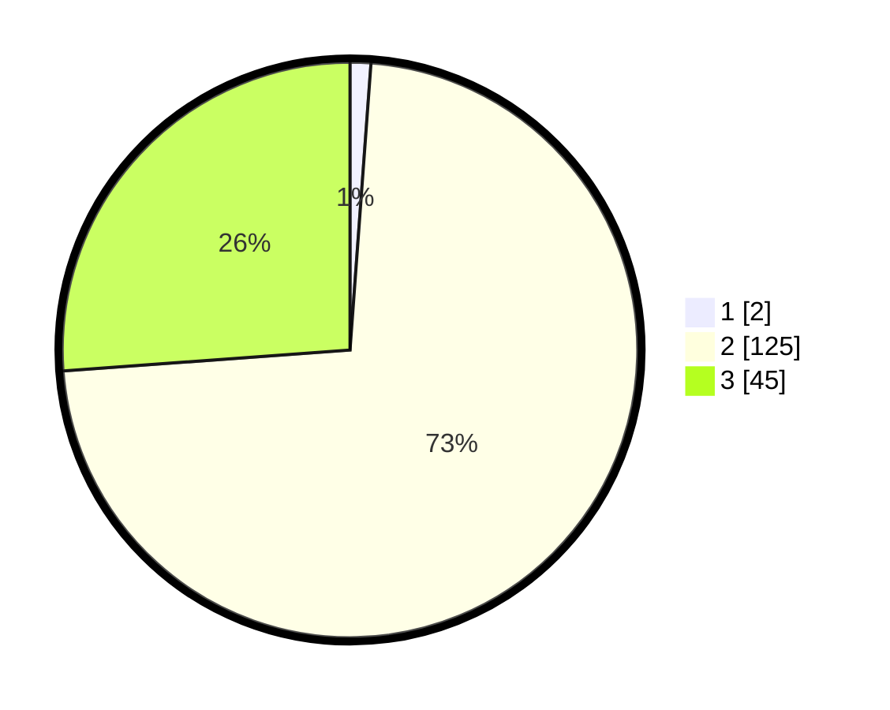

# Hasil

## Grafik

## Tabel

| No. | Nama Paslon    | Suara | Suara (raw) | Persentase |
|:--- |:-------------- | -----:| -----------:| ----------:|
| 1   | ANIES MUHAIMIN | 2     | [2][p-1]    | 1,16       |
| 2   | PRABOWO GIBRAN | 125   | [125][p-2]  | 72,67      |
| 3   | GANJAR MAHFUD  | 45    | [45][p-3]   | 26,16      |

[p-1]: https://github.com/gigit-pemilu/pemilu-2024-53-nusa-tenggara-timur/blob/main/pilpres/hitung-suara/sub/53-nusa-tenggara-timur/sub/08-ende/sub/13-kota-baru/sub/2001-kotabaru/sub/001-tps/sub/paslon-1.txt
[p-2]: https://github.com/gigit-pemilu/pemilu-2024-53-nusa-tenggara-timur/blob/main/pilpres/hitung-suara/sub/53-nusa-tenggara-timur/sub/08-ende/sub/13-kota-baru/sub/2001-kotabaru/sub/001-tps/sub/paslon-2.txt
[p-3]: https://github.com/gigit-pemilu/pemilu-2024-53-nusa-tenggara-timur/blob/main/pilpres/hitung-suara/sub/53-nusa-tenggara-timur/sub/08-ende/sub/13-kota-baru/sub/2001-kotabaru/sub/001-tps/sub/paslon-3.txt

## Foto C Plano

https://sirekap-obj-formc.kpu.go.id/00f3/pemilu/ppwp/53/08/13/20/01/5308132001001-20240215-191552--b7e20ff5-45c2-47d3-9d81-48694ee3d126.jpg

https://sirekap-obj-formc.kpu.go.id/00f3/pemilu/ppwp/53/08/13/20/01/5308132001001-20240215-191740--510d9afc-c7e2-4a63-b5f7-c8f165a8279b.jpg

https://sirekap-obj-formc.kpu.go.id/00f3/pemilu/ppwp/53/08/13/20/01/5308132001001-20240215-191848--4efe7e97-c38d-41ad-be71-a7aa9c0270b8.jpg

## Metadata

| Key        | Value               |
| ---------- | ------------------- |
| Time Stamp | 2024-02-16 22:01:00 |

