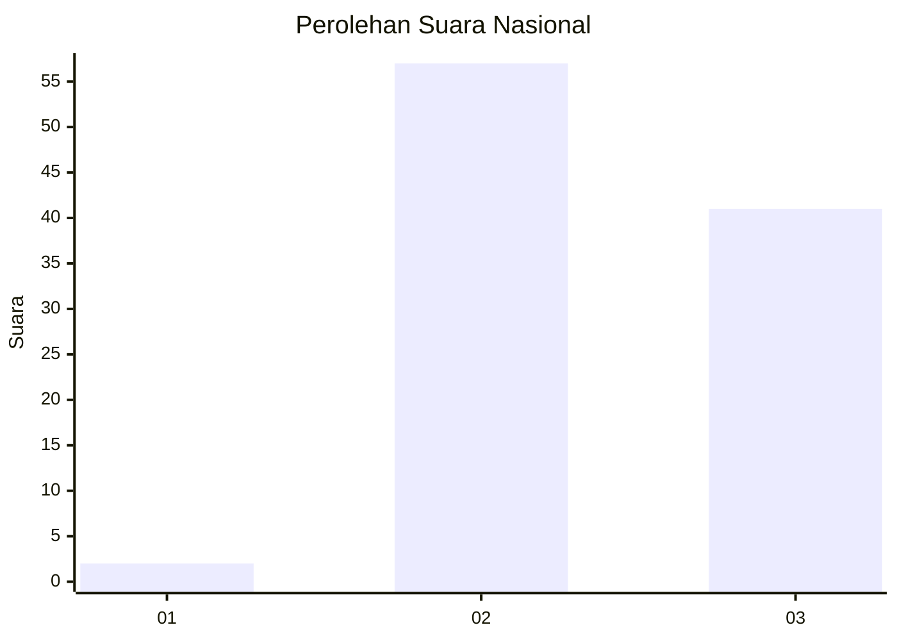
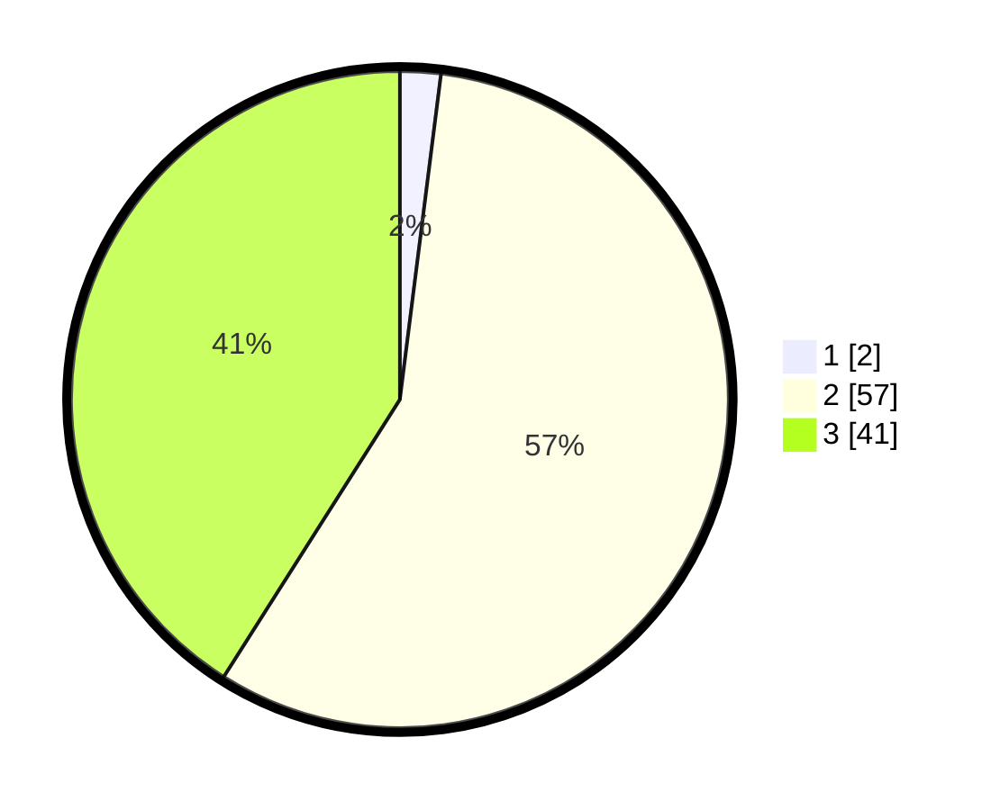

# Hasil

## Grafik

## Tabel

| No. | Nama Paslon    | Suara | Suara (raw) | Persentase |
|:--- |:-------------- | -----:| -----------:| ----------:|
| 1   | ANIES MUHAIMIN | 2     | [2][p-1]    | 2,00       |
| 2   | PRABOWO GIBRAN | 57    | [57][p-2]   | 57,00      |
| 3   | GANJAR MAHFUD  | 41    | [41][p-3]   | 41,00      |

[p-1]: https://github.com/gigit-pemilu/pemilu-2024/blob/main/pilpres/hitung-suara/sub/53-nusa-tenggara-timur/sub/08-ende/sub/13-kota-baru/sub/2016-neotonda/sub/001-tps/sub/paslon-1.txt
[p-2]: https://github.com/gigit-pemilu/pemilu-2024/blob/main/pilpres/hitung-suara/sub/53-nusa-tenggara-timur/sub/08-ende/sub/13-kota-baru/sub/2016-neotonda/sub/001-tps/sub/paslon-2.txt
[p-3]: https://github.com/gigit-pemilu/pemilu-2024/blob/main/pilpres/hitung-suara/sub/53-nusa-tenggara-timur/sub/08-ende/sub/13-kota-baru/sub/2016-neotonda/sub/001-tps/sub/paslon-3.txt

## Foto C Plano

https://sirekap-obj-formc.kpu.go.id/30f7/pemilu/ppwp/53/08/13/20/16/5308132016001-20240215-091146--e1f37edf-29ae-45e1-804d-4ca4d9909eab.jpg

https://sirekap-obj-formc.kpu.go.id/30f7/pemilu/ppwp/53/08/13/20/16/5308132016001-20240215-091110--24f10029-a55f-4871-a78b-00b23a7a4d7f.jpg

https://sirekap-obj-formc.kpu.go.id/30f7/pemilu/ppwp/53/08/13/20/16/5308132016001-20240215-092207--5a86729d-22c2-4805-ae3a-91501d2fc3f1.jpg

## Metadata

| Key        | Value               |
| ---------- | ------------------- |
| Time Stamp | 2024-02-25 16:00:00 |

