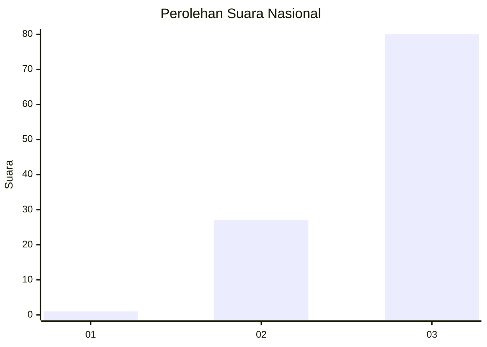
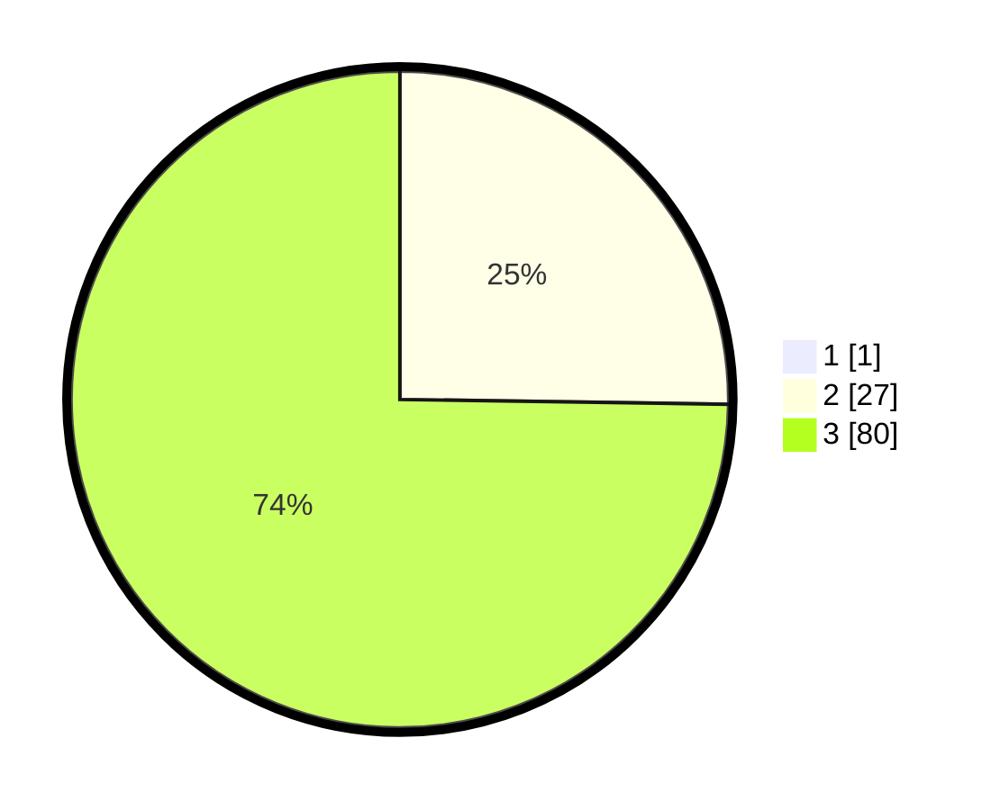

# Hasil

## Grafik

## Tabel

| No. | Nama Paslon    | Suara | Suara (raw) | Persentase |
|:--- |:-------------- | -----:| -----------:| ----------:|
| 1   | ANIES MUHAIMIN | 1     | [1][p-1]    | 0,93       |
| 2   | PRABOWO GIBRAN | 27    | [27][p-2]   | 25,00      |
| 3   | GANJAR MAHFUD  | 80    | [80][p-3]   | 74,07      |

[p-1]: https://github.com/gigit-pemilu/pemilu-2024/blob/main/pilpres/hitung-suara/sub/53-nusa-tenggara-timur/sub/08-ende/sub/14-kelimutu/sub/2009-detuena/sub/002-tps/sub/paslon-1.txt
[p-2]: https://github.com/gigit-pemilu/pemilu-2024/blob/main/pilpres/hitung-suara/sub/53-nusa-tenggara-timur/sub/08-ende/sub/14-kelimutu/sub/2009-detuena/sub/002-tps/sub/paslon-2.txt
[p-3]: https://github.com/gigit-pemilu/pemilu-2024/blob/main/pilpres/hitung-suara/sub/53-nusa-tenggara-timur/sub/08-ende/sub/14-kelimutu/sub/2009-detuena/sub/002-tps/sub/paslon-3.txt

## Foto C Plano

https://sirekap-obj-formc.kpu.go.id/1ee2/pemilu/ppwp/53/08/14/20/09/5308142009002-20240215-062002--76807e1f-5067-4805-b59b-921390648efe.jpg

https://sirekap-obj-formc.kpu.go.id/1ee2/pemilu/ppwp/53/08/14/20/09/5308142009002-20240215-061034--9011e743-d913-4f67-a545-e66606cf619d.jpg

https://sirekap-obj-formc.kpu.go.id/1ee2/pemilu/ppwp/53/08/14/20/09/5308142009002-20240215-062414--6203f216-4c2a-4dcd-8140-4e9bfd29a3d7.jpg

## Metadata

| Key        | Value               |
| ---------- | ------------------- |
| Time Stamp | 2024-02-16 22:01:00 |

