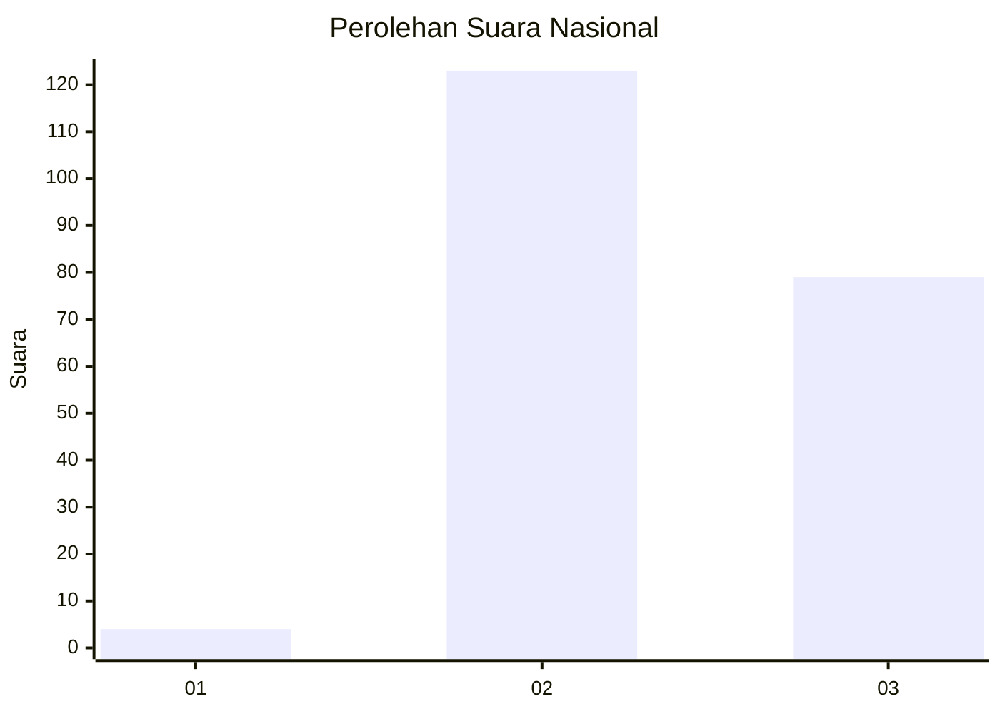
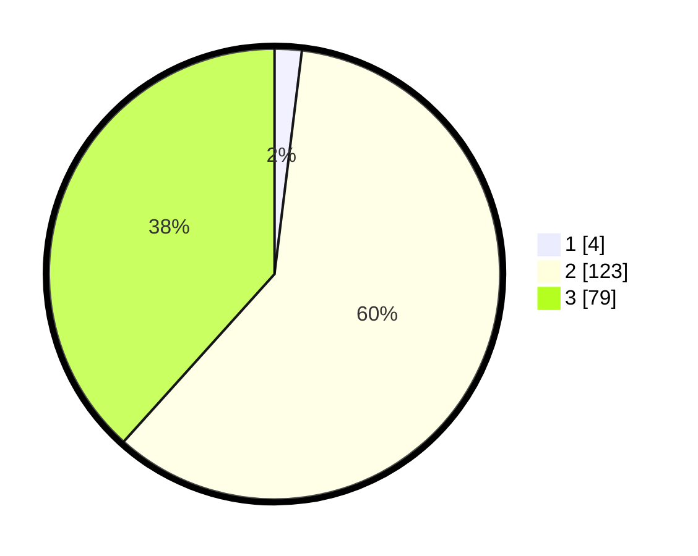

# Hasil

## Grafik

## Tabel

| No. | Nama Paslon    | Suara | Suara (raw) | Persentase |
|:--- |:-------------- | -----:| -----------:| ----------:|
| 1   | ANIES MUHAIMIN | 4     | [4][p-1]    | 1,94       |
| 2   | PRABOWO GIBRAN | 123   | [123][p-2]  | 59,71      |
| 3   | GANJAR MAHFUD  | 79    | [79][p-3]   | 38,35      |

[p-1]: https://github.com/gigit-pemilu/pemilu-2024/blob/main/pilpres/hitung-suara/sub/53-nusa-tenggara-timur/sub/08-ende/sub/15-detukeli/sub/2007-maurole-selatan/sub/001-tps/sub/paslon-1.txt
[p-2]: https://github.com/gigit-pemilu/pemilu-2024/blob/main/pilpres/hitung-suara/sub/53-nusa-tenggara-timur/sub/08-ende/sub/15-detukeli/sub/2007-maurole-selatan/sub/001-tps/sub/paslon-2.txt
[p-3]: https://github.com/gigit-pemilu/pemilu-2024/blob/main/pilpres/hitung-suara/sub/53-nusa-tenggara-timur/sub/08-ende/sub/15-detukeli/sub/2007-maurole-selatan/sub/001-tps/sub/paslon-3.txt

## Foto C Plano

https://sirekap-obj-formc.kpu.go.id/6bdd/pemilu/ppwp/53/08/15/20/07/5308152007001-20240216-181540--409c0eb6-e2b6-4f8f-9d61-3ea567c437ce.jpg

https://sirekap-obj-formc.kpu.go.id/6bdd/pemilu/ppwp/53/08/15/20/07/5308152007001-20240216-181618--ca7355b2-4db9-4a59-83b9-9ab01fce081f.jpg

https://sirekap-obj-formc.kpu.go.id/6bdd/pemilu/ppwp/53/08/15/20/07/5308152007001-20240216-181646--bff9f197-2f78-47cb-a417-2f3f9237fa36.jpg

## Metadata

| Key        | Value               |
| ---------- | ------------------- |
| Time Stamp | 2024-02-17 16:00:02 |

