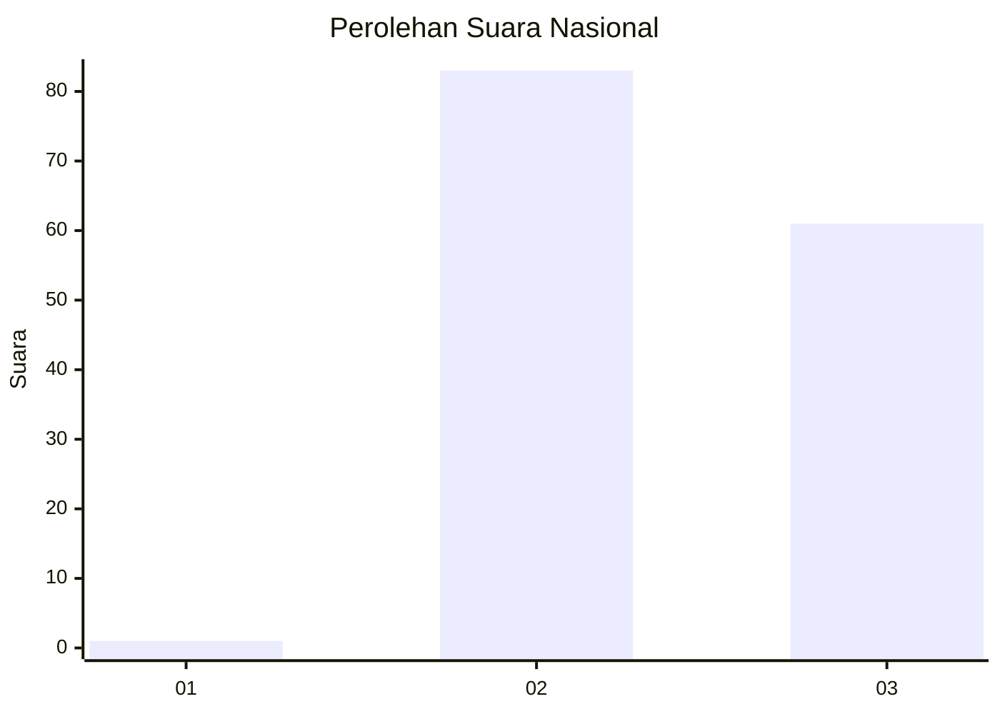
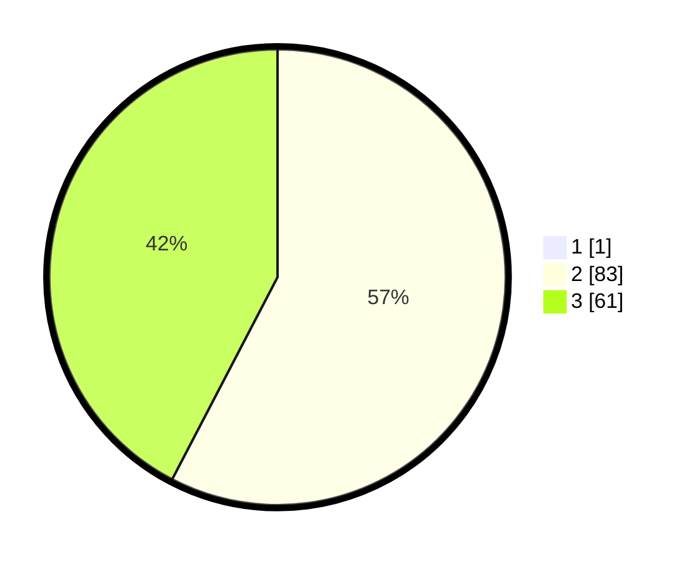

# Hasil

## Grafik

## Tabel

| No. | Nama Paslon    | Suara | Suara (raw) | Persentase |
|:--- |:-------------- | -----:| -----------:| ----------:|
| 1   | ANIES MUHAIMIN | 1     | [1][p-1]    | 0,69       |
| 2   | PRABOWO GIBRAN | 83    | [83][p-2]   | 57,24      |
| 3   | GANJAR MAHFUD  | 61    | [61][p-3]   | 42,07      |

[p-1]: https://github.com/gigit-pemilu/pemilu-2024/blob/main/pilpres/hitung-suara/sub/53-nusa-tenggara-timur/sub/08-ende/sub/16-ndona-timur/sub/2001-kurulimbu/sub/002-tps/sub/paslon-1.txt
[p-2]: https://github.com/gigit-pemilu/pemilu-2024/blob/main/pilpres/hitung-suara/sub/53-nusa-tenggara-timur/sub/08-ende/sub/16-ndona-timur/sub/2001-kurulimbu/sub/002-tps/sub/paslon-2.txt
[p-3]: https://github.com/gigit-pemilu/pemilu-2024/blob/main/pilpres/hitung-suara/sub/53-nusa-tenggara-timur/sub/08-ende/sub/16-ndona-timur/sub/2001-kurulimbu/sub/002-tps/sub/paslon-3.txt

## Foto C Plano

https://sirekap-obj-formc.kpu.go.id/9e31/pemilu/ppwp/53/08/16/20/01/5308162001002-20240215-094315--1f35029e-4c8d-486f-99d4-379f5907101c.jpg

https://sirekap-obj-formc.kpu.go.id/9e31/pemilu/ppwp/53/08/16/20/01/5308162001002-20240215-104656--941399e4-6f1e-47a9-ada5-84a940216d0e.jpg

https://sirekap-obj-formc.kpu.go.id/9e31/pemilu/ppwp/53/08/16/20/01/5308162001002-20240215-103615--5f37edc8-2b72-47bd-bf49-b4aa33a64b7b.jpg

## Metadata

| Key        | Value               |
| ---------- | ------------------- |
| Time Stamp | 2024-02-15 19:00:26 |

