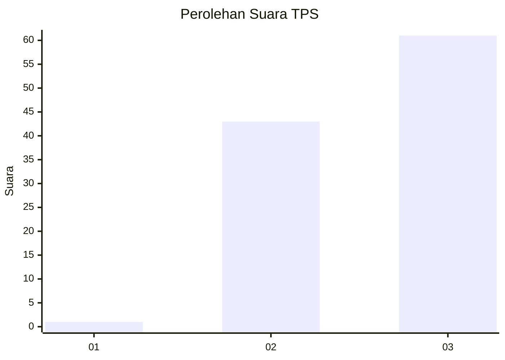
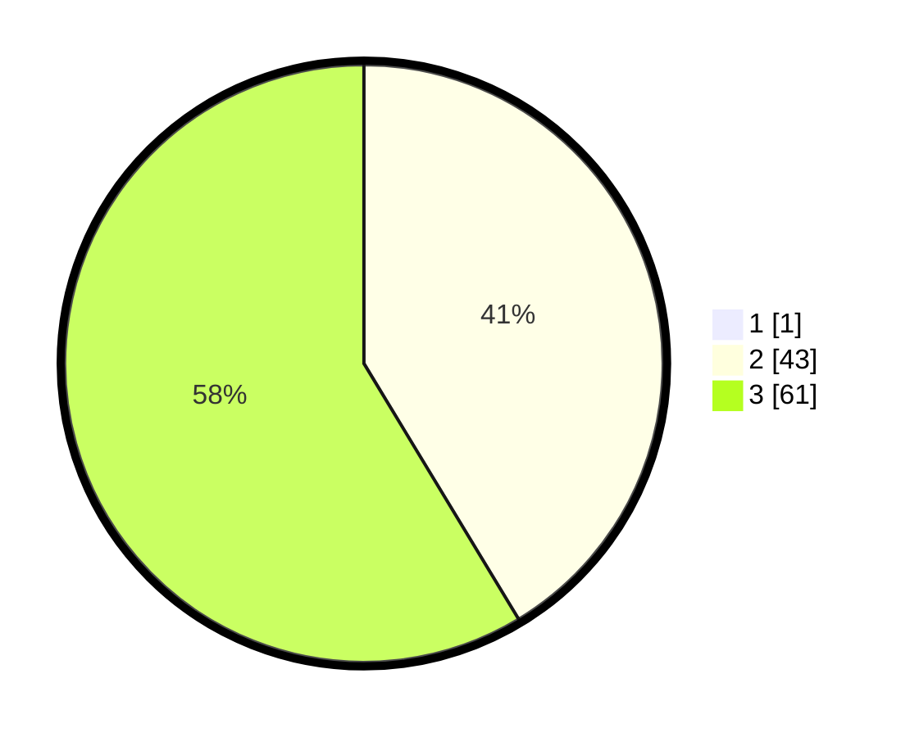

# Hasil

## Grafik

## Tabel

| No. | Nama Paslon    | Suara | Suara (raw) | Persentase |
|:--- |:-------------- | -----:| -----------:| ----------:|
| 1   | ANIES MUHAIMIN | 1     | [1][p-1]    | 0,95       |
| 2   | PRABOWO GIBRAN | 43    | [43][p-2]   | 40,95      |
| 3   | GANJAR MAHFUD  | 61    | [61][p-3]   | 58,10      |

[p-1]: https://github.com/gigit-pemilu/pemilu-2024-53-nusa-tenggara-timur/blob/main/pilpres/hitung-suara/sub/53-nusa-tenggara-timur/sub/08-ende/sub/16-ndona-timur/sub/2002-sokoria/sub/001-tps/sub/paslon-1.txt
[p-2]: https://github.com/gigit-pemilu/pemilu-2024-53-nusa-tenggara-timur/blob/main/pilpres/hitung-suara/sub/53-nusa-tenggara-timur/sub/08-ende/sub/16-ndona-timur/sub/2002-sokoria/sub/001-tps/sub/paslon-2.txt
[p-3]: https://github.com/gigit-pemilu/pemilu-2024-53-nusa-tenggara-timur/blob/main/pilpres/hitung-suara/sub/53-nusa-tenggara-timur/sub/08-ende/sub/16-ndona-timur/sub/2002-sokoria/sub/001-tps/sub/paslon-3.txt

## Foto C Plano

https://sirekap-obj-formc.kpu.go.id/4a65/pemilu/ppwp/53/08/16/20/02/5308162002001-20240215-085643--0c354c69-56bd-4409-b848-f45e8f836bea.jpg

https://sirekap-obj-formc.kpu.go.id/4a65/pemilu/ppwp/53/08/16/20/02/5308162002001-20240215-085747--c7d5ceaa-eda7-4fa9-945f-9ecab70ba2e8.jpg

https://sirekap-obj-formc.kpu.go.id/4a65/pemilu/ppwp/53/08/16/20/02/5308162002001-20240215-085857--ac33ff23-e0f6-4c2c-a644-7a9fbd4200c5.jpg

## Metadata

| Key        | Value               |
| ---------- | ------------------- |
| Time Stamp | 2024-02-15 19:00:26 |

