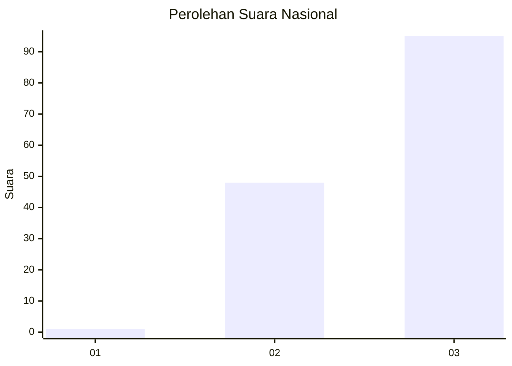
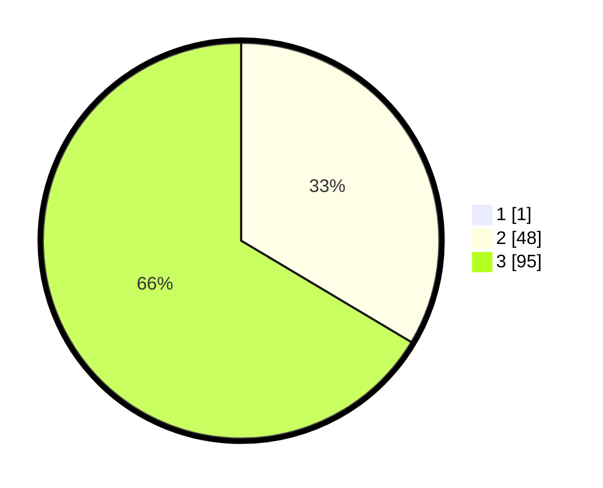

# Hasil

## Grafik

## Tabel

| No. | Nama Paslon    | Suara | Suara (raw) | Persentase |
|:--- |:-------------- | -----:| -----------:| ----------:|
| 1   | ANIES MUHAIMIN | 1     | [1][p-1]    | 0,69       |
| 2   | PRABOWO GIBRAN | 48    | [48][p-2]   | 33,33      |
| 3   | GANJAR MAHFUD  | 95    | [95][p-3]   | 65,97      |

[p-1]: https://github.com/gigit-pemilu/pemilu-2024/blob/main/pilpres/hitung-suara/sub/53-nusa-tenggara-timur/sub/08-ende/sub/16-ndona-timur/sub/2002-sokoria/sub/002-tps/sub/paslon-1.txt
[p-2]: https://github.com/gigit-pemilu/pemilu-2024/blob/main/pilpres/hitung-suara/sub/53-nusa-tenggara-timur/sub/08-ende/sub/16-ndona-timur/sub/2002-sokoria/sub/002-tps/sub/paslon-2.txt
[p-3]: https://github.com/gigit-pemilu/pemilu-2024/blob/main/pilpres/hitung-suara/sub/53-nusa-tenggara-timur/sub/08-ende/sub/16-ndona-timur/sub/2002-sokoria/sub/002-tps/sub/paslon-3.txt

## Foto C Plano

https://sirekap-obj-formc.kpu.go.id/539a/pemilu/ppwp/53/08/16/20/02/5308162002002-20240215-151805--9d14fcd9-339a-40db-a4c9-d7475c0a68a6.jpg

https://sirekap-obj-formc.kpu.go.id/539a/pemilu/ppwp/53/08/16/20/02/5308162002002-20240215-151946--f8e98ebd-bf7f-42f0-9256-cbed77c97efa.jpg

https://sirekap-obj-formc.kpu.go.id/539a/pemilu/ppwp/53/08/16/20/02/5308162002002-20240215-152110--361c39ec-eb4b-4840-88db-08eafced4ff3.jpg

## Metadata

| Key        | Value               |
| ---------- | ------------------- |
| Time Stamp | 2024-02-15 19:00:26 |

