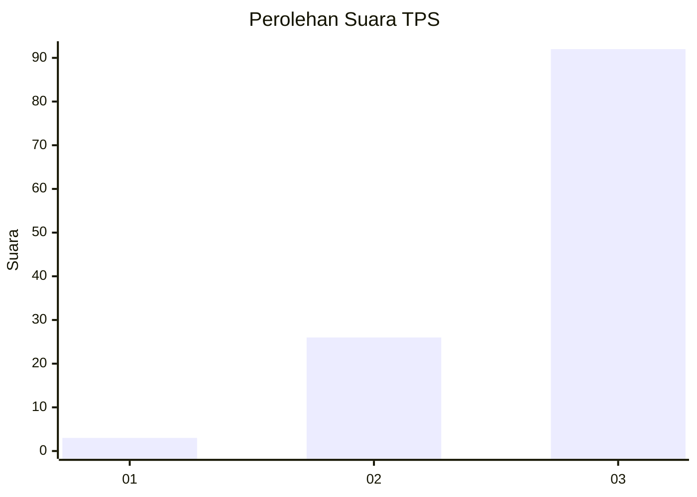
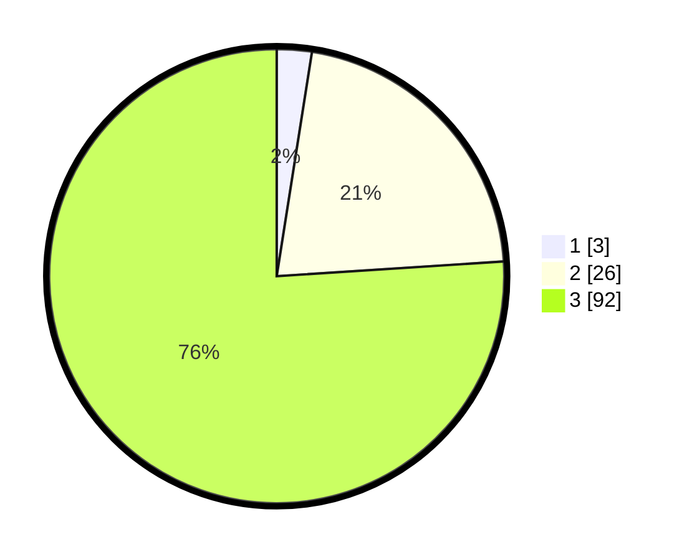

# Hasil

## Grafik

## Tabel

| No. | Nama Paslon    | Suara | Suara (raw) | Persentase |
|:--- |:-------------- | -----:| -----------:| ----------:|
| 1   | ANIES MUHAIMIN | 3     | [3][p-1]    | 2,48       |
| 2   | PRABOWO GIBRAN | 26    | [26][p-2]   | 21,49      |
| 3   | GANJAR MAHFUD  | 92    | [92][p-3]   | 76,03      |

[p-1]: https://github.com/gigit-pemilu/pemilu-2024-53-nusa-tenggara-timur/blob/main/pilpres/hitung-suara/sub/53-nusa-tenggara-timur/sub/08-ende/sub/16-ndona-timur/sub/2004-roga/sub/001-tps/sub/paslon-1.txt
[p-2]: https://github.com/gigit-pemilu/pemilu-2024-53-nusa-tenggara-timur/blob/main/pilpres/hitung-suara/sub/53-nusa-tenggara-timur/sub/08-ende/sub/16-ndona-timur/sub/2004-roga/sub/001-tps/sub/paslon-2.txt
[p-3]: https://github.com/gigit-pemilu/pemilu-2024-53-nusa-tenggara-timur/blob/main/pilpres/hitung-suara/sub/53-nusa-tenggara-timur/sub/08-ende/sub/16-ndona-timur/sub/2004-roga/sub/001-tps/sub/paslon-3.txt

## Foto C Plano

https://sirekap-obj-formc.kpu.go.id/8344/pemilu/ppwp/53/08/16/20/04/5308162004001-20240218-184009--b3cd9eae-44a9-4612-9462-c86c59caeef8.jpg

https://sirekap-obj-formc.kpu.go.id/8344/pemilu/ppwp/53/08/16/20/04/5308162004001-20240215-110419--ca18a688-9f05-4c38-9426-98d4354c34e8.jpg

https://sirekap-obj-formc.kpu.go.id/8344/pemilu/ppwp/53/08/16/20/04/5308162004001-20240218-185122--cdea2437-3dc2-40f5-8ac3-d0d30e418847.jpg

## Metadata

| Key        | Value               |
| ---------- | ------------------- |
| Time Stamp | 2024-02-19 06:16:00 |

