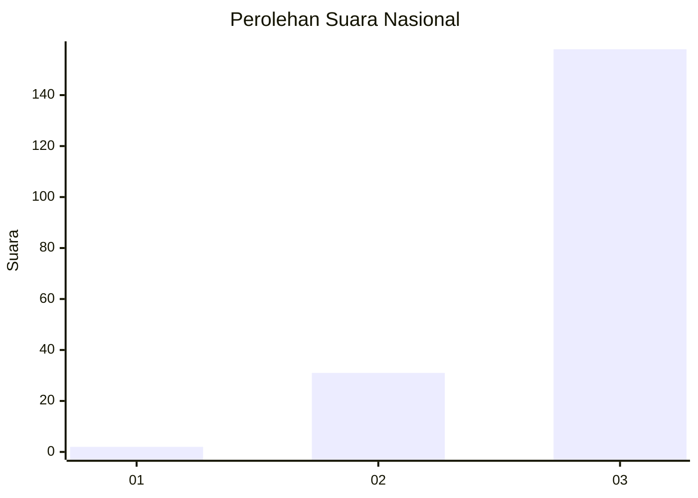
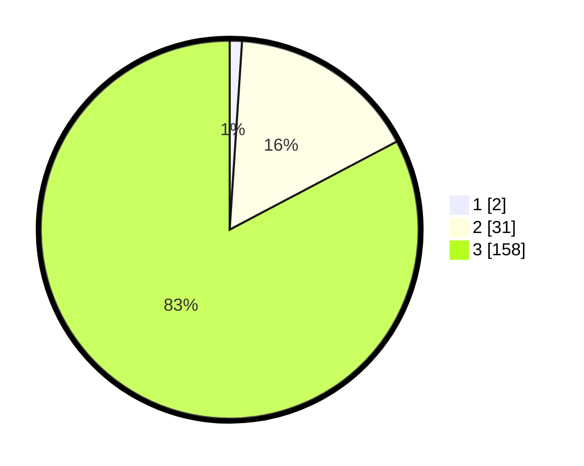

# Hasil

## Grafik

## Tabel

| No. | Nama Paslon    | Suara | Suara (raw) | Persentase |
|:--- |:-------------- | -----:| -----------:| ----------:|
| 1   | ANIES MUHAIMIN | 2     | [2][p-1]    | 1,05       |
| 2   | PRABOWO GIBRAN | 31    | [31][p-2]   | 16,23      |
| 3   | GANJAR MAHFUD  | 158   | [158][p-3]  | 82,72      |

[p-1]: https://github.com/gigit-pemilu/pemilu-2024/blob/main/pilpres/hitung-suara/sub/53-nusa-tenggara-timur/sub/08-ende/sub/16-ndona-timur/sub/2004-roga/sub/004-tps/sub/paslon-1.txt
[p-2]: https://github.com/gigit-pemilu/pemilu-2024/blob/main/pilpres/hitung-suara/sub/53-nusa-tenggara-timur/sub/08-ende/sub/16-ndona-timur/sub/2004-roga/sub/004-tps/sub/paslon-2.txt
[p-3]: https://github.com/gigit-pemilu/pemilu-2024/blob/main/pilpres/hitung-suara/sub/53-nusa-tenggara-timur/sub/08-ende/sub/16-ndona-timur/sub/2004-roga/sub/004-tps/sub/paslon-3.txt

## Foto C Plano

https://sirekap-obj-formc.kpu.go.id/71a3/pemilu/ppwp/53/08/16/20/04/5308162004004-20240215-082551--d8a56a82-b8a6-48d1-9ad9-7ab55331e197.jpg

https://sirekap-obj-formc.kpu.go.id/71a3/pemilu/ppwp/53/08/16/20/04/5308162004004-20240216-143142--dc82a217-715e-4929-879d-74dda460a2f3.jpg

https://sirekap-obj-formc.kpu.go.id/71a3/pemilu/ppwp/53/08/16/20/04/5308162004004-20240215-144447--5a1f0157-e229-4601-a27c-32874e2cb7b3.jpg

## Metadata

| Key        | Value               |
| ---------- | ------------------- |
| Time Stamp | 2024-02-16 23:45:47 |

