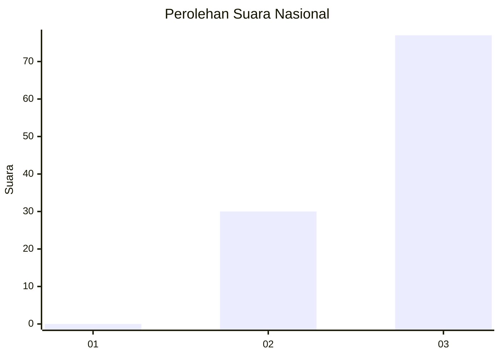
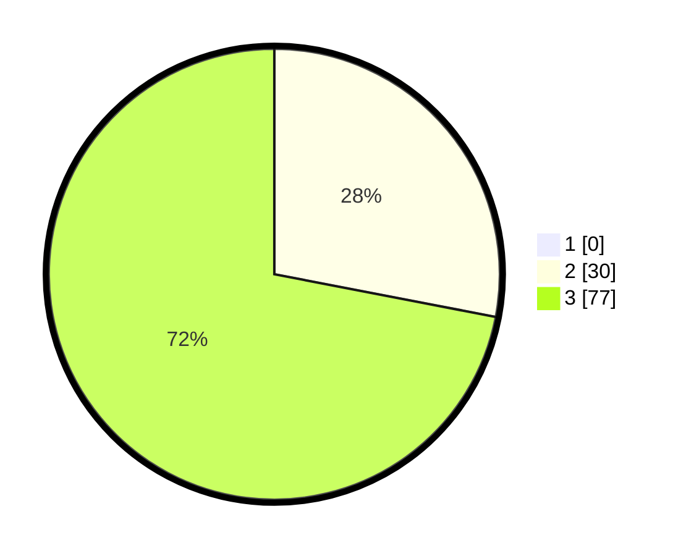

# Hasil

## Grafik

## Tabel

| No. | Nama Paslon    | Suara | Suara (raw) | Persentase |
|:--- |:-------------- | -----:| -----------:| ----------:|
| 1   | ANIES MUHAIMIN | 0     | [0][p-1]    | 0,00       |
| 2   | PRABOWO GIBRAN | 30    | [30][p-2]   | 28,04      |
| 3   | GANJAR MAHFUD  | 77    | [77][p-3]   | 71,96      |

[p-1]: https://github.com/gigit-pemilu/pemilu-2024/blob/main/pilpres/hitung-suara/sub/53-nusa-tenggara-timur/sub/08-ende/sub/16-ndona-timur/sub/2006-ngguwa/sub/002-tps/sub/paslon-1.txt
[p-2]: https://github.com/gigit-pemilu/pemilu-2024/blob/main/pilpres/hitung-suara/sub/53-nusa-tenggara-timur/sub/08-ende/sub/16-ndona-timur/sub/2006-ngguwa/sub/002-tps/sub/paslon-2.txt
[p-3]: https://github.com/gigit-pemilu/pemilu-2024/blob/main/pilpres/hitung-suara/sub/53-nusa-tenggara-timur/sub/08-ende/sub/16-ndona-timur/sub/2006-ngguwa/sub/002-tps/sub/paslon-3.txt

## Foto C Plano

https://sirekap-obj-formc.kpu.go.id/b6c5/pemilu/ppwp/53/08/16/20/06/5308162006002-20240215-141528--c667aabd-c8b0-4799-be2f-0ab4ba801c9c.jpg

https://sirekap-obj-formc.kpu.go.id/b6c5/pemilu/ppwp/53/08/16/20/06/5308162006002-20240220-130633--99ab38f4-4af5-4c88-8947-331f2e0f4ba1.jpg

https://sirekap-obj-formc.kpu.go.id/b6c5/pemilu/ppwp/53/08/16/20/06/5308162006002-20240215-110129--6d7e13f2-5e2f-4e01-b40e-e842de309f68.jpg

## Metadata

| Key        | Value               |
| ---------- | ------------------- |
| Time Stamp | 2024-02-25 15:00:00 |

